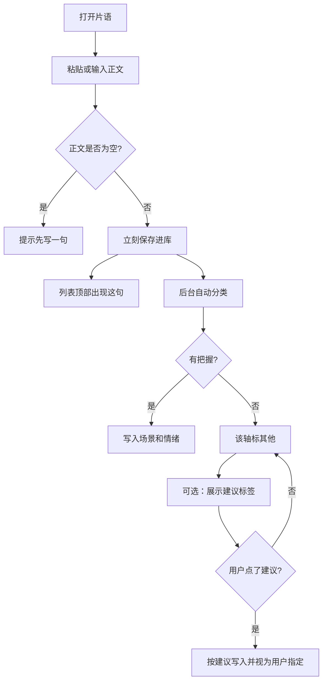
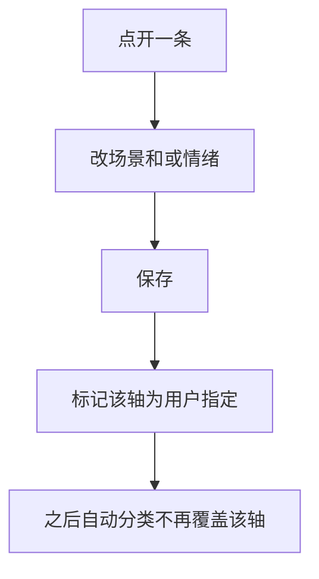
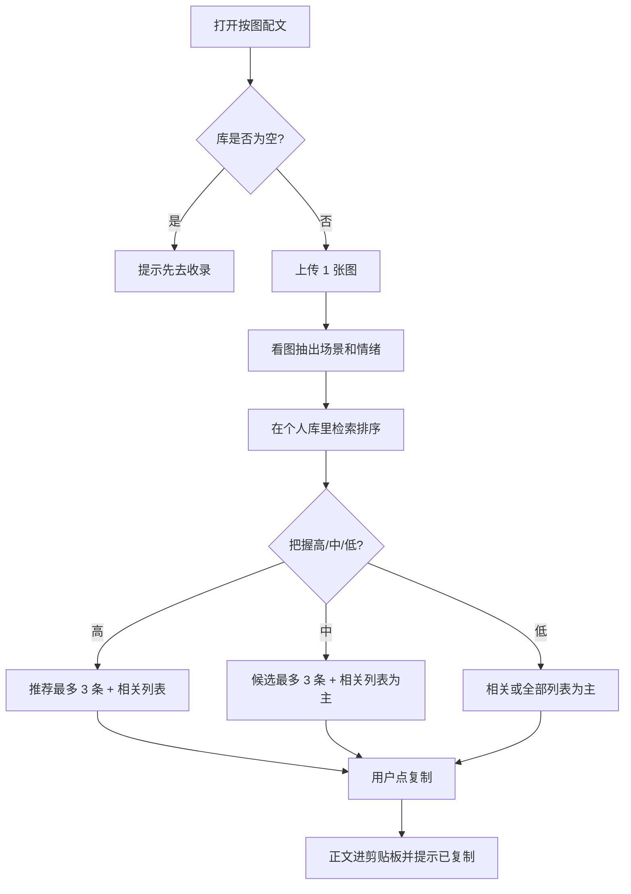

# 朋友圈金句灵感 · 产品需求文档（PRD）

| 项 | 内容 |
|---|---|
| 文档类型 | PRD |
| 版本 | v0.6 |
| 日期 | 2026-08-21 |
| 作者 | 产品（模拟） |
| 状态 | 评审通过 |
| 前置文档 | [01-需求分析.md](./01-需求分析.md) |
| 评审纪要 | [03-需求评审纪要.md](./03-需求评审纪要.md) |
| 第一期范围 | 仅个人库；P0 必须做，P1 可排在第一期后半段 |

> 需求分析回答「做不做、做什么」。  
> **PRD 回答「做成什么样」**：有哪几页、每页上有什么、主流程怎么走、空了/错了怎么办、怎样算验收通过。  
> 本文仍然不选框架、不定接口、不写代码。

---

## 1. 文档怎么用

| 读者 | 读什么 |
|---|---|
| 产品 | 检查有没有漏场景、有没有把「不做」又写进来 |
| 设计 | 按第 4、5、6 节画页面和状态，不自己发明新页面 |
| 开发 | 按模块、字段、流程、异常实现；优先级按 P0/P1 |
| 测试 | 按第 11 节验收标准写用例 |

需求编号与分析文档对齐：R1～R11。超出分析文档范围的功能，第一期禁止加入。

---

## 2. 产品一句话

**片语**：随手记下句子，系统用「场景 × 情绪」归类；发圈时上传一张图，从自己的库里给出比较适合的文案，配不准就按分类让你划。

---

## 3. 信息架构

产品名 **片语**。打开先是太阳封面，点太阳写句子，上滑才进入列表；按图配文是子页。首页不放产品名当标题。不要做成后台管理系统。

```text
片语
└── 封面（太阳：点击记下；上滑进列表；按图配文按钮）
    ├── 写字处（点太阳后）
    ├── 句子列表（上滑后：筛选 / 卡片 / 复制 / 底部悬浮按图配文）
    └── 按图配文（子页，左上角「← 返回」）
        ├── 上传 1 张图
        ├── 推荐区（最多 3 条）
        └── 相关分类列表（兜底遍历）
```

不提供：注册登录页、发现页、他人主页、设置、顶栏双 Tab。

---

## 4. 全局规则

这些规则全站生效，写代码时不要每个页面各解释一遍。

### 4.1 用户与数据

- 第一期无注册、无登录、无多人。
- P0 持久化：同一浏览器里刷新、关掉再打开，金句还在、分类还在。
- 换浏览器、换手机、Safari 与微信内置浏览器互切，第一期不验收（无登录做不到稳定同步）。
- 存在哪里由技术方案决定。P0 验收有网络时保存必成功；离线保存不是 P0。

### 4.2 分类词表（v1，不允许开发自己加类）

**场景（一条金句 1～2 个）：**  
旅行、美食、风景自然、日常生活、人物自拍、宠物、夜色城市、工作学习、节日纪念日、其他

**情绪（一条金句恰好 1 个）：**  
松弛治愈、浪漫暧昧、幽默俏皮、孤独丧、热血励志、冷淡高级、珍惜感恩、其他

- 自动分类没把握时，对应轴标「其他」。
- 「其他」不能和真实场景共存：场景要么是 1～2 个真实场景，要么单独一个「其他」。
- 自动分类若给出真实场景，不要再附带「其他」；多于 2 个场景时只取最有把握的 2 个，且去重。
- 用户改过的轴，之后自动分类不得覆盖该轴。
- 分类还在进行时，用户已经保存了分类：以用户为准，丢弃这次自动结果。
- 用户点建议标签采用：视为用户指定。
- 只改正文、且该轴从未被用户改过：保存后可重新自动分类。

### 4.3 文案原则

- 只检索库里已有句子，不生成新句子。
- 推荐区文案用「比较适合这张图的几句」，禁用「唯一匹配」「AI 已为你写好」。

### 4.4 图片

- 一次仅 1 张，用于当次匹配。
- 匹配结束不提供「历史配图相册」，产品内不长期展示过往原图。
- 支持 jpg / png / webp；若手机 HEIC 无法识别，提示换成 jpg 或 png。

### 4.5 复制即使用

用户点「复制」视为使用过该句（P1 用来降低「刚用过又置顶」）。P0 至少复制成功并有「已复制」反馈。微信内置浏览器可能复制失败：正文必须能长按选中，并提示「长按句子自己复制」。

### 4.6 正文、重复、连点

- 保存前去掉首尾空白（含首尾换行）。去掉后为空则不能保存。
- 最多 500 个字符（含标点、换行）。超出则阻止保存并提示「最多 500 字」，不得悄悄截断。
- 与库中已有正文（同样去过首尾空白后）完全相同：提示「库里已有这句」，不创建第二条。中间空格不同算另一句。第一期不做模糊查重。
- 连续点击保存：不得因连点把同一句存成两条。

### 4.7 匹配：相关分类、把握、排序（P0）

看图会得到「图的场景、图的情绪」。相关列表按下面瀑布放宽，直到有句子可展示：

1. 场景有交集 **并且** 情绪相同
2. 仅场景有交集
3. 仅情绪相同
4. 全部金句（按创建时间倒序）

把握程度（供展示和验收，不看模型内部分数）：

| 把握 | 何时 |
|---|---|
| 高 | 图的场景、情绪都不是「其他」，且库里至少 1 条满足第 1 层 |
| 中 | 对得上第 2 或第 3 层；或图有一轴是「其他」但另一轴能对上库 |
| 低 | 其余（含看图失败、图两轴都是其他、库里对不上） |

推荐区最多 3 条的 P0 排序：第 1 层 > 第 2 层 > 第 3 层 > 其余，同一层创建时间新的在前。刚用过的降权是 P1。

P0 推荐区标题用固定句，不强制展示抽出的标签（标签是 P1）：

- 高 / 中：「比较适合这张图的几句」
- 低：「没找到特别贴的，先按分类看」
- 已降到全部：「这张图暂时对不上分类，先从全部里面挑」

---

## 5. 页面说明

下面的框图是结构，不是视觉稿。颜色、字体、间距留给第 4 步设计。

### 5.1 首页（封面 + 列表）

打开先是太阳封面：点太阳写一句；上滑进入列表。

```text
┌─────────────────────────────────────┐
│              ◎ 太阳                  │
│            按图配文                  │
└─────────────────────────────────────┘
              ↓ 上滑
┌─────────────────────────────────────┐
│  下滑回到太阳                        │
│  场景 [全部 ▾]    情绪 [全部 ▾]     │
│  人间烟火气…                   复制 │
│  今晚的风…                     复制 │
│           【 按图配文 】             │  ← 钉在底部，不随列表滚动
└─────────────────────────────────────┘
```

**P0 要素**

| 元素 | 行为 |
|---|---|
| 太阳 | 封面主视觉，光圈向外扩散；点击进入写字处 |
| 上滑 | 封面进入句子列表；列表在顶部下滑回到封面 |
| 输入框 | 点太阳后出现；占位符「把想发的那句话贴在这里」 |
| 保存 | 正文去首尾空白后为空：不可保存，并提示「先写一句」；超 500 字符不可保存；与已有完全相同不创建第二条 |
| 保存成功 | 收回到太阳封面，轻提示「记下了」；分类可稍后在列表里回填 |
| 自动分类 | 不挡住保存。先出现「分类中」，完成后显示标签 |
| 分类失败 | 两轴均为「其他」，不弹致命错误，列表照常显示 |
| 建议标签 | 仅当某轴是「其他」且系统有建议时出现，点一下即采用 |
| 筛选 | 场景、情绪各一个下拉；默认「全部」；同时选则取交集 |
| 列表 | 默认按创建时间倒序；每条展示正文 + 场景 + 情绪 |
| 点一条 | 进入编辑态（点「复制」不进入编辑） |
| 复制 | 每张卡片提供文字按钮「复制」；只复制正文；成功提示「已复制，去微信粘贴就行」。不配图、只发圈时走这条。片语页的复制是次要操作，不用实心主色按钮，避免和「保存」抢 |
| 按图配文按钮 | 悬浮在屏幕底部，不随列表滚动；点进去进入配图子页。列表底部留白，避免最后一条被挡住 |

**空状态（库里 0 条，且未筛到 0 条）**

> 还没有金句。下滑回到太阳，点一下记下。

**筛选结果为 0**

> 这个分类下还没有句子。可换成「全部」，或先去记一句。

### 5.2 编辑一条金句

可以是下钻页，也可以是在列表中展开。第一期不要做成复杂表单。

| 元素 | 规则 |
|---|---|
| 正文 | 必填，最多 500 字 |
| 场景 | 多选，最少 1 个、最多 2 个；选项仅限词表 |
| 情绪 | 单选，必选 1 个 |
| 保存修改 | 写回列表；若用户改了分类，标记为「用户指定」 |
| 删除 | 二次确认：「删除这句？删除后配图时不会再出现。」确认后从库中去掉 |
| 取消 | 不保存，回到列表 |

不允许：文件夹、置顶、封面图、来源必填。

### 5.3 按图配文

```text
┌─────────────────────────────────────┐
│  ← 返回           按图配文           │
├─────────────────────────────────────┤
│  ┌──────────────┐                   │
│  │  上传一张    │  选好图后开始匹配  │
│  │  朋友圈图    │                   │
│  └──────────────┘                   │
├─────────────────────────────────────┤
│  比较适合这张图的几句 · 夜景 · 松弛  │
│  1. ……                        复制  │
│  2. ……                        复制  │
│  3. ……                        复制  │
├─────────────────────────────────────┤
│  相关分类里的全部文案                │
│  ……                           复制  │
│  ……                           复制  │
└─────────────────────────────────────┘
```

**P0 要素**

| 元素 | 行为 |
|---|---|
| 上传 | 从相册选 1 张；选中后展示缩略图，可换一张重新匹配 |
| 匹配中 | 明确「正在看图找句子」，禁止空白闪烁 |
| 推荐区 | 最多 3 条，每条有正文 + 复制 |
| 相关列表 | 同一页下方，方便接着划；每条同样可复制 |
| 复制 | 只复制金句正文；成功提示「已复制，去微信粘贴就行」 |
| 返回 | 左上角「← 返回」，回到首页；当次图和结果先留着，直到换图或刷新 |
| 换图 | 清空当次结果，重新走匹配 |

**库里还没有金句**

不强制禁止上传，但结果区写：

> 库是空的，现在配不出句子。先回去记几句，再回来传图。

并提供返回首页。

**把握程度与展示（必须按此降级，禁止空结果页）**

| 把握 | 推荐区 | 相关列表 | P0 标题 |
|---|---|---|---|
| 高 | 最多 3 条（有几条展示几条） | 仍展示当前瀑布层的全部（第一期允许与推荐重复） | 比较适合这张图的几句 |
| 中 | 最多 3 条候选 | 必须有，且是主浏览区 | 比较适合这张图的几句 |
| 低 | 不假装很准；可把最接近的 0～3 条标成「仅供参考」 | 主区域为当前瀑布层全部文案 | 没找到特别贴的，先按分类看 |
| 已降到全部 | — | 全部金句，创建时间倒序 | 这张图暂时对不上分类，先从全部里面挑 |

库小于 20 条时：即使模型自称很准，也必须同时展示相关（或全部）列表，不能只给 3 条就结束。

**P1 要素（写进 PRD，但可后做）**

| 元素 | 行为 |
|---|---|
| 匹配理由 | 推荐区标题旁展示图的场景 + 情绪，例如「夜色城市 · 松弛治愈」 |
| 使用记录 | 复制后记一次使用；下次匹配时，最近用过的不优先置顶 |
| 换一批 / 改轴 | 用户可改「按哪个场景/情绪筛选」，列表跟着变，不必重新传图 |

---

## 6. 主流程

### 6.1 收录（P0，对应 R1/R2）



验收口径：保存成功不依赖分类完成。分类慢或失败，句子也必须在。

### 6.2 改分类（P0，对应 R3/R4）



### 6.3 按图配文（P0，对应 R5/R6/R7/R8）



看图失败（格式不支持、文件太大、识别超时）：

- 提示原因（「图片看不了，换一张 jpg/png 试试」或「这次没看清，下面先按分类给你看」）。
- 若库非空，仍必须给出分类或全部列表，不能停在错误页。

### 6.4 删除（P0）

确认后删除。已打开的匹配结果里若包含该句，下一次匹配不再出现；当次结果允许暂时仍显示，第一期不强制即时刷新匹配页。

---

## 7. 数据字段

技术方案会变成表结构。PRD 先把「业务上有哪些信息」定死。

### 7.1 金句

| 字段 | 含义 | 规则 |
|---|---|---|
| 正文 | 金句本身 | 必填，1～500 字，保存时去首尾空格 |
| 场景 | 1～2 个场景值 | 只允许词表内取值；缺省「其他」 |
| 情绪 | 1 个情绪值 | 只允许词表内取值；缺省「其他」 |
| 场景是否用户指定 | 用户是否亲手改过场景 | 默认否 |
| 情绪是否用户指定 | 用户是否亲手改过情绪 | 默认否 |
| 创建时间 | 收录时间 | 系统生成；列表默认按此倒序 |
| 更新时间 | 最后修改时间 | 系统生成 |
| 使用次数 | 复制次数 | P1，默认 0 |
| 上次使用时间 | 最近一次复制 | P1，可空 |

第一期不要求：作者、公开状态、来源、配图、文件夹。

### 7.2 当次配图（不作为长期资料）

| 字段 | 含义 | 规则 |
|---|---|---|
| 当次图片 | 用户上传的图 | 仅当次使用 |
| 图的场景 | 看图得到 | 用于筛选和展示理由 |
| 图的情绪 | 看图得到 | 用于筛选和展示理由 |
| 把握程度 | 高 / 中 / 低 | 决定推荐区怎么展示 |

---

## 8. 异常与边界

| 情况 | 产品怎么做 |
|---|---|
| 正文为空 | 不保存，提示「先写一句」 |
| 正文超过 500 字符 | 阻止保存，提示「最多 500 字」，不截断 |
| 与库中某条正文完全相同 | 提示「库里已有这句」，不重复创建 |
| 连点保存 | 同一正文只产生一条 |
| 自动分类超时/失败 | 句子保留，两轴为「其他」 |
| 分类中用户已改分类 | 以用户保存为准，丢弃自动结果 |
| 筛选无结果 | 见 5.1 空状态，不是报错页 |
| 库为空就去配图 | 见 5.3，引导回片语 |
| 图片格式不支持 | 提示换 jpg/png，库非空则仍给列表 |
| 图片过大 | 限制 10MB（原文件），超出提示换图或压缩后再选 |
| 看图超时/失败 | 把握视为低；不当作崩溃；按瀑布给出列表 |
| 复制失败（浏览器限制） | 提示「长按句子自己复制」，正文可被选中 |
| 有网保存失败 | 提示没存上，列表不出现假数据 |
| 无网络去配图 | 不作为 P0 必过；能读到已有金句则给全部列表，否则说明网络原因 |

---

## 9. 非功能需求

| 项 | 要求 |
|---|---|
| 设备 | 手机优先，桌面能用即可，第一期不做独立 App、不做小程序 |
| 收录耗时 | 从点保存到出现在列表，应是立刻（分类可以稍后到） |
| 匹配耗时 | 传图后 10 秒内应有结果或降级结果；超时走第 8 节降级 |
| 隐私 | 不在产品里做历史相册；刷新配图页后当次图可以消失 |
| 文案语气 | 短、像人话，不说「模型推理失败返回空集」这类内部话 |
| HEIC | 技术方案优先支持；不支持时人话提示换 jpg/png，库非空仍给列表 |
| 图片压缩 | 允许上传前压缩，产品不承诺原图像素 |

**已知限制（第一期如实告知，不当缺陷）**

- 无登录，换设备或换浏览器，库可能空。
- 微信内置浏览器里复制按钮可能失败，靠长按兜底。

---

## 10. 需求追溯

防止做着做着漏了分析里的 P0，或把 P2 偷做进来。

| 分析文档 | PRD 落点 | 本期 |
|---|---|---|
| R1 录入 | 5.1 保存 | P0 |
| R2 自动分类 | 4.2、6.1 | P0 |
| R3 用户改分类 | 5.2、6.2 | P0 |
| R4 查看编辑删除 | 5.1、5.2 | P0 |
| R5 按分类筛选 | 5.1 筛选 | P0 |
| R6 上传图片匹配 | 5.3、6.3 | P0 |
| R7 匹配降级浏览 | 5.3 把握程度表 | P0 |
| R8 一键复制 | 5.1、5.3 复制 | P0 |
| R9 匹配理由 | 5.3 P1 | P1 |
| R10 使用记录避重复 | 4.5、5.3 P1 | P1 |
| R11 换一批/改轴 | 5.3 P1 | P1 |
| R12～R14 | 不进入本 PRD 功能节 | 不做 |

---

## 11. 验收标准（给测试和开发）

企业里测试会把这一节拆成用例。实习生先按「给定 / 当 / 则」理解。

### 收录

1. 给定输入框为空，当点保存，则不出现新金句，并看到「先写一句」。
2. 给定输入一句有效正文，当点保存，则该句立刻出现在列表顶部，输入框被清空。
3. 给定刚保存成功，当分类还没返回，则句子已在列表中，标签可以是「分类中」或「其他」。
4. 给定分类失败，则句子仍在，场景和情绪为「其他」，页面不是错误页。
5. 给定库中已有完全相同正文（去首尾空白后），当再保存一次，则提示已有，不产生第二条。
5b. 给定正文超过 500 字符，当点保存，则不出现新金句，并看到字数提示；库中不出现被截断的半句。

### 分类与编辑

6. 给定一条金句，当用户把情绪改为「幽默俏皮」并保存，则列表展示新情绪；之后即使自动分类再跑，情绪仍是「幽默俏皮」。
7. 给定一条金句，当删除并确认，则列表中消失；当取消删除，则还在。
8. 给定选场景「美食」且情绪「全部」，则只出现场景包含美食的句子。

### 按图配文

9. 给定库为空，当进入按图配文，则看到去收录的引导，而不是一片空白。
10. 给定库非空且上传一张可用图，当匹配结束，则页面上至少能看到 1 条可复制的金句（来自推荐或列表）。
11. 给定匹配把握为低，则不以「最佳 3 条」作为唯一内容，必须以分类或全部列表为主。
12. 给定看图失败但库非空，则仍能看到金句列表并可复制。
13. 给定点复制且浏览器允许，则剪贴板为该句正文，并出现「已复制」类成功提示。
14. 给定上传不被支持的文件，则有人话提示，且不是程序崩溃。

### 持久化

15. 给定已保存若干金句，当在同一浏览器刷新或重新打开，则金句还在、分类还在。
16. 给定图抽出「夜色城市 + 松弛治愈」，库里既有两轴都命中的也有只命中场景的，当把握为高，则推荐区优先出现两轴都命中的句子，且页面仍有列表可划。
17. 给定看图失败且库非空，则把握按低处理，页面仍能复制到至少 1 条已有金句。

### 明确不验收（防止范围爬走）

- 不验收注册登录、公开页、别人的金句。
- 不验收「根据图片写一段新文案」。
- 不验收自动发到微信、九宫格、海报。

---

## 12. 第一期交付切片

避免开发把 P0、P1 搅在一个大包里。建议两刀：

| 切片 | 内容 | 对用户可演示 |
|---|---|---|
| 切片 1 | 片语：录入、列表、筛选、编辑、删除、复制、持久化；自动分类可先做成「保存后打标，失败则其他」 | 能当分类备忘录用 |
| 切片 2 | 按图配文：上传、推荐最多 3 条、降级列表、复制；看图失败也有列表 | 能完成发圈闭环 |
| 切片 3（P1） | 匹配理由、使用记录降权、不重新传图改轴筛选 | 更好用，但不挡上线 |

评审时默认：**切片 1 + 切片 2 构成第一期可上线范围。** 切片 3 不挡需求通过。

---

## 13. 评审决议（原待确认点）

| 点 | 决议 |
|---|---|
| 2 个主页面 | 维持 |
| 复制等于使用过 | 是，仅 P1 用来降权 |
| 完全重复正文 | 禁止第二条（去首尾空白后完全一致） |
| 库 < 20 条强制出列表 | 沿用 20 |
| 500 字 / 10MB | 沿用；500 为字符，超长不截断；10MB 为原文件 |

其余决议见 [03-需求评审纪要.md](./03-需求评审纪要.md)。

---

## 14. 结论

PRD v0.2 为需求评审通过版本，作为设计、技术方案、开发、测试的共同源头。

下一步是 **第 4 步：交互与页面设计**——把 2 个主页面和评审列出的状态画清楚，仍不写代码。

---

## 修订记录

| 版本 | 日期 | 说明 |
|---|---|---|
| v0.1 | 2026-08-21 | 初稿，待评审 |
| v0.2 | 2026-08-21 | 评审回写：持久化口径、匹配瀑布、把握定义、P0 排序、其他互斥、超长不截断、已知限制 |
| v0.3 | 2026-08-21 | 设计阶段变更：片语每条可复制；页面名由「金句库」改为「片语」 |
| v0.4 | 2026-08-21 | 按图配文改为片语底部悬浮子页，不再与首页平行 Tab |
| v0.5 | 2026-08-21 | 产品名定为片语；首页去掉标题栏 |
| v0.6 | 2026-08-21 | 首页改为太阳封面：点太阳记下，上滑才见列表 |
| v0.7 | 2026-08-21 | 开发中变更：用户改分类后，从句子抽关键词写入本机词典，下次同类句优先按词典归类 |
