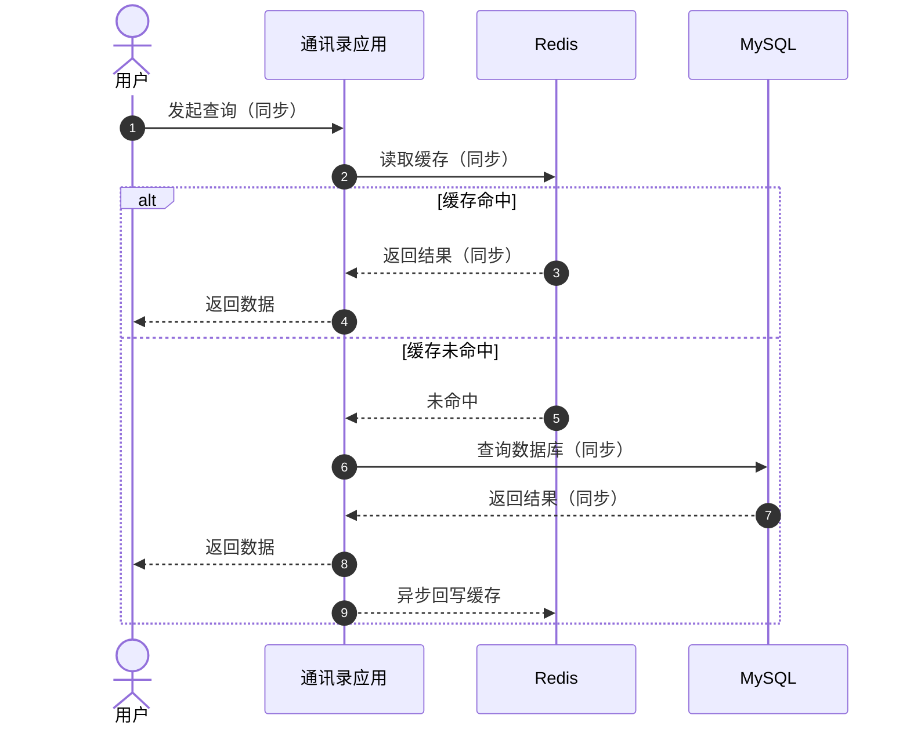

# 通讯录查询链路图

```mermaid
sequenceDiagram
    autonumber
    actor U as 用户
    participant A as 通讯录应用
    participant R as Redis
    participant M as MySQL

    U->>A: 发起查询（同步）
    A->>R: 读取缓存（同步）
    alt 缓存命中
        R-->>A: 返回结果（同步）
        A-->>U: 返回数据
    else 缓存未命中
        R-->>A: 未命中
        A->>M: 查询数据库（同步）
        M-->>A: 返回结果（同步）
        A-->>U: 返回数据
        A-->>R: 异步回写缓存
    end
```

