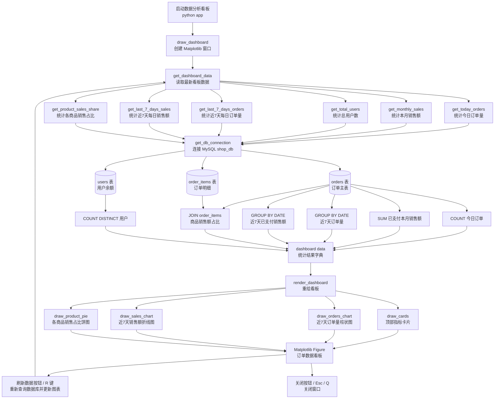

# DataAnalysis 订单数据看板

这是一个基于 `MySQL + Matplotlib` 的桌面数据分析小工具，用来从订单库里读取统计数据并渲染成可交互看板。

## 功能

- 统计今日订单量
- 统计本月已支付销售额
- 统计累计用户数
- 统计近 7 天订单量趋势
- 统计近 7 天销售额趋势
- 统计商品销售占比
- 支持按钮刷新数据
- 支持 `R` 刷新，`Esc` / `Q` 关闭窗口

## 项目结构

```text
DataAnalysis/
├─ app
├─ README.md
├─ data-analysis-flow.md
├─ data-analysis-flow.mmd
└─ .gitignore
```

## 链路图



更多细节可查看 [data-analysis-flow.md](./data-analysis-flow.md) 与 [data-analysis-flow.mmd](./data-analysis-flow.mmd)。

## 运行环境

- Python 3.10+
- MySQL 8.x
- `mysql-connector-python`
- `matplotlib`

## 安装依赖

```bash
pip install mysql-connector-python matplotlib
```

## 数据库配置

在 `app` 中修改数据库连接信息：

```python
DB_CONFIG = {
    'host': 'localhost',
    'user': 'root',
    'password': '123456',
    'port': 3307,
    'database': 'shop_db'
}
```

项目依赖以下核心表：

- `orders`
- `order_items`
- `users`

## 启动方式

```bash
python app
```

## 说明

- 图表数据每次都从数据库实时读取。
- 如果没有已支付订单，销售额和商品占比图会显示空状态。
- 如果数据库连接失败，程序会在控制台输出错误信息。
