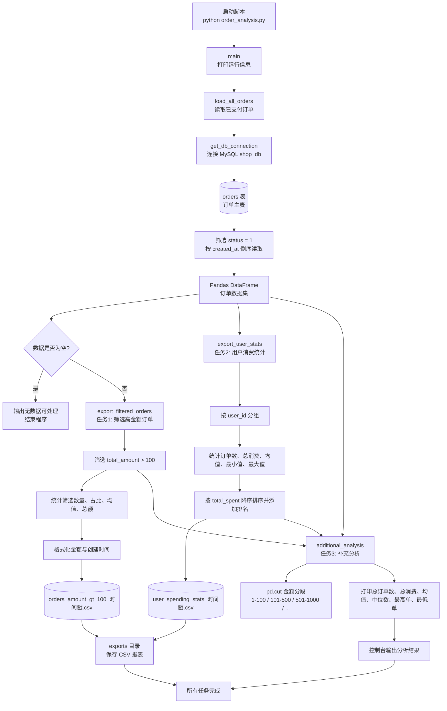

# OrderAnalysis 订单数据分析

这是一个基于 `MySQL + Pandas` 的订单分析脚本，用来从数据库读取已支付订单，完成筛选导出、用户消费统计和补充分析，并把结果输出到本地 CSV。

## 功能

- 读取 `shop_db.orders` 中已支付订单
- 筛选金额大于 100 的订单并导出 CSV
- 按用户分组统计消费情况并导出 CSV
- 生成订单金额分布和总体统计信息
- 输出结果到 `exports/` 目录

## 处理链路



更多细节见 [order-analysis-flow.md](./order-analysis-flow.md)。

## 运行环境

- Python 3.10+
- MySQL 8.x
- `mysql-connector-python`
- `pandas`

## 安装依赖

```bash
pip install mysql-connector-python pandas
```

## 数据库配置

在 `order_analysis.py` 中修改连接参数：

```python
DB_CONFIG = {
    'host': 'localhost',
    'user': 'root',
    'password': '123456',
    'port': 3307,
    'database': 'shop_db'
}
```

## 输出目录

脚本会自动创建 `exports/` 目录，用于保存导出的 CSV 文件。

## 启动方式

```bash
python order_analysis.py
```

## 说明

- 只处理 `orders.status = 1` 的已支付订单。
- 如果数据库里没有符合条件的数据，脚本会直接退出。
- 所有统计结果都以当前数据库内容为准。
