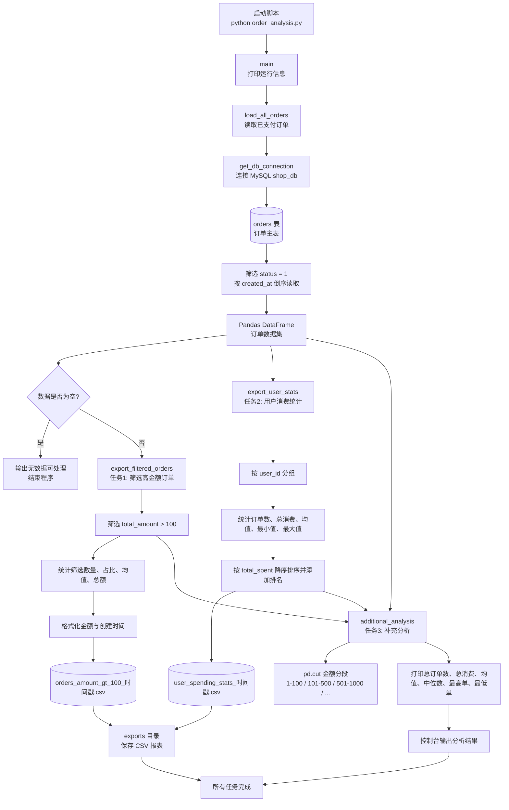

# 订单数据分析链路图

```mermaid
flowchart TD
    A["启动脚本<br/>python order_analysis.py"] --> B["main<br/>打印运行信息"]
    B --> C["load_all_orders<br/>读取已支付订单"]

    C --> D["get_db_connection<br/>连接 MySQL shop_db"]
    D --> E[("orders 表<br/>订单主表")]
    E --> F["筛选 status = 1<br/>按 created_at 倒序读取"]
    F --> G["Pandas DataFrame<br/>订单数据集"]

    G --> H{"数据是否为空?"}
    H -->|是| I["输出无数据可处理<br/>结束程序"]
    H -->|否| J["export_filtered_orders<br/>任务1: 筛选高金额订单"]

    J --> J1["筛选 total_amount > 100"]
    J1 --> J2["统计筛选数量、占比、均值、总额"]
    J2 --> J3["格式化金额与创建时间"]
    J3 --> J4[("orders_amount_gt_100_时间戳.csv")]

    G --> K["export_user_stats<br/>任务2: 用户消费统计"]
    K --> K1["按 user_id 分组"]
    K1 --> K2["统计订单数、总消费、均值、最小值、最大值"]
    K2 --> K3["按 total_spent 降序排序并添加排名"]
    K3 --> K4[("user_spending_stats_时间戳.csv")]

    G --> L["additional_analysis<br/>任务3: 补充分析"]
    J1 --> L
    K3 --> L
    L --> L1["pd.cut 金额分段<br/>1-100 / 101-500 / 501-1000 / ..."]
    L --> L2["打印总订单数、总消费、均值、中位数、最高单、最低单"]

    J4 --> M["exports 目录<br/>保存 CSV 报表"]
    K4 --> M
    L2 --> N["控制台输出分析结果"]
    M --> O["所有任务完成"]
    N --> O
```

本图对应的主程序是 [order_analysis.py](./order_analysis.py)。
