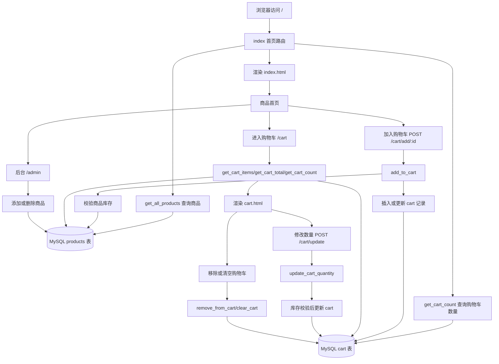

# ShoppingCart 购物车项目

这是一个基于 Flask + MySQL 的购物车项目，包含商品展示、商品详情、购物车增删改、购物车金额统计、后台商品管理和商品图片上传功能。

## 功能概览

- 商品首页：展示商品列表、价格、库存和购物车数量。
- 商品详情：展示商品图片、价格、库存、描述，并支持按数量加入购物车。
- 购物车页面：展示购物车商品、数量、小计、总价和商品总数。
- 数量更新：通过 AJAX 更新购物车数量，并实时刷新小计和总价。
- 删除商品：支持从购物车移除单个商品。
- 清空购物车：支持一键清空购物车。
- 后台管理：支持查看商品、添加商品、删除商品。
- 图片上传：添加商品时可上传本地图片，也可填写图片 URL。

## 技术栈

- Python
- Flask
- Jinja2
- MySQL
- mysql-connector-python
- 原生 HTML/CSS/JavaScript

## 目录结构

```text
ShoppingCart/
├── app
├── requirements.txt
├── README.md
├── .gitignore
├── docs/
│   └── shopping-cart-flow.md
├── static/
│   └── images/
│       └── .gitkeep
└── templates/
    ├── admin.html
    ├── admin_add.html
    ├── base.html
    ├── cart.html
    ├── index.html
    └── product_detail.html
```

## 链路图

完整 Mermaid 链路图见：[docs/shopping-cart-flow.md](docs/shopping-cart-flow.md)



## 数据库配置

数据库连接配置在 `app` 文件的 `DB_CONFIG` 中：

```python
DB_CONFIG = {
    "host": "localhost",
    "user": "root",
    "password": "123456",
    "port": 3307,
    "database": "shop_db"
}
```

需要根据本机 MySQL 环境调整用户名、密码、端口和数据库名。

## 数据表建议

项目代码依赖 `users`、`products`、`cart`、`orders` 和 `order_items` 表。可参考以下结构：

```sql
CREATE TABLE users (
    id INT PRIMARY KEY AUTO_INCREMENT,
    username VARCHAR(100) NOT NULL,
    password VARCHAR(255),
    email VARCHAR(255),
    role VARCHAR(50) NOT NULL DEFAULT 'user',
    balance DECIMAL(10, 2) NOT NULL DEFAULT 0,
    created_at TIMESTAMP DEFAULT CURRENT_TIMESTAMP
);

CREATE TABLE products (
    id INT PRIMARY KEY AUTO_INCREMENT,
    name VARCHAR(255) NOT NULL,
    price DECIMAL(10, 2) NOT NULL DEFAULT 0,
    stock INT NOT NULL DEFAULT 0,
    image_url VARCHAR(500),
    description TEXT,
    created_at TIMESTAMP DEFAULT CURRENT_TIMESTAMP
);

CREATE TABLE cart (
    id INT PRIMARY KEY AUTO_INCREMENT,
    product_id INT NOT NULL,
    quantity INT NOT NULL DEFAULT 1,
    created_at TIMESTAMP DEFAULT CURRENT_TIMESTAMP,
    FOREIGN KEY (product_id) REFERENCES products(id)
);

CREATE TABLE orders (
    id INT PRIMARY KEY AUTO_INCREMENT,
    order_no VARCHAR(64) NOT NULL UNIQUE,
    user_id INT NOT NULL,
    total_amount DECIMAL(10, 2) NOT NULL DEFAULT 0,
    status TINYINT NOT NULL DEFAULT 0 COMMENT '0待支付 1已支付 2已取消 3已完成',
    remark VARCHAR(500),
    created_at TIMESTAMP DEFAULT CURRENT_TIMESTAMP,
    FOREIGN KEY (user_id) REFERENCES users(id)
);

CREATE TABLE order_items (
    id INT PRIMARY KEY AUTO_INCREMENT,
    order_id INT NOT NULL,
    product_id INT NOT NULL,
    product_name VARCHAR(255) NOT NULL,
    product_price DECIMAL(10, 2) NOT NULL DEFAULT 0,
    quantity INT NOT NULL DEFAULT 1,
    subtotal DECIMAL(10, 2) NOT NULL DEFAULT 0,
    created_at TIMESTAMP DEFAULT CURRENT_TIMESTAMP,
    FOREIGN KEY (order_id) REFERENCES orders(id),
    FOREIGN KEY (product_id) REFERENCES products(id)
);

INSERT INTO users (id, username, balance)
VALUES (1, '默认用户', 1000.00)
ON DUPLICATE KEY UPDATE username = VALUES(username);
```

## 运行方式

1. 安装依赖：

   ```bash
   pip install -r requirements.txt
   ```

2. 准备 MySQL 数据库和数据表。

3. 按本机环境修改 `app` 中的 `DB_CONFIG`。

4. 启动项目：

   ```bash
   python app
   ```

5. 浏览器访问：

   ```text
   http://127.0.0.1:5000
   ```

## 主要路由

| 路由 | 方法 | 说明 |
| --- | --- | --- |
| `/` | GET | 商品首页 |
| `/product/<product_id>` | GET | 商品详情 |
| `/cart` | GET | 购物车页面 |
| `/cart/add/<product_id>` | POST | 加入购物车 |
| `/cart/update` | POST | 更新购物车数量 |
| `/cart/remove/<cart_id>` | POST | 移除购物车商品 |
| `/cart/clear` | POST | 清空购物车 |
| `/admin` | GET | 后台商品列表 |
| `/admin/add` | GET/POST | 添加商品 |
| `/admin/delete/<product_id>` | POST | 删除商品 |

## 版本管理说明

仓库已通过 `.gitignore` 排除以下内容：

- Python 缓存文件
- 虚拟环境目录
- 本地环境变量文件
- 编辑器配置
- 日志和临时文件
- 上传生成的商品图片
- 本地导出文件和压缩包

`static/images/.gitkeep` 用来保留图片上传目录，实际上传图片不会提交到仓库。
