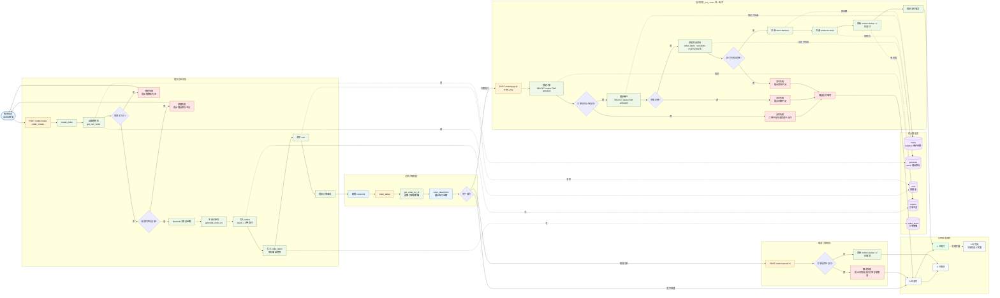

# 结算支付链路图

```mermaid
flowchart LR
    Start([购物车页<br/>点击去结算])

    subgraph Submit[提交订单阶段]
        S1[POST /order/create<br/>order_create]
        S2[create_order]
        S3[读取购物车<br/>get_cart_items]
        S4{购物车为空?}
        S5{创建时库存足够?}
        S6[Decimal 计算总金额]
        S7[生成订单号<br/>generate_order_no]
        S8[写入 orders<br/>status = 0 待支付]
        S9[写入 order_items<br/>保存商品快照]
        S10[清空 cart]
        S11[提交订单事务]
        SF1[创建失败<br/>提示购物车为空]
        SF2[创建失败<br/>提示商品库存不足]

        S1 --> S2 --> S3 --> S4
        S4 -->|是| SF1
        S4 -->|否| S5
        S5 -->|否| SF2
        S5 -->|是| S6 --> S7 --> S8 --> S9 --> S10 --> S11
    end

    subgraph Detail[订单详情阶段]
        D1[跳转 /order/:id]
        D2[order_detail]
        D3[get_order_by_id<br/>读取订单和明细]
        D4[order_detail.html<br/>展示应付金额]
        D5{用户操作}

        D1 --> D2 --> D3 --> D4 --> D5
    end

    subgraph Pay[支付阶段: pay_order 同一事务]
        P1[POST /order/pay/:id<br/>order_pay]
        P2[锁定订单<br/>SELECT orders FOR UPDATE]
        P3{订单存在且待支付?}
        P4[锁定用户<br/>SELECT users FOR UPDATE]
        P5{余额足够?}
        P6[锁定商品库存<br/>order_items + products FOR UPDATE]
        P7{支付时库存足够?}
        P8[扣减 users.balance]
        P9[扣减 products.stock]
        P10[更新 orders.status = 1<br/>已支付]
        P11[提交支付事务]
        PF1[支付失败<br/>订单不存在或状态不允许]
        PF2[支付失败<br/>提示余额不足]
        PF3[支付失败<br/>提示库存不足]
        PR[回滚支付事务]

        P1 --> P2 --> P3
        P3 -->|否| PF1 --> PR
        P3 -->|是| P4 --> P5
        P5 -->|否| PF2 --> PR
        P5 -->|是| P6 --> P7
        P7 -->|否| PF3 --> PR
        P7 -->|是| P8 --> P9 --> P10 --> P11
    end

    subgraph Cancel[取消订单阶段]
        C1[POST /order/cancel/:id]
        C2{订单是否待支付?}
        C3[更新 orders.status = 2<br/>已取消]
        CF[取消失败<br/>提示只有待支付订单才能取消]

        C1 --> C2
        C2 -->|是| C3
        C2 -->|否| CF
    end

    subgraph Data[核心数据表]
        TUser[(users<br/>balance 用户余额)]
        TProduct[(products<br/>stock 商品库存)]
        TCart[(cart<br/>购物车)]
        TOrder[(orders<br/>订单主表)]
        TItem[(order_items<br/>订单明细)]
    end

    subgraph Status[订单状态流转]
        ST0[0 待支付]
        ST1[1 已支付]
        ST2[2 已取消]
        ST3[3 已完成<br/>当前仅定义文案]
        ST0 --> ST1
        ST0 --> ST2
        ST1 -.后续扩展.-> ST3
    end

    Start --> S1
    S11 --> D1
    SF1 --> Start
    SF2 --> Start
    D5 -->|立即支付| P1
    D5 -->|取消订单| C1
    D5 -->|暂不处理| ST0
    P11 --> ST1
    PR --> ST0
    C3 --> ST2
    CF --> ST0

    S3 -.读.-> TCart
    S3 -.读.-> TProduct
    S8 -.写.-> TOrder
    S9 -.写.-> TItem
    S10 -.清空.-> TCart
    P2 -.锁定.-> TOrder
    P4 -.锁定并扣减.-> TUser
    P6 -.锁定并校验.-> TProduct
    P8 -.扣余额.-> TUser
    P9 -.扣库存.-> TProduct
    P10 -.改状态.-> TOrder

    classDef page fill:#e8f4ff,stroke:#2f6fab,color:#111;
    classDef route fill:#fff3d6,stroke:#b77800,color:#111;
    classDef logic fill:#eef7e8,stroke:#3c7d22,color:#111;
    classDef data fill:#f3e8ff,stroke:#805ad5,color:#111;
    classDef fail fill:#ffe6e6,stroke:#c53030,color:#111;
    classDef success fill:#e6ffed,stroke:#2f855a,color:#111;
    classDef status fill:#f7fafc,stroke:#4a5568,color:#111;

    class Start,D1,D4 page;
    class S1,D2,P1,C1 route;
    class S2,S3,S6,S7,S8,S9,S10,S11,D3,P2,P4,P6,P8,P9,P10,P11,C3 logic;
    class TUser,TProduct,TCart,TOrder,TItem data;
    class SF1,SF2,PF1,PF2,PF3,PR,CF fail;
    class ST1 success;
    class ST0,ST2,ST3 status;
```
