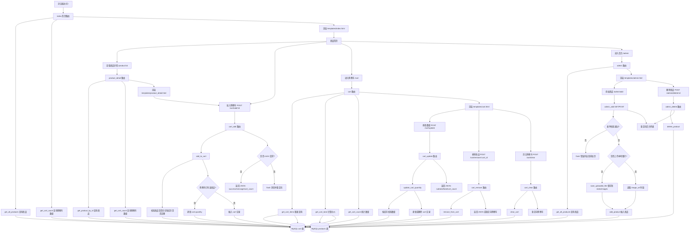

# ShoppingCart 链路图

## 链路说明

- 前台链路围绕商品首页、商品详情和购物车操作展开。
- 购物车核心数据来自 `cart` 表，并通过 `products` 表补齐名称、价格、库存、图片等展示字段。
- 加入购物车和修改数量都会做库存校验，避免购物车数量超过商品库存。
- 后台链路负责商品新增和删除，本地上传图片会写入 `static/images/`，数据库保存图片路径。
