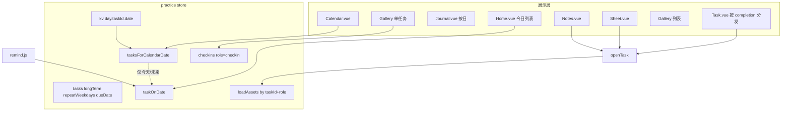
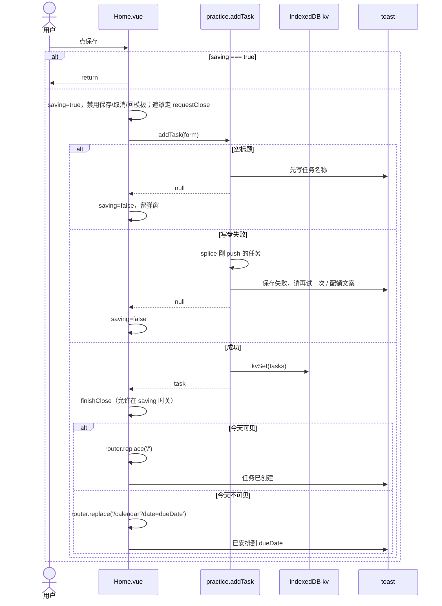
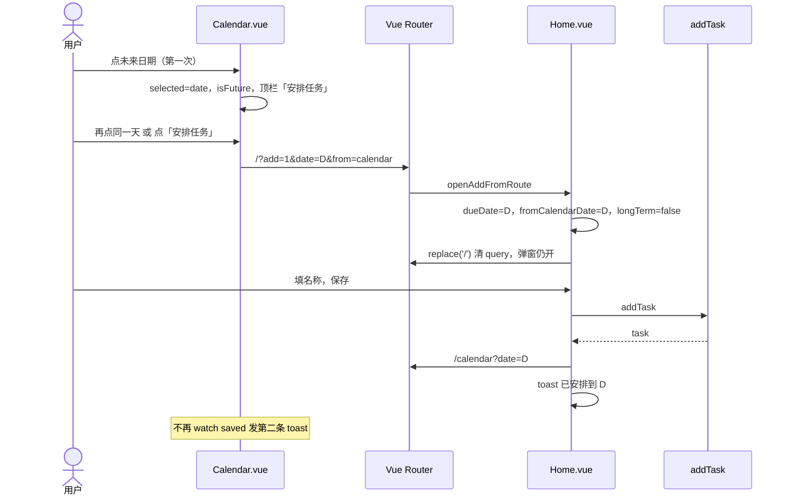
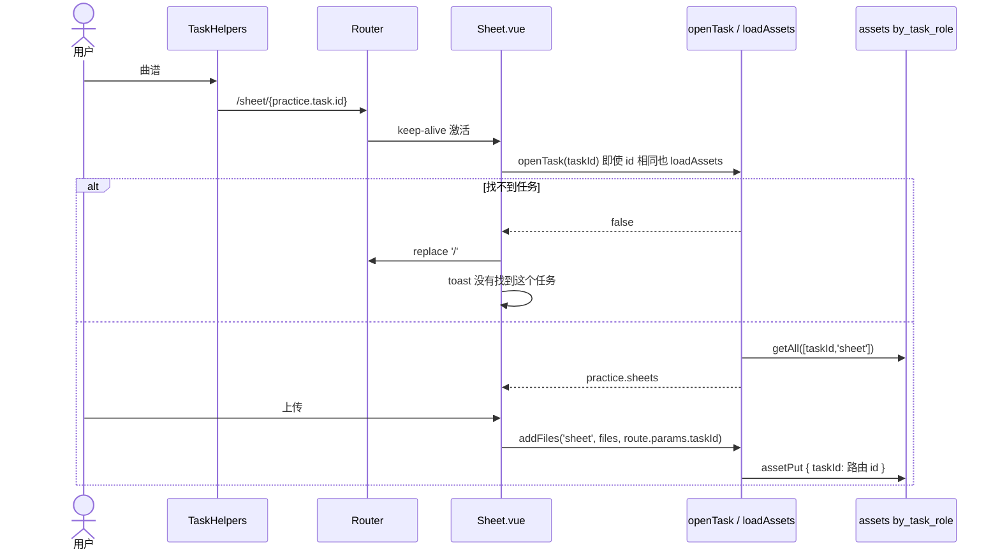
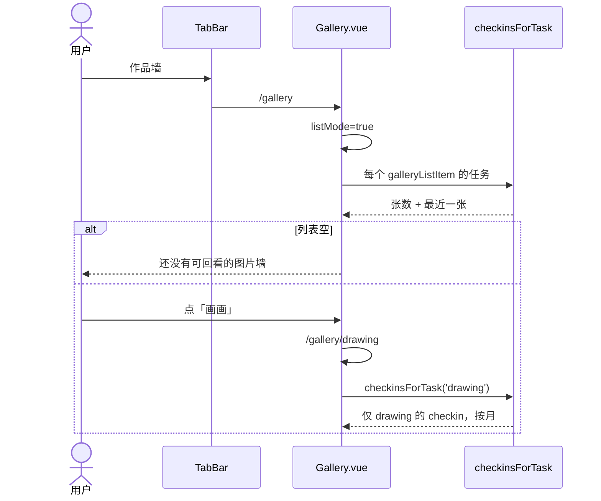
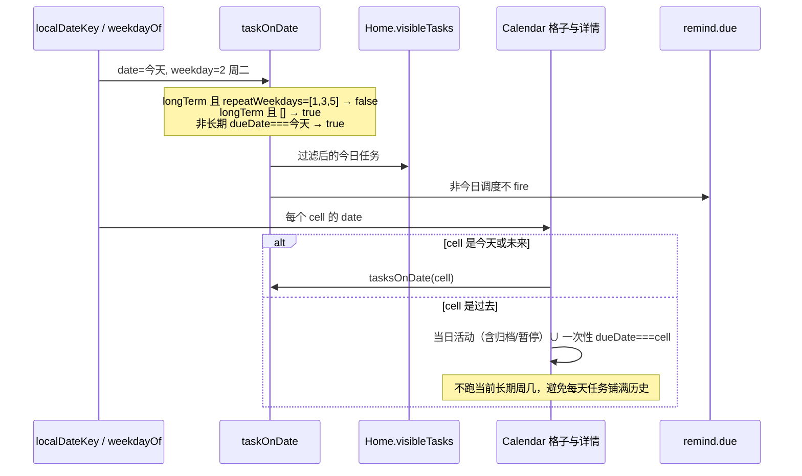

# 日课（rike）五问题完善方案

| 项 | 内容 |
|---|---|
| 文档类型 | 产品 + 工程设计 |
| 版本 | v1.3 |
| 日期 | 2026-08-25 |
| 作者 | 工程（设计稿） |
| 状态 | Draft |
| 修订 | v1.3：日历选中日必须有「每天小汇总」（今天/过去/未来都罗列做了什么、还要做什么）；v1.2 的日记/安排任务是顶栏主按钮，不能顶掉这份列表 |
| 代码根目录 | `/Users/mac/项目/personal-projects/rike` |
| 前置文档 | `docs/01-需求分析.md`、`docs/02-PRD.md`、`docs/03-技术方案.md`、`docs/04-云同步.md` |

---

## Overview

日课已经从「吉他练习台」扩成多任务私人日课：首页任务列表、日历、日记、曲谱、笔记、图片打卡作品墙、长期任务与周几重复、可选云同步。用户反馈的五件事——曲谱退出后再进消失、日历过去/未来行为不明显、创建任务保存后像没跳转且可能重复创建、作品墙串任务、长期任务要按周几出现——**方向都对，但原稿把若干已落地的骨架当成「还没做」**。

对照 2026-08-25 的源码，这五件事在 `src/stores/practice.js`、`src/pages/Home.vue`、`src/pages/Calendar.vue`、`src/pages/Sheet.vue`、`src/pages/Gallery.vue`、`src/router/index.js` 里都已有第一轮实现。本方案的工作不是从零重写，而是：

1. 用代码核实每条诊断，保留对的、修正错的、补全原稿没写清的产品规则。
2. 把日历三种日期模式、保存防重、长期任务周几、曲谱/作品墙按任务绑定做成**可验收的完整规则**。
3. 修掉仍然会让用户觉得「图丢了 / 存了两份 / 进错墙」的剩余缺口（可选路由、Sheet keep-alive 竞态、`addFiles` 绑定全局 `practice.task`、作品墙资格过宽、过去日被当前长期课表改写或污染、保存失败内存已 push、双 toast、日历 `today` 冻在 setup 等）。

---

## Background & Motivation

### 当前产品形态

底部 Tab：主页 / 日记 / 日历 / 作品墙（`src/components/TabBar.vue`）。任务详情按 `completion` 分发（`src/pages/Task.vue`）：

- `counter` → `RichTask.vue`（计数 + `TaskHelpers`）
- `photo-log` → `Draw.vue`（图片打卡）
- `check` → `CheckTask.vue`

资源按任务隔离存储已经是 IndexedDB 的事实：

- `assets` 索引 `by_task_role = [taskId, role]`（`src/db/index.js`）
- `role`：`sheet` | `note` | `helper-image` | `checkin` | `journal`
- 每日进度：`kv["day.{taskId}.{YYYY-MM-DD}"]`
- 日记文字：`kv["journal.{date}"]`（按**日**，不按任务）

### 痛点（用户原话 vs 实际）

用户在用的过程中仍会碰到：从 A 任务进曲谱上传，再从别处进 `/sheet` 以为谱丢了；在日历点过去/未来日期，不知道能补日记还是能安排任务；首页弹窗保存后如果人已经在首页，没有「已创建」的明确闭环，连点会再造一条；作品墙入口曾经像默认某一任务；长期任务希望只在周一三五出现。

这些有的已经做了半截，有的规则互相打架，有的只在 UI 拦、store 仍接受任意日期写入。不把规则写死，下一轮会继续改出新的串台。

### 代码里已经存在、原稿未承认的骨架

| 原稿以为还没有 | 实际位置 |
|---|---|
| `/sheet/:taskId?`、`/notes/:taskId?` | `src/router/index.js` |
| 曲谱按钮跳当前任务 | `TaskHelpers.vue`：`router.push(\`/sheet/${practice.task.id}\`)` |
| 进曲谱先 `openTask` | `Sheet.vue` `syncTaskFromRoute()` |
| 日历过去/未来文案与「安排任务」「写日记」 | `Calendar.vue`：`isFuture` / `isToday` / `canEditJournal` / `canCompleteTasks` |
| 保存 `saving` + 禁用 +「保存中」 | `Home.vue` `saveEditor()` |
| 从日历创建后回日历 + toast | `goHomeAfterSave()` + `query.saved` |
| `repeatWeekdays` + 周几筛选 | `practice.taskOnDate()`、`weekdayOf()`、首页编辑器「重复」 |
| `/gallery` 列表 + `/gallery/:taskId` | `Gallery.vue` `listMode` |
| 提醒走 `taskOnDate` | `src/utils/remind.js` `due()` |
| 云同步整份 `tasks` jsonb（含 `longTerm` / `repeatWeekdays` / `dueDate`） | `src/stores/sync.js` `push()` / `rike_meta.tasks` |

本方案下面各节先写「核实结论」，再写「目标规则」和「剩余改动」。

---

## Goals & Non-Goals

### Goals

- 曲谱、乐理笔记、插入图片（`helper-image`）始终按 `taskId` 读写；用户不会因为换了一个当前任务而以为谱丢了。
- 日历对**今天 / 过去 / 未来**三种模式有固定能力矩阵。**点未来日期 = 给那天安排任务；点过去或今天 = 写/打开当天日记。** 过去不可补打卡；未来不可执行、不可写日记。今天新建任务不走日历，只走首页 FAB。
- 创建/编辑任务：一次点击最多创建一条；保存中按钮不可用；成功有且仅有一条 toast；导航目标明确（首页或日历选中日）。
- 作品墙先出任务列表，再进该任务自己的 `checkin` 墙；练画看不到健身打卡图。
- 长期任务 `repeatWeekdays` 规则在首页、日历格子/当日列表、提醒三处一致。
- 旧链接 `/sheet`、`/gallery`、`/notes` 可预测地重定向，不丢数据。
- 不改云端表结构；`repeatWeekdays` 继续活在 `rike_meta.tasks` jsonb 里。

### Non-Goals

- 不做任务的「按日实例」表。长期任务仍是一条 task + 按日 `day.*` 记录，没有「只改某周五这一次」的 exception date。
- 不把 helper `images` 组件的参考图当成作品墙（见 Key Decisions）。
- 不自动合并用户已经重复创建出来的任务。
- 不同步曲谱/打卡/日记图片（维持 `docs/04-云同步.md`）。
- 不引入测试框架（`package.json` 只有 `dev` / `build` / `preview`）；验收靠每 PR 的手动清单。
- 不改第一期吉他手势、标注坐标、备份文件 `app: "rike"` 格式（备份 version 保持 3，kv 里的任务字段向前兼容）。
- 不把日记改成按任务绑定。日记继续按本地日。

---

## 核实：五条诊断对照代码

### 问题 1：上传曲谱退出再进入消失

**原稿判断（部分正确，已过时）：** 图没丢，是全局 `practice.task` 串台。要把 `/sheet` 改成任务绑定。

**代码事实：**

- 图确实按任务存。`addFiles()` 写入 `asset.taskId = practice.task.id`，`loadAssets()` 调 `db.assetsByRole(practice.task.id, 'sheet' | 'note' | 'helper-image')`。IndexedDB 不会因为换任务删掉旧谱。
- 路由已经是 `/sheet/:taskId?`，不是全局死 `/sheet`。`TaskHelpers` 已带 id。
- `Sheet.vue` / `Notes.vue` 的 `syncTaskFromRoute()`：

```js
const id = String(route.params.taskId || '')
if (id && id !== practice.task.id) await openTask(id)
else await ensureToday()
```

**诊断补全——图「消失」的真实剩余路径：**

1. **`taskId` 仍是可选。** 打开 `#/sheet`（旧书签、手改 hash、技术方案原文 `#/sheet/:taskId?`）时 `id` 为空，函数走 `ensureToday()`，继续展示**当时** `practice.task` 的谱。从吉他进谱再去画画任务，再进无 id 的 `/sheet`，谱变成画画的（常常是 0 页）。用户以为吉他谱丢了。吉他谱仍在 `assets` 里。
2. **`openTask` 失败被忽略。** `openTask` 找不到 id 时 `return false`（`Task.vue` 会 `router.replace('/')`，Sheet/Notes 不会）。界面继续显示上一任务的 `practice.sheets`。
3. **`addFiles` / `loadAssets` 只信全局 `practice.task.id`，不信路由。** Sheet 是 `keep-alive`（`App.vue` `include="Home,Journal,Calendar,Sheet"`）。从 `#/sheet/guitar` 快切到 `#/sheet/{other}` 时，若用户在 `openTask` await 结束前选图，新页会写到旧 `taskId`，随后 `loadAssets()` 又换成新任务列表——表现就是「刚传的谱没了」。Notes **不是** keep-alive（无 `meta.keep`，也不在 `include` 里），同路径的竞态弱得多；但 `Notes.vue` / `NotesOverlay.vue` 同样调用 `addFiles('note', files)` 不传 id。Overlay 从曲谱页打开时仍吃全局 `practice.task`，必须和 Sheet 一起改调用方，不要写成「Notes 也有 keep-alive 竞态」。
4. **同 id 时不重新 `loadAssets`。** `id === practice.task.id` 只 `ensureToday()`。多数情况没事；若外部改过 assets 或 keep-alive 期间 `practice.sheets` 被别的 `openTask` 换掉再换回来，依赖 `openTask` 是否被调用。
5. **空状态文案缺失。** 0 页时只有「上传曲谱」按钮，没有「这是任务 X 的谱墙」。用户更难判断现在看的是哪一个任务。`Notes.vue` 空态同样只有按钮、没有正文。

**结论：** 「按任务存、路由带 taskId」已经做了；要修的是**必填 taskId、失败回退、上传绑定路由 id、空状态标明任务**。数据丢失不是主因，串台才是。不能完全排除用户清过缓存或配额满（`quotaMessage`）导致真丢，那种必须有 toast，与串台分开处理。

### 问题 2：日历切换日期补过去日记 / 设置未来任务不明显

**原稿判断（方向对，实现已有大半）：** 过去回看+补日记、禁止补打卡；未来安排任务、禁止执行。

**代码事实（`Calendar.vue`）：**

| 能力 | 现状 |
|---|---|
| 选中日 | `selected`，写入 `?date=` |
| 未来 | `selected > today`（字符串比较 `YYYY-MM-DD`，合法） |
| 安排任务 | `addTaskForSelected()` → `/?add=1&date={selected}&from=calendar` |
| 日记 | `canEditJournal = selected <= today`，「写日记 / 打开日记」→ `/journal/{date}` |
| 完成/勾子/上传 | `canCompleteTasks = selected === today` |
| 未来说明 | 「未来日期只做计划，明天到来后再执行。」 |
| 过去说明 | 「过去日期用于回看和补写日记，暂不补打卡。」 |
| 未来默认 dueDate | `Home.openAdd()`：`form.dueDate = route.query.date`，`longTerm = false` |

**诊断补全——仍然含糊或错误的点：**

1. **「当天任务记录」= 当前调度，不是历史。** `selectedTasks = tasksOnDate(selected)`，`taskOnDate` 排除 `archived` / `paused`，长期任务还按**现在**的 `repeatWeekdays` 滤。改周几或归档后，过去某天实际练过的记录在 `day.*` 和 `checkin` 里还在，日历当日列表却消失。反向也危险：若过去日继续跑当前 `taskOnDate`，`repeatWeekdays=[]` 的每天任务会铺满所有历史日，状态经常是「未完成」。任务对象没有 `createdAt`，无法按「任务存在的那天」截断。
2. **过去日期不能打开任务，这是对的，但没写原因。** `Task.vue` / `RichTask` / `Draw` / `CheckTask` 全部读写 `practice.date`（今天）。从过去日 `router.push('/task/'+id)` 会让用户在「今天」上误操作。当前 UI 只在 `isToday` 给「打开任务」，且 **check 无子任务走 `v-else`，今天也没有「打开任务」、未来也没有「调整安排」**，只有行内勾子。
3. **日历 `today` 冻在 setup。** `const today = localDateKey()`（`Calendar.vue` 约第 29 行），组件又是 keep-alive。跨日或挂后台过夜后 `isToday` / `isFuture` / `canCompleteTasks` 全是旧值：真今天会被当成未来（出现「安排任务」），昨天会被当成今天（UI 允许补打卡）。`App.vue` 的 `visibilitychange → ensureToday` 只刷新 `practice.date`，不刷新这个闭包。
4. **日历缩略图点击打开 `PhotoViewer`，不是作品墙。** 「查看作品墙」是另外的按钮，且只在当天该任务 `record.count` 有值时出现。当天无图但历史有图时，过去日既没有墙按钮也没有打开任务。
5. **Store 不守日期。** `toggleSubtask` / `toggleCheckOnDate` / `addCheckins(..., date)` 接受任意 `date`。`addCheckins` 默认参数在 `ensureToday()` **之前**用调用时的 `practice.date` 求值；`Draw.vue` 还显式传入 `practice.date`。跨日后会把图写到昨天，随后内存切到今天，表现像「刚传的打卡没了」。`saveJournalText` / `addJournalPhotos` 同样不拒未来日。
6. **过去日 checkin 的 PhotoViewer 默认可删**（`deletable` 默认 true），等于允许改写历史完成态。
7. **「调整安排」改的是整条任务**，不是「只改这一天」。长期任务尤其容易让人以为在改单次实例。
8. **从日历进新建后取消，人被丢在首页**（`openAddFromRoute` 立刻 `router.replace('/')`）。
9. **双 toast：** 保存侧 `已安排到 {dueDate}`，日历 watch `query.saved` 再 `已保存到 {selected}`。`ui.toast` 只有一格，后者覆盖前者。
10. **格子点击和顶栏按钮抢语义。** 现网点格子只选中；未来和过去/今天的按钮可以同时出现在不同日期，但今天没有「这是日记入口、新建请回首页」的说明。v1.2 把格子二次点击和顶栏主按钮收成互斥的两种日期语义。

### 问题 3：创建任务保存后没有明确回首页，可能重复创建

**原稿判断（曾经对，现在大半已做，仍有洞）：**

已有：`saving` ref、`if (saving.value) return`、按钮 `:disabled="saving"`、文案「保存中」、成功 toast「任务已创建」/「已安排到 {date}」、`goHomeAfterSave()`。

**仍会重复创建 / 看起来没保存的路径：**

1. **`addTask` 先 `practice.tasks.push(task)` 再 `await saveTasks()`。** `saveTasks` 抛错（配额、IndexedDB）时内存里已经有一条。用户看到失败（如果有）再按保存，会再 push 一条。`saveEditor` 没有 `catch`，只有 `finally { saving = false }`。
2. **首页创建 dueDate 为未来的一次性任务：** toast「任务已创建」，列表 `visibleTasks()` = `tasksOnDate(practice.date)`，新任务今天不可见。用户以为没存，再按一次。从日历来的会回日历，从首页 FAB 改了完成日期的不会。
3. **保存中仍可点遮罩关闭。** `closeEditor()` 会把 `saving` 置 false，后台 `addTask` 仍在跑，回来可能再点一次。
4. **空标题：** `addTask` toast「先写任务名称」并 `return null`，弹窗留下，行为正确。
5. **人已经在首页时 `router.replace('/')` 无感知。** 关弹窗 + toast 就是闭环；不需要假跳转动画。缺的是「新任务今天不可见时不要只回首页」。

### 问题 4：作品墙要按图片打卡任务独立

**原稿判断（方向对，资格条件过宽）：** `/gallery/:taskId`、Tab 先进列表。

**代码事实：** `Gallery.vue` 无 `taskId` 走 `listMode`；TabBar `goGallery()` → `/gallery`；`Draw.vue` / 日历有「查看作品墙」。墙内容是 `checkinsForTask(taskId)`（`role === 'checkin'`）。

**剩余问题：**

1. **`hasImageWall` = `completion === 'photo-log' || components.includes('images')`。** 默认吉他任务 `components` 含 `images`（`DEFAULT_RICH_COMPONENTS`），健身模板也是。它们的图是 `helper-image`，不是 `checkin`。列表会出现「练习吉他 · 还没有图片」空墙，和作品墙产品语义不符。
2. **归档任务不过滤。** 归档后的练画墙应该还能回看；空的归档 photo-log 可以不占列表。当前是「有 images 组件就出」，归档空墙也会出。
3. **`Draw.vue` 的「查看作品墙」只在 `todayPhotos.length` 时显示**，历史上传过、今天还没传的任务详情看不到入口。
4. **无效 `taskId`：** 空状态「没有找到这个任务」已有。
5. **`checkinsForTask('')` 在 `!taskId` 时返回全部 checkin。** `listMode` 不用 `rows`，现在安全；若以后有人在列表模式复用 `rows` 会混墙。应改成「无 id 返回 []」。

### 问题 5：长期任务设置周几

**原稿判断（当作新字段）与代码不符。** 字段、归一化、筛选、编辑器、提醒、文档、默认任务都已经在。

| 层 | 现状 |
|---|---|
| 字段 | `task.longTerm: boolean`，`task.repeatWeekdays: number[]` |
| 归一化 | `normalizeTask()`：去重、`Math.round`、只留 `1..7` |
| 缺省 | 无 `longTerm` 键时 `longTerm = !task.dueDate`；`repeatWeekdays` 缺省 `[]` |
| 显示 | `taskOnDate`：非长期看 `dueDate`；长期且空数组 → 每天；长期且有值 → `weekdays.includes(weekdayOf(date))` |
| 周序 | `weekdayOf`：`date.getDay() \|\| 7`（周日 0→7），本地 `new Date(y, m-1, d)` |
| UI | 长期开关下「重复」一二三四五六日，空选择文案「每天出现」 |
| 首页 | `visibleTasks()` → `tasksOnDate(practice.date)` |
| 日历 | 格子与列表都 `tasksOnDate(cell)` |
| 提醒 | `due()` 第一句 `if (!taskOnDate(task, date)) return false` |
| 云 | 整份 tasks 写入 `rike_meta.tasks`，无单独列 |
| 迁移 | `schemaVersion >= 3` 即跳过；`< 3` 时 `map(normalizeTask)` |

**剩余问题：** 不是「没有字段」，而是过去日仍在跑当前 `taskOnDate`（会藏历史、也会把每天任务刷进所有过去日）、任务详情深链、store 日期闸门、文案还没锁死（见 Proposed Design 1.2 / 3.2）。

### 建议修改顺序（维持原稿，代码不强迫调整）

| 序 | 主题 | 为何仍按此序 |
|---|---|---|
| 1 | 保存防重 + toast + 回跳 | 最小、直接影响「以为没存又建一条」。**同一 PR 删掉日历 `saved` toast**，否则单独上线仍是双提示。日历「安排任务」的返回也走 `Home.saveEditor`。 |
| 2 | 日历过去/未来能力矩阵 | 产品感知第二强。只改显隐/文案/`today` computed，**列表仍用现有 `tasksOnDate`**，不碰并集、不接 store 闸门。依赖 PR1 的返回/toast 单一事实源。 |
| 3 | 长期任务周几 + 过去日列表 + store 日期闸门 | `taskOnDate` 已存在；PR3 换成 `tasksForCalendarDate`（过去=活动∪一次性，不套当前长期课表）、`assertMutableDay` / 日记未来闸门、周几文案锁死。放在日历 UI 规则之后，避免 PR2 再打一遍列表。 |
| 4 | 曲谱隔离 + 作品墙 | 同属「资源按任务绑定」，可一起。不阻塞 1–3。 |

没有反向依赖（例如周几不依赖曲谱路由）。**不调整产品顺序**；PR 边界按上表切开，避免 toast / 并集 / 闸门跨 PR 泄漏。

---

## Key Decisions

1. **本轮是补齐与硬化，不是从零做五件事。** 已有 API 能用的继续用（`taskOnDate`、`addTask`、`openTask`、`saving`），只改缺口。
2. **曲谱/笔记路由保持兄弟路由，不嵌套进 `/task/:id`。** 目标形态：`/sheet/:taskId`、`/notes/:taskId`（`taskId` **必填**）。Sheet 全屏无 Tab（`meta.tab` 未设），`Task.vue` 又是按 `completion` 整页切换，嵌套 `/task/:id/sheet` 要拆 `router-view`，收益只是 URL 形状。旧 `/sheet`、`/notes` 做 redirect。
3. **作品墙：`/gallery` 列表 + `/gallery/:taskId` 单墙。** 与原稿一致，已经是这条，保持。
4. **作品墙列表谓词只有一个：`galleryListItem(task)` = `(completion==='photo-log' && !archived && !paused) || checkinsForTask(task.id).length > 0`。** 不含仅有 helper `images` 的计数/健身任务。空归档、空暂停 photo-log 都不进列表（回归档箱）。归档/暂停**仅当已有 checkin** 才出现，并标 `已归档` / `已暂停`。空的未归档、未暂停 photo-log 仍出卡（`还没有图片`），方便发现入口。
5. **日历「查看作品墙」与缩略图拆开，三种日期同一规则：** 只要 `taskHasGallery(task)`（`photo-log` 或已有 checkin），过去 / 今天 / 未来都显示「查看作品墙」。缩略图仍**只**来自该日 `checkinsOn(date, taskId)`，点开当天 PhotoViewer，不跳进按月墙。
6. **「安排任务」只从日历未来日期进来，默认一次性任务**：`longTerm=false`，`dueDate=选中未来日`。今天和过去的日历不提供这个入口。`form.longTerm` 从 false→true 时，**仅当 `repeatWeekdays` 为空**才预勾 `weekdayOf(form.dueDate)`；已有多选不覆盖。true→false 仍把周几清成 `[]`（保存时已是 `form.longTerm ? form.repeatWeekdays : []`）。不要在 `openAdd()` 里预勾一次就结束——日历进来时长期是 false，预勾必须发生在用户后来勾选的那一下。
7. **保存后导航：**
   - 从日历来（`from=calendar`）→ 回 `/calendar?date=`，toast `已安排到 YYYY-MM-DD`（编辑则 `已更新到 YYYY-MM-DD`）。**不再带 `saved=1`。**
   - 其他，且新任务**今天可见**（`taskOnDate(task, today)`）→ 关弹窗留在 `/`，toast `任务已创建`。
   - 其他，今天不可见（未来一次性等）→ `/calendar?date=dueDate`，toast `已安排到 YYYY-MM-DD`。
8. **toast 单一事实源在 `saveEditor`。** PR1 **同时**让 Home 不再写 `saved=1`，并删除 `Calendar.vue` 对 `query.saved` 的 toast watch。禁止把「删第二条 toast」留到 PR2。
9. **过去日期不进入 `/task/:id`。** 详情永远是今日。过去只在日历看记录。墙入口见 Decision 5，与是否有当天缩略图无关。
10. **执行类写入只允许 `date === localDateKey()`（在 `ensureToday()` 之后取）。** store 拒绝补打卡、补勾子、补传/删 checkin。`bump` / `toggleCheck` 无 date 参数：先 `ensureToday()`，写的就是新的今天；调用方不得把跨日前的 `practice.date` 再传进来。日记文字/日记图片允许今天和过去；`saveJournalText` / `addJournalPhotos` 对 `date > localDateKey()` **store 层直接 return**（文案 `未来日期不能写日记`），不只靠 `Journal.vue`。
11. **过去日历列表 = 当日活动（含归档/暂停）∪ 非长期且 `dueDate===该日` 的一次性任务。不要把当前长期周几套到过去当课表。** 活动：`day.*` 有 count / `completedAt` / 子任务勾选，或有 checkin。一次性 dueDate 命中也显示（含归档/暂停，标状态）。今天 / 未来 / 首页 / 提醒仍只用 `taskOnDate`（排除归档/暂停，长期按现在的周几）。格子点：过去有活动或有一次性 dueDate 才打点。
12. **长期 + `repeatWeekdays=[]` = 每天出现，不是「永不出现」。** 只作用于今天/未来/提醒，不回溯改写过去格子。与现 UI「每天出现」、与 `docs/03-技术方案.md` 一致。
13. **周序 ISO：1=周一 … 7=周日。** 只存 1–7。禁止存 JS `getDay()` 的 0。时区=设备本地日，禁止 UTC。
14. **任务详情深链允许在非选中周几操作「今日」。** 首页/日历/提醒不展示，但 `/task/:id` 仍针对今天可完成。不把「今天不是训练日」做成硬锁，避免用户从通知点进来无法收尾。提醒本身不会在非训练日触发。
15. **`addTask` 必须可回滚：** 先写盘成功再进入 `practice.tasks`，或 push 失败则立刻 splice 掉。禁止「内存有、盘没有」后再点一次变两条。`updateTask` 在**校验失败和写盘失败**时都 restore snapshot（含已原地改掉的 title/color/components）。失败文案走导出的 `quotaMessage`：配额用原句，其余统一 `保存失败，请再试一次`。
16. **保存中禁止用户关掉弹窗，但成功路径必须能关。** 拆两个入口：遮罩 / 取消 / 回模板走 `requestClose()`（`saving===true` 时 return）；成功路径走 `finishClose()`（忽略 saving，清 `fromCalendarDate`、关弹窗）。取消 / 遮罩 / 回模板加 `:disabled="saving"`，不要把守卫只塞进一个 `closeEditor`。
17. **不新增 IndexedDB store、不改 Supabase DDL。** `repeatWeekdays` 已在任务对象里。
18. **取消从日历发起的新建/编辑：回日历该日，不留在首页。** 走 `requestClose()`。
19. **日历的 `today` 必须是 computed**（`practice.date` 或每次 `localDateKey()`），禁止 setup 里 `const today = localDateKey()` 冻死。keep-alive `onActivated` 与 `visibilitychange` 后重算 `dateMode`。
20. **日历格子和首页卡片都不加「一三五」小字。** 7 列格子太挤；周几只在编辑器里改。若用户仍找不到「为什么周二没有」，再单开一轮。
21. **所有 completion 在日历今天都有「打开任务」，未来都有「修改任务」。** check 无子任务的行内勾子**仅今天**可点；过去只读文案，不要留 disabled 勾子（看起来仍像能点）。
22. **过去日允许改日记图片**（补写/改正）。过去 checkin 不可删。
23. **日历格子点击是三种日期的主入口，不要把「今天安排任务」写进日历。** 点未来日期 → 给该日安排任务（默认一次性，`dueDate` = 选中日）。点过去或今天 → 写/打开该日日记。今天的新建任务只走首页 FAB。第一次点格子只选中并展开当天（仍能看见已安排 / 历史记录 / 今日任务）；**再点一次已经选中的同一天**，直接进入该日主操作。这样「点日期就能安排/写日记」成立，又不会第一次点击就把当天列表盖掉。
24. **选中任何一天，日历下半页必须有「每天小汇总」。** 这是日历页的主体，不是可选项。日记/安排任务只是顶栏按钮，不能把任务列表换成空说明。今天 = 需要做什么 + 做了没；过去 = 那天做了什么；未来 = 那天要做什么。早期吉他/画画两张固定卡片就是这个汇总；多任务化之后改成 `tasksOnDate`，空日子只剩「这天还没有安排任务」，看起来像功能丢了。v1.3 把区块标题写死（`这天的日课` / `这天做了什么` / `这天要做的`），点格子滚到这块。过去日数据源仍按 Decision 11（PR3 换成活动 ∪ 一次性）。

---

## Proposed Design

### 1. 日期与三种日历模式

继续用 `localDateKey()`（`src/utils/date.js`），禁止 `toISOString().slice(0,10)`。比较用字符串 `YYYY-MM-DD`。

新增（建议放 `src/utils/date.js`）：

```js
export function dateMode(date, today = localDateKey()) {
  if (date > today) return 'future'
  if (date < today) return 'past'
  return 'today'
}
```

`weekdayOf(dateKey)` 保持：本地午夜 Date，`getDay() || 7`。

**Calendar 的 `today` 不得冻在 setup。** 现网 `const today = localDateKey()` 在 keep-alive 下跨日后 `isToday` / `isFuture` / `canCompleteTasks` 全错。改为：

```js
const today = computed(() => practice.date || localDateKey())
const mode = computed(() => dateMode(selected.value, today.value))
const isFuture = computed(() => mode.value === 'future')
const isToday = computed(() => mode.value === 'today')
```

`onActivated` 调 `ensureToday()`（或至少读一次 `localDateKey()` 写入 `practice.date`）。`App.vue` 已有 `visibilitychange → ensureToday`；Calendar 依赖 `practice.date` 这个响应源，不要自己再缓存一份字符串常量。

#### 1.0 日历格子点什么

现网 `pick(dateKey)` 只改 `selected` 和 `?date=`，主操作藏在详情顶栏小按钮里，所以「给未来安排任务 / 补过去日记」不明显。v1.2 把格子点击当成日历的主交互：

```js
function pick(dateKey) {
  if (!dateKey) return
  const mode = dateMode(dateKey, today.value)
  if (dateKey === selected.value) {
    if (mode === 'future') addTaskForSelected()
    else router.push(`/journal/${dateKey}`)
    return
  }
  selected.value = dateKey
  router.replace({ path: '/calendar', query: { date: dateKey } })
}
```

| 点格子 | 第一次（未选中） | 再点已选中的同一天 | 详情顶栏主按钮（唯一） |
|---|---|---|---|
| 未来 | 选中，看已安排任务 | 打开新建任务，`dueDate` = 该日 | `安排任务` |
| 今天 | 选中，看今日任务 | 打开今天日记 | `写日记` / `打开日记` |
| 过去 | 选中，看当天记录 | 打开该日日记 | `写日记` / `打开日记` |

规则：

- 未来详情顶栏**只有** `安排任务`，没有写日记。
- 过去、今天详情顶栏**只有**日记按钮，没有安排任务。
- 今天新建任务走首页 `+`，日历今天不提供「安排任务」。避免两个入口抢「给今天建任务」。
- 选中后**必须**列出当天小汇总（见 §1.05），不能只剩顶栏按钮。
- 禁止第一次点击就跳走：否则看不到「这天已经安排了什么 / 练过什么」。

#### 1.05 每天小汇总（日历页主体）

月历格子下面的详情，结构固定为四段，顺序不能倒：

1. 日期标题（`formatDayTitle`）
2. 顶栏主按钮（未来 `安排任务` / 过去·今天 `写日记`）+ 一行说明
3. **当天小汇总**（有标题、有条数、有任务行；空也要保留这个区块）
4. 日记预览（仅过去/今天）

汇总标题：

| 日期 | 标题 | 右侧 | 每一行状态 |
|---|---|---|---|
| 今天 | `这天的日课` | `已完成数/总数 已完成` | 未完成 / 3/10 / 已打卡 · 2 张 / 已完成 |
| 过去 | `这天做了什么` | 同上 | 只读结果；没练过的一次性任务写 `未完成`，有活动的写当时计数/打卡 |
| 未来 | `这天要做的` | `N 项` | `已安排`；不显示完成勾子 |

空态（区块还在，不要整段消失）：

- 今天：`今天没有安排的日课`
- 过去：`这天没有任务记录`
- 未来：`这天还没有安排任务`

点格子后 `scrollIntoView` 到 `.detail`，避免月历占满一屏时以为汇总没了。

**为什么看起来「突然没了」：** 第一期日历写死吉他 + 画画两张卡，没数据也占着。`35ec552` 改成 `selectedTasks = tasksOnDate(selected)` 之后，不是当天调度的任务整行不渲染，过去练过但已改周几的也消失。代码里列表还在，只是经常为空、又挤在月历下面。v1.3 先把区块钉死；PR3 再让过去日按活动回填。

#### 1.1 能力矩阵

| 能力 | 过去 | 今天 | 未来 |
|---|---|---|---|
| 按**当前**长期周几课表列出任务 | ✗ 不套到过去 | ✓ `taskOnDate` | ✓ `taskOnDate` |
| 列出当日活动（计数/勾选/打卡图，含归档/暂停） | ✓ | ✓（活动叠在调度上） | 通常无；有则显示（不鼓励） |
| 列出 `dueDate===该日` 的一次性任务（含归档/暂停） | ✓ | ✓（已含于 `taskOnDate`） | ✓ |
| 写/改日记文字 | ✓ | ✓ | ✗ store + 页面双闸 |
| 加/删日记图片 | ✓ | ✓ | ✗ store + 页面双闸 |
| 打开 `/journal/:date` | ✓ 日历主入口 | ✓ 日历主入口 | 可直达但页内+store 锁定「未来日期不能写日记」 |
| 格子主操作 | 写/打开日记 | 写/打开日记 | 安排任务 |
| 新建任务「安排任务」 | ✗ | ✗ 只走首页 FAB | ✓ 点未来日期 |
| 修改任务定义（标题/周几/dueDate） | ✗（避免从历史改全局） | 首页左滑「修改」 | ✓「修改任务」（所有 completion） |
| 打开 `/task/:id` 执行 | ✗ | ✓ 所有 completion 都有「打开任务」 | ✗ |
| +1 / −1 / 改目标生效于选中日 | ✗ | ✓（目标是任务级，立即生效于今日） | ✗ |
| 勾子任务完成/取消 | ✗ 只读文案，无勾子按钮 | ✓ 行内勾子仅今天 | ✗ 无勾子按钮，用「修改任务」 |
| 子任务勾选 | ✗ | ✓ | ✗ |
| 上传 checkin | ✗ | ✓ | ✗ |
| 删除 checkin | ✗ | ✓ | ✗ |
| 查看作品墙 | ✓ 只要 `taskHasGallery` | ✓ 只要 `taskHasGallery` | ✓ 只要 `taskHasGallery` |
| 当天缩略图 → PhotoViewer | ✓ 仅该日 checkin | ✓ | 有则显示 |
| 上传曲谱/笔记/helper 图 | 不从日历；详情仅今日 | ✓ 经任务详情 | 不从日历 |
| 提醒 | 不补发过去 | 按 `taskOnDate(today)` | 不预告触发 |

主文案（日历详情顶）：

- 未来：`点这一天来安排任务。到了那天再执行。`
- 过去：`点这一天来写日记。过去不能补打卡。`
- 今天：`点今天来写日记。新建任务回首页。`
- 无任务（未来）：`这天还没有安排任务`
- 无任务（过去/今天）：`这天还没有任务记录`（过去）/ 沿用首页空态语气，今天仍可「写日记」

按钮（**所有 completion 同一套**，含无子任务的 `check`，现网漏了这一支）：

- 未来顶栏**唯一主按钮**：`安排任务`（无写日记）
- 过去 / 今天顶栏**唯一主按钮**：有日记 `打开日记`，无日记 `写日记`（无安排任务）
- 今天每条任务：`打开任务`；`check` 另有行内「完成今天 / 取消完成」；photo-log 另有 `上传图片`
- 未来每条任务：`修改任务`（替代「调整安排」）；**没有**行内勾子
- 过去每条任务：只读状态，无「打开任务」、无勾子按钮
- 三种日期：只要 `taskHasGallery(task)` 就有 `查看作品墙`（与当天有没有缩略图无关）

#### 1.2 「当天任务记录」定义

对选中日 `date` 构造列表 `tasksForCalendarDate(date, daysByTask)`：

**今天 / 未来：** `practice.tasks.filter(t => taskOnDate(t, date))`  
即：未归档、未暂停；非长期则 `dueDate === date`；长期则周几匹配或空数组。

**过去：不要跑当前 `taskOnDate`。** 任务没有 `createdAt`，把现在的「每天」长期课表套到去年会把所有历史日刷成未完成。过去列表 =

1. **当日活动**（含 archived / paused）：
   - `daysByTask[taskId][date].count > 0`
   - 或 `completedAt` 有值
   - 或 `subtasks` map 中任一为 true
   - 或 `checkinsOn(date, taskId).length > 0`
2. **∪ 非长期且 `dueDate === 该日` 的一次性任务**（含 archived / paused，标 `已归档` / `已暂停`）

不把 `longTerm === true` 的任务仅因「现在勾了这一周几 / 现在是每天」塞进过去日。该长期任务若那天**确有活动**，仍出现在 (1)。

排序：pinned desc、pinnedAt desc、order asc（与首页一致）。归档/暂停排在当天列表末尾，标题旁小字 `已归档` / `已暂停`。

过去日不给「打开任务」。有 `taskHasGallery` 则给「查看作品墙」。

#### 1.3 日记

- 绑定本地日，键 `journal.{YYYY-MM-DD}`，图片 `role:'journal', taskId:'journal', date`。
- TabBar「日记」继续进**今天**（`/journal/${practice.date}`）。
- **日历上的过去和今天：写日记是主操作。** 点格子选中后，顶栏只有日记按钮；再点同一天格子直接进 `/journal/{date}`。
- 过去：可补文字、补日记图片（含删除日记图）。自动保存 debounce 400ms 保持。
- 今天：同样可写日记；执行今日任务走列表上的「打开任务」，不走日记。
- 未来：不显示写入口；`saveJournalText` / `addJournalPhotos` 对未来日直接 return + toast `未来日期不能写日记`。直达 `#/journal/{未来}` 仍进页，但页内锁定。
- 日历日记块仅 `canEditJournal`（`selected <= today`，today 为 computed）时渲染。

#### 1.4 「安排任务」流程

入口只有日历上的**未来日期**：

1. 点一个未选中的未来格子 → 选中，顶栏出现 `安排任务`。
2. 点顶栏 `安排任务`，或再点一次已选中的同一天 → 进入新建。

打开首页弹窗，query：`add=1&date={selected}&from=calendar`。

`openAdd()`：

- `dueDate = date`
- `fromCalendarDate = date`
- `longTerm = false`
- `repeatWeekdays = []`
- 模板第一步仍是「选择模板」

表单提示：`安排到 {dueDate}`（已有）。

长期开关时机（Home 编辑器，新建和编辑共用）：

```js
watch(
  () => form.longTerm,
  (on, was) => {
    if (on && !was && form.repeatWeekdays.length === 0) {
      form.repeatWeekdays = [weekdayOf(form.dueDate)]
    }
    if (!on && was) form.repeatWeekdays = []
  },
)
```

不要在 `openAdd()` 里预勾——日历进来时 `longTerm` 已是 false，那一次预勾永远不会发生。用户已经多选后再打开长期，不要覆盖。关掉长期仍清 `[]`。文案：有选 `按选中的周几出现`，空选 `每天出现`。

保存成功按 Key Decision 7 回日历。

取消 / 点遮罩：走 `requestClose()`；若 `fromCalendarDate` 有值，回 `/calendar?date=`，不留在首页。`saving` 时 `requestClose` 为 no-op，按钮 disabled。

编辑：未来日「修改任务」→ `/?edit={id}&date={selected}&from=calendar`。保存回日历。**编辑改的是任务定义全局字段**，弹窗内加一句：`这里改的是整条任务，不是只改这一天。`

### 2. 创建任务：防重、toast、回跳

#### 2.1 `addTask` 原子性

现状：

```js
practice.tasks.push(task)
await saveTasks()
await refreshTodayMap()
return task
```

改为：

```js
const task = { id: uid('t'), /* ... */ }
try {
  practice.tasks.push(task)
  await saveTasks()
  await refreshTodayMap()
  return task
} catch (error) {
  const i = practice.tasks.findIndex((item) => item.id === task.id)
  if (i >= 0) practice.tasks.splice(i, 1)
  toast(quotaMessage(error)) // 导出；配额用原句，否则「保存失败，请再试一次」
  return null
}
```

`updateTask`：patch **之前**深拷贝 snapshot（`title` / `color` / `components` / `subtasks` / `repeatWeekdays` 等数组要拷贝）。校验失败（空标题、目标非法）和 `saveTasks` 抛错都 `Object.assign(task, snapshot)` 再 return false。现网是先改 title/color 再在 `target` 非法时 `return false`，内存已脏、盘未写。

`quotaMessage` 从 `practice.js` **导出**（或改名为导出的 `saveFailureMessage`），供 `addTask` / `updateTask` / `saveEditor` 共用：

```js
export function quotaMessage(error) {
  if (error?.name === 'QuotaExceededError') {
    return '手机给这个页面的空间不够了，删几张谱或导出后清理'
  }
  return '保存失败，请再试一次'
}
```

非配额不再返回裸的 `error.message || '保存失败'`。

#### 2.2 `saveEditor` 状态机

拆两个关弹窗入口，避免「saving 时 closeEditor 直接 return」把成功路径也挡住：

```js
function requestClose() {
  if (saving.value) return
  finishClose({ navigateToCalendar: Boolean(fromCalendarDate.value) })
}

function finishClose({ navigateToCalendar } = {}) {
  const calendarDate = fromCalendarDate.value
  editor.value = null
  editorStep.value = 'details'
  saving.value = false
  fromCalendarDate.value = ''
  if (navigateToCalendar && calendarDate) {
    return router.replace({ path: '/calendar', query: { date: calendarDate } })
  }
}

async function saveEditor() {
  if (saving.value) return
  saving.value = true
  try {
    const calendarDate = fromCalendarDate.value
    const taskOrOk = editor.value?.mode === 'add' ? await addTask(...) : await updateTask(...)
    if (!taskOrOk) return // 弹窗留下
    const message = /* 见 2.3 */
    await finishClose({ navigateToCalendar: Boolean(calendarDate) || /* 今天不可见 */ })
    toast(message)
  } catch (error) {
    toast(quotaMessage(error))
  } finally {
    saving.value = false
  }
}
```

```
idle → 点保存 → saving=true
  已是 saving → return
  :disabled="saving"：保存、取消、回模板；遮罩 @click.self="requestClose"
  按钮文案：保存中
  校验/写盘失败 → 留弹窗，finally 把 saving 置 false
  成功 → finishClose()（允许在 saving 仍为 true 时关）→ 导航 → toast → finally saving=false
```

`goHomeAfterSave` 删掉或改成调用 `finishClose`。现网一上来 `closeEditor()` 的写法，若把「saving 则 return」塞进同一个函数，成功路径会关不掉弹窗、也清不掉 `fromCalendarDate`。

#### 2.3 Toast 文案

| 场景 | 文案 |
|---|---|
| 首页新建且今天可见 | `任务已创建` |
| 新建且回日历 | `已安排到 {YYYY-MM-DD}` |
| 编辑且留首页 | `任务已保存` |
| 编辑且回日历 | `已更新到 {YYYY-MM-DD}` |
| 写盘失败 | `保存失败，请再试一次`（或配额文案） |
| 空标题 | `先写任务名称`（已有） |

**PR1 同时做两件事：** `goHomeAfterSave` / `finishClose` **不再写 `saved=1`**；删除 `Calendar.vue` 213–219 行对 `query.saved` 的 toast watch。只改一侧，单独发布仍会双 toast 或死链。

#### 2.4 首页「看起来没跳转」

不发明第二段跳转动画。成功时：

- 关弹窗（用户回到列表，这就是回首页）
- toast
- `window.scrollTo(0, 0)`（Home `.page` 滚动容器则对其 `scrollTop = 0`）
- 若新任务今天可见，可把 `expandedId` 设为新 id（仅当有子任务时有可见差异；无子任务不做闪烁，避免花）

今天不可见则不要留在空列表上「假装成功」，按 Decision 7 去日历。

### 3. 长期任务与周几

#### 3.1 数据含义

```text
task.longTerm: boolean
task.repeatWeekdays: number[]   // ISO，1=周一 … 7=周日，已去重排序
task.dueDate: 'YYYY-MM-DD'      // 非长期：出现日；长期：仍保存但不参与 taskOnDate
task.paused / task.archived
```

`taskOnDate(task, date)` 保持现逻辑，作为**今天/未来/提醒/首页**的唯一调度函数：

```js
export function taskOnDate(task, date = localDateKey()) {
  if (!task) return false
  if (task.archived) return false
  if (task.paused) return false
  if (task.longTerm) {
    const weekdays = Array.isArray(task.repeatWeekdays) ? task.repeatWeekdays : []
    if (!weekdays.length) return true
    return weekdays.includes(weekdayOf(date))
  }
  return (task.dueDate || localDateKey()) === date
}
```

关闭长期时 `repeatWeekdays` 清成 `[]`（watch true→false，保存时也是 `form.longTerm ? form.repeatWeekdays : []`）。打开长期时 dueDate 不清空，以免来回切丢失。预勾规则见 §1.4 / Decision 6。

#### 3.2 筛选表面

| 表面 | 函数 |
|---|---|
| 首页列表 | `tasksOnDate(practice.date)` |
| 日历格子圆点 / 当日列表 | 今天/未来：`tasksOnDate(cell)`；过去：`tasksForCalendarDate`（活动 ∪ 一次性 dueDate，**不**跑当前长期周几） |
| 提醒 `due()` | `taskOnDate(task, today)` |
| 作品墙列表 | **不**按周几滤，谓词见 §5.1 |
| `/task/:id` | 不按周几拦截 |

格子点：当天 `tasksForCalendarDate`（过去）或 `tasksOnDate`（今天/未来）非空就画 bar。

**`allDoneOn`：**

- 今天/未来：保持现逻辑，输入是 `tasksOnDate`（排除归档/暂停）。无任务 → false。
- 过去：输入改为 `tasksForCalendarDate`。列表非空且每条都有完成记录（`dayComplete` 或该日 checkin count>0）→ `full`。仅归档历史且当天都完成 → 也是 `full`。不要再用排除归档的 `tasksOnDate` 去算过去日，否则「只有归档历史」会打点但 bar 永不 `full`。

#### 3.3 编辑周几

- 非长期：隐藏「重复」。
- 长期：显示七键，多选。全部不选 = 每天。
- 改周几立即影响之后的首页/日历/提醒；**不删除**已写入的 `day.*` 和 checkin。
- 默认吉他/画画：`longTerm: true, repeatWeekdays: []`（每天）。迁移不改用户已选的周几。

#### 3.4 完成与提醒

- 匹配周几的今天：正常完成，写入 `day.{id}.{today}`。完成不结束长期任务。
- 非匹配周几：首页不出现；若通知或 URL 打开详情，允许对**今天**完成（Decision 14）。提醒不在非匹配日 `fire`。
- `already` 键 `rike.reminded.{date}.{taskId}` 已按日，下周同一周几会再提醒。

### 4. 曲谱 / 笔记 / 插入图片按任务

#### 4.1 加载与写入

`openTask(id)` 已：找到任务 → `practice.task = task` → `loadToday()` → `loadAssets()`。找不到 `false`。

硬化：

```js
// Sheet.vue / Notes.vue
async function syncTaskFromRoute() {
  const id = String(route.params.taskId || '')
  if (!id) return false
  const ok = await openTask(id)
  if (!ok) {
    toast('没有找到这个任务')
    router.replace('/')
    return false
  }
  return true
}
```

即使 `id === practice.task.id` 也走 `openTask`（内部 `loadAssets`），避免 **Sheet keep-alive** 脏列表。`openTask` 做成「id 相同仍 reload assets」，成本是一次 IDB 读，曲谱页可接受。Notes 不是 keep-alive，同样走这套 `syncTaskFromRoute`，避免两套逻辑。

`addFiles(role, fileList, taskId = practice.task.id)`：`asset.taskId` 用参数。所有调用方都传 id：`Sheet.vue`、`Notes.vue`、**从曲谱页打开的 `NotesOverlay.vue`**、`TaskHelpers.vue`。上传前若 `practice.task.id !== routeTaskId` 先 `await openTask(routeTaskId)`，失败则中止。

#### 4.2 缺失任务 / 无当前任务

- `#/sheet`、`#/notes`：见路由表 redirect。
- boot 时 `practice.tasks` 为空：`practice.task` 仍是代码里的占位吉他对象，但 `tasks` 可能 `[]`（`loadTasks` 在完全没有旧键时给 `[]`）。无任务时 `/sheet/guitar` 的 `openTask` 失败 → 回首页。
- 占位 `practice.task = { id: 'guitar', ... }` 在 `tasks=[]` 时**不要**让 `/sheet` redirect 到 guitar。Redirect 条件：`practice.tasks` 里确实有这个 id。

#### 4.3 空状态文案

曲谱 0 页：

> 还没有曲谱。拍一张谱或从相册选，练习时它会铺满屏幕。

主按钮 `上传曲谱`。副文案：`这是「{task.title}」的曲谱墙`。

笔记 0 张（现网只有按钮、没有正文）：

> 把要背的乐理拍下来。练谱时随时能翻，不用离开曲谱。

副文案：`这是「{task.title}」的笔记`。主按钮 `上传笔记图片`。

#### 4.4 TaskHelpers

保持 `router.push(\`/sheet/${practice.task.id}\`)` 与 notes 同形。不要再推无 id 的 `/sheet`。

返回：Sheet `goHome` 已是 `/task/${practice.task.id}`，保持（曲谱页无 TabBar）。

### 5. 作品墙列表与单任务墙

#### 5.1 资格

两个函数，职责拆开：

```js
export function taskHasGallery(task) {
  if (!task) return false
  if (task.completion === 'photo-log') return true
  return checkinsForTask(task.id).length > 0
}

export function galleryListItem(task) {
  if (!task) return false
  const n = checkinsForTask(task.id).length
  if (n > 0) return true
  return task.completion === 'photo-log' && !task.archived && !task.paused
}
```

| 任务 | 日历「查看作品墙」(`taskHasGallery`) | 作品墙列表 (`galleryListItem`) |
|---|---|---|
| 未归档未暂停的空 photo-log | ✓ | ✓（`还没有图片`） |
| 暂停/归档的空 photo-log | ✓（任务若出现在日历过去日） | ✗ |
| 有 checkin 的任意任务（含归档/暂停/非 photo-log） | ✓ | ✓，标 `已归档` / `已暂停` |
| 仅 helper `images`、无 checkin（默认吉他、健身模板） | ✗ | ✗ |

`checkinsForTask(taskId)`：无 `taskId` 时返回 `[]`，禁止再短路成「全部」。

#### 5.2 入口

| 入口 | 目标 |
|---|---|
| TabBar 作品墙 | `/gallery` 列表（`galleryListItem`） |
| 列表卡片 | `/gallery/:taskId` |
| `Draw.vue` | 只要当前任务 `taskHasGallery`，**始终**显示「查看作品墙」（不依赖今天有没有图） |
| 日历三种日期 | 只要该条 `taskHasGallery(task)` → 按钮「查看作品墙」。缩略图**仅** `checkinsOn(selected, task.id)`，点开当天 PhotoViewer |

列表空：

> 还没有可回看的图片墙。新建一个「画画 / 创作」任务，打卡图片会出现在这里。

按钮 `回首页`。

单墙空：`这个任务还没有图片。` + `回列表`。  
任务不存在：`没有找到这个任务。` + `回列表`。

单墙只渲染该 `taskId` 的 checkin，按月分组（已有）。代表作标记保持，只写本机 asset（不同步图，见云文档）。

#### 5.3 helper-image 不是作品墙

`TaskHelpers`「插入图片」继续本任务内参考图。不进 Gallery。健身模板的动作示意图 ≠ 作品。

### 6. 架构与关键流程



#### 6.1 首页创建任务



#### 6.2 从未来日历日安排任务



取消：`requestClose`（saving 时 no-op）发现 `fromCalendarDate` → `router.replace({ path:'/calendar', query:{ date }})`。成功关弹窗走 `finishClose`，不经过 `requestClose` 的 saving 守卫。

#### 6.3 打开某任务曲谱



无 id 的 `/sheet` 进不了这个序列，在路由层被 redirect 掉。

#### 6.4 作品墙列表 → 单任务墙



#### 6.5 周几过滤（首页 + 日历）



---

## API / Interface Changes

无 HTTP API。前端 store / 路由契约如下。

### 路由表

| 现在 | 之后 | 行为 |
|---|---|---|
| `#/` | 不变 | 首页 |
| `#/task/:id` | 不变 | 找不到任务 → `/`（已有） |
| `#/guitar` → `/task/guitar` | 不变 | |
| `#/draw` → `/task/drawing` | 不变 | |
| `#/sheet/:taskId?` | `#/sheet/:taskId` **必填** | keep-alive 保持 |
| `#/sheet` | redirect | 若 `practice.task.id` 存在于 `tasks` 且该任务 `taskHasComponent('sheet')` 或 `components` 含 sheet → `/sheet/{id}`；否则 `/` |
| `#/notes/:taskId?` | `#/notes/:taskId` 必填 | 无 id 规则同 sheet，组件改为 `notes` |
| `#/notes` | redirect | 同上 |
| `#/calendar` | 不变 | `?date=` 选中日 |
| `#/gallery/:taskId?` | 不变 | 无 id=列表，有 id=单墙 |
| `#/journal/:date?` | 不变 | 无 date 时页内用 `practice.date` |
| 其他 | `/` | 已有 catch-all |

原稿建议的 `/task/:taskId/sheet` **不采用**（Key Decision 2）。若必须在地址栏强调从属关系，可在实现后于 README 写「曲谱地址是 `#/sheet/{taskId}`」。

建议 redirect 写法（示意）：

```js
{
  path: '/sheet/:taskId?',
  name: 'sheet',
  component: Sheet,
  meta: { keep: true },
  beforeEnter: (to) => {
    if (to.params.taskId) return true
    const id = practice.tasks.some((t) => t.id === practice.task.id) ? practice.task.id : ''
    if (id) return { path: `/sheet/${id}`, replace: true }
    return { path: '/', replace: true }
  },
}
```

注意：`bootPractice` 是 async，router 可能在 `practice.ready` 前进入。`beforeEnter` 若 tasks 仍空，不要误 redirect 到 `/` 再丢掉深链。规则：

- `practice.ready === false`：允许进入 Sheet，组件内 `watch(practice.ready)` 后再 `syncTaskFromRoute`；无 id 则等 ready 再 redirect。
- 或在 `main.js` 等 `bootPractice()` resolve 再 `mount`（现在是并行 `bootPractice().then(bootSync)` 与 `createApp().mount`）。**本方案不改启动时序**，Sheet 自己等 `practice.ready`。

### Store 函数

| 函数 | 变更 |
|---|---|
| `quotaMessage(error)` | **导出**。配额用原句，否则 `保存失败，请再试一次` |
| `addTask` / `updateTask` | try/catch 回滚；校验失败也 restore snapshot；失败 toast + `null`/`false` |
| `addFiles(role, files, taskId?)` | 第三参默认 `practice.task.id`；Sheet / Notes / NotesOverlay / TaskHelpers 都显式传 |
| `openTask(id)` | 同 id 也 `loadAssets`+`loadToday` |
| `checkinsForTask(taskId)` | 假值 → `[]` |
| `taskHasGallery(task)` | 新增：photo-log 或已有 checkin |
| `galleryListItem(task)` | 新增：列表谓词，见 §5.1 |
| `tasksForCalendarDate(date, daysByTask)` | 新增。过去=活动∪一次性 dueDate，**不**调用 `taskOnDate` |
| `assertMutableDay(date)` | 新增。用 **`ensureToday()` 之后的 `localDateKey()`** 比较，不用调用时的 `practice.date` |
| `toggleCheckOnDate` / `toggleSubtask` / `addCheckins` / `removeCheckin` | 显式 date ≠ 今天 → toast 并 return |
| `bump` / `toggleCheck` | **没有 date 参数**。先 `await ensureToday()`，写新的今天。不要在表里假装它们接受 date |
| `saveJournalText` / `addJournalPhotos` | `date > localDateKey()` → toast `未来日期不能写日记` 并 return。过去允许 |
| `taskOnDate` / `weekdayOf` / `normalizeTask` | 行为锁定，不改语义 |

`assertMutableDay` 文案：

- 未来：`还没到这一天，不能打卡。`
- 过去：`过去日期不能补打卡。`

`addCheckins` 时序（现网默认参数会在 `ensureToday` 前抓到昨天）：

```js
export async function addCheckins(fileList, date, taskId) {
  await ensureToday()
  const today = localDateKey()
  const targetDate = date == null ? today : date
  const targetTask = taskId == null ? practice.task.id : taskId
  if (targetDate !== today) {
    toast(targetDate > today ? '还没到这一天，不能打卡。' : '过去日期不能补打卡。')
    return []
  }
  // ...
}
```

`Draw.vue` 改为 `addCheckins(event.target.files)`，**不要**把 `practice.date` 闭包进调用。显式传入的过期 date 一律拒绝。

`removeCheckin`：该 checkin 的 `date !== localDateKey()` → toast `只能改今天的打卡图。` 日历过去 PhotoViewer `deletable=false`。日记图片走 `removeJournalPhoto`，不受这条限制。

### 组件

- `Home.vue`：`requestClose` / `finishClose`、导航规则、长期开关预勾、取消回日历。
- `Calendar.vue`：`today` computed、能力矩阵、check 补按钮、墙 CTA、过去 PhotoViewer 不可删；列表数据源改动在 PR3；**删 `saved` toast 在 PR1**。
- `Sheet.vue` / `Notes.vue` / `NotesOverlay.vue`：必填 id、失败回首页、上传带 taskId、空状态带任务名。
- `Gallery.vue`：`galleryListItem`、空文案。
- `Draw.vue`：作品墙入口常驻；`addCheckins` 不传过期 date。
- `TabBar.vue`：已指向 `/gallery`，不改。
- `TaskHelpers.vue`：已带 id，不改路径；`addFiles` 显式传 `practice.task.id`。

---

## Data Model Changes

### 任务对象（无新字段）

```js
{
  id, title, template, color, completion, target,
  reminder, dueDate, longTerm, repeatWeekdays, // 1-7
  paused, archived, sheet, notes, components, subtasks,
  pinned, pinnedAt, order
}
```

默认值（`normalizeTask` 已做，保持）：

| 字段 | 缺省 |
|---|---|
| `repeatWeekdays` | `[]`（长期=每天；非长期忽略） |
| `longTerm` | 若键存在则 Boolean；否则 `!dueDate` |
| `dueDate` | `localDateKey()` |
| `archived` / `paused` / `pinned` | `false` |

非法周几（0、8、`"Mon"`）丢弃。不把 0 映射成 7（避免「存了 JS Sunday 却显示没选周日」的双向歧义）；展示层只认 1–7。

### 迁移

- `schemaVersion` 保持 **3**。`repeatWeekdays` 已在 v3 归一化路径里。
- 现网任务：吉他/画画默认长期每天；用户已选的周几不动。
- 备份：`utils/backup.js` version 3，kv 原样进出；导入后 `schemaVersion` 被写成 0 再 `reloadAll` → `migrateLocalData` 再归一化。不改备份格式。
- **不**把旧 `/sheet` 上「看起来丢了」的谱做数据迁移——它们从未写错 taskId 的话就还在原任务下；写错的（竞态）无法自动认亲，不扫描搬运，以免把画画参考图拼进吉他谱。

### 云同步

`supabase/schema.sql` **不改**。`rike_meta.tasks` 已是 jsonb 数组，`push` 发 `practice.tasks` 全量。`repeatWeekdays` / `longTerm` / `dueDate` 已在同步范围（`docs/04-云同步.md` 已写）。

图片仍不同步。换设备：任务和周几在，曲谱/作品图要靠导出备份。

冲突：`mergeTasks` 按 `tasksUpdatedAt` 整表覆盖较新一侧，与现在一致。两台同时改同一任务周几，后写入胜。可接受（单用户）。

---

## Alternatives Considered

### A. 曲谱 URL：嵌套 `/task/:taskId/sheet` vs 兄弟 `/sheet/:taskId` vs query `?taskId=`

| 方案 | 好处 | 坏处 |
|---|---|---|
| 嵌套 `/task/:id/sheet`（原稿） | 从属关系直观 | `Task.vue` 无 child view；Sheet 要 TabBar/布局特例；与现网 `#/sheet/...` 不兼容 |
| **兄弟 `/sheet/:taskId` 必填（采用）** | 已存在；全屏无 Tab；keep-alive 独立 | URL 不在 task 树下 |
| `/sheet?taskId=` | 改动小 | keep-alive 同组件同 path 不同 query 容易漏 watch；不好分享 |

### B. 周几：ISO 1–7 vs 存 `Date.getDay()` 0–6

| 方案 | 好处 | 坏处 |
|---|---|---|
| **ISO 1–7（采用，已落地）** | 和文档、UI「一…日」一致；周日不是 0 | 实现要 `getDay() \|\| 7` |
| 存 0–6 | 少一次转换 | 与产品文案、技术方案冲突；周日/周一搞反是高危 bug |

### C. 作品墙：path `/gallery/:taskId` vs query vs 全局大墙

| 方案 | 好处 | 坏处 |
|---|---|---|
| **path 参数（采用，已落地）** | Tab 列表与单墙同一 name，高亮简单 | 要处理空 id |
| 全局混排所有 checkin | 实现短 | 练画/健身串墙，正是问题 4 |
| `/gallery?taskId=` | — | 同 Sheet query 方案 |

### D. 过去日历列表：只跟当前调度 vs 当前调度∪历史 vs 活动∪一次性

| 方案 | 好处 | 坏处 |
|---|---|---|
| 只跟当前 `taskOnDate`（现状） | 实现短 | 改周几/归档会抹掉过去；反向会把「每天」铺满历史未完成 |
| 当前调度 ∪ 历史 | 过去练过的不会消失 | **当前**长期课表仍污染历史。任务无 `createdAt`，无法截断 |
| **当日活动 ∪ 一次性 dueDate（采用）** | 回看的是「那天实际发生/安排过的一次性」；改成每天不会淹没历史 | 过去格子不再预演「假如按现在的周几，那天该出现谁」 |

不采用「按现在的重复规则回看，不是当年课表」这条文案借口。过去日就是档案，不是课表预览。今天/未来才是课表。

### E. 非训练日是否允许从 `/task/:id` 完成

禁止更「干净」，但通知 `location.hash = #/task/{id}` 在跨日或改周几后会卡死。采用允许详情操作今日、列表与提醒仍过滤。

### F. 「安排任务」默认长期 vs 一次性

默认长期会让一次「周五安排」变成每天出现。采用一次性 + 表单可改长期并预勾该周几。

### G. 点未来日期第一次就进新建 vs 先选中再进

第一次点击直接 `/?add=1` 会让「点日期 = 安排任务」更直，但看不到这天已经排了什么，也容易连点建两条。v1.2 采用：**第一次选中并展示当天列表，第二次或点主按钮才进新建/日记**。主按钮按日期类型互斥，不再同时放「安排任务」和「写日记」。

---

## Security & Privacy

私人单用户工具，无多租户。威胁模型不变：

| 威胁 | 处理 |
|---|---|
| 本机 IndexedDB 被同浏览器其它脚本读 | 同源；无额外密钥。不在此方案扩大攻击面 |
| 云端 RLS | `rike_*` 已 `auth.uid() = user_id`。本方案不改表 |
| anon key 在前端 | 已文档化，禁止 `service_role` |
| 图片永不上传 | 保持。作品墙/曲谱隔离是本机 taskId，不是 ACL |
| 深链 `/sheet/{别人猜的id}` | 单用户无「别人」；无效 id 回首页 |

不新增 PII。日记补写仍只在本机（文字可同步）。

---

## Observability

无服务端日志。产品可观察性用 toast + 不静默失败：

| 事件 | 用户可见 |
|---|---|
| 创建成功 | 上述 toast |
| 保存失败 | `保存失败，请再试一次` / 配额文案 |
| 曲谱任务不存在 | `没有找到这个任务` |
| 非今日写入被拒 | `过去日期不能补打卡。` / `还没到这一天，不能打卡。` / `只能改今天的打卡图。` |
| 未来日记被拒 | `未来日期不能写日记` |
| 图片格式/过大 | 现有 `ImageError` 文案 |
| 云同步失败 | 现有 `cloud.error` + toast |

开发期：`bootPractice` 已 `console.error`。不打 telemetry。

无需新监控告警（GitHub Pages 静态站）。

---

## Rollout Plan

静态站，无 feature flag 基础设施。采用 **按 PR 合并、`./scripts/publish-pages.sh` 发布 gh-pages `/rike/`**。

1. 每 PR 单独可发布。Hash 路由旧链接靠 redirect，不需要双版本并存。
2. 回滚：git revert 该 PR 再跑发布脚本。IndexedDB 无破坏性 migration（仍 v3），回滚前端不会把 `repeatWeekdays` 读坏（`normalizeTask` 容忍缺字段）。
3. 若 PR4 的 `/sheet` 必填在旧客户端书签上：redirect 已覆盖；回滚 PR4 只是再次允许无 id。
4. 云端无 migration 可回滚。

建议发布顺序与 PR Plan 相同，不必攒四个 PR 一次发。PR1 可单独上，立刻减轻重复创建。

---

## 风险

| 风险 | 严重度 | 缓解 |
|---|---|---|
| 曲谱「消失」其实是串台，用户已重新上传到错误任务 | 中 | PR4 后新上传绑路由 id；**不**自动搬家。文案标明「这是「X」的曲谱墙」 |
| 真丢图：清微信缓存 / 配额 / 换浏览器 | 高（数据） | 已有配额 toast 与备份；README 已知限制。本方案不假装云会带回谱 |
| 用户已重复创建多条同名任务 | 中 | 不自动删。可手动归档。PR1 阻止未来连点 |
| 把 JS `getDay()===0` 存进数组 | 高（若写错） | 只经 `normalizeTask`；过滤 `>=1 && <=7`；UI 只用 `WEEKDAYS.value` 1–7 |
| 时区 / 跨日 23:59 | 中 | 全程本地日；`today` computed；`addCheckins` 在 `ensureToday` 后取 `localDateKey()`；`Draw.vue` 不闭包旧 date。UTC 禁止 |
| 成功保存关不掉弹窗 | 高 | `requestClose` 与 `finishClose` 拆开，成功路径不走 saving 守卫 |
| 两台设备改周几后整表覆盖 | 低 | 单用户；文档保持 |
| 作品墙资格收紧后，吉他空墙从列表消失 | 低 | 预期。真有 checkin 的自定义任务仍在 |
| keep-alive Sheet 在 boot 未完成时无 taskId redirect 到 `/` | 中 | 等 `practice.ready` 再 redirect |
| 日历过去列表让归档任务「又出现」 | 低 | 只在有活动或一次性 dueDate 时出现，标 `已归档`；今天列表仍隐藏 |
| 把当前「每天」长期任务画进所有过去日 | 高 | 过去日不跑 `taskOnDate` |
| 保存失败但用户以为成功 | 中 | 必须 toast 失败；内存回滚 |
| PhotoViewer 过去日误删导致当天 count 变 0 | 中 | 过去 `deletable=false` + store 拒绝删非今日 checkin |

---

## UX 文案汇总

| 位置 | 文案 |
|---|---|
| 保存按钮 | `保存` / `保存中` |
| 新建成功（首页可见） | `任务已创建` |
| 新建成功（到日历） | `已安排到 2026-08-29` |
| 编辑成功（首页） | `任务已保存` |
| 编辑成功（日历） | `已更新到 2026-08-29` |
| 写盘/校验以外的失败 | `保存失败，请再试一次` |
| 配额满 | `手机给这个页面的空间不够了，删几张谱或导出后清理` |
| 空标题 | `先写任务名称` |
| 名称清空 | `名称不能为空` |
| 目标非法 | `目标遍数请填 1 到 999 的整数` |
| 日历未来说明 | `点这一天来安排任务。到了那天再执行。` |
| 日历过去说明 | `点这一天来写日记。下面是这天做了什么。` |
| 日历今天说明 | `点今天来写日记。下面是今天要做的日课。` |
| 汇总标题今天 | `这天的日课` |
| 汇总标题过去 | `这天做了什么` |
| 汇总标题未来 | `这天要做的` |
| 汇总空态今天 | `今天没有安排的日课` |
| 汇总空态过去 | `这天没有任务记录` |
| 日历无任务 | `这天还没有安排任务` |
| 安排任务按钮 | `安排任务` |
| 写日记 / 打开日记 | `写日记` / `打开日记` |
| 修改任务（未来，所有 completion） | `修改任务` |
| 修改任务提示 | `这里改的是整条任务，不是只改这一天。` |
| 打开任务（今天，所有 completion） | `打开任务` |
| check 行内（仅今天） | `完成今天` / `取消完成` |
| 查看作品墙 | `查看作品墙` |
| 日历任务旁状态 | `已归档` / `已暂停` |
| 作品墙列表卡片副文案 | `已归档` / `已暂停`（有图的归档/暂停） |
| 长期重复空选 | `每天出现` |
| 长期重复有选 | `按选中的周几出现` |
| 首页无今日任务、但有别的任务 | `今天没有安排的日课`（已有） |
| 首页完全无任务 | `今天还没有任务`（已有） |
| 曲谱空 | `还没有曲谱。拍一张谱或从相册选，练习时它会铺满屏幕。` |
| 曲谱空副文案 | `这是「练习吉他」的曲谱墙` |
| 笔记空 | `把要背的乐理拍下来。练谱时随时能翻，不用离开曲谱。` |
| 笔记空副文案 | `这是「练习吉他」的笔记` |
| 笔记空按钮 | `上传笔记图片` |
| 作品墙列表空 | `还没有可回看的图片墙。新建一个「画画 / 创作」任务，打卡图片会出现在这里。` |
| 作品墙列表空按钮 | `回首页` |
| 单墙空 | `这个任务还没有图片。` |
| 单墙空按钮 | `回列表` |
| 单墙任务不存在 | `没有找到这个任务。` |
| 未来日记（页内+store） | `未来日期不能写日记` |
| 拒绝补打卡 | `过去日期不能补打卡。` |
| 拒绝提前执行 | `还没到这一天，不能打卡。` |
| 拒绝删非今日 checkin | `只能改今天的打卡图。` |
| 曲谱/笔记任务不存在 | `没有找到这个任务` |

---

## Open Questions

无阻塞未决项。原先条目已写入 Key Decisions，实现时不要再当问题问：

- 日历格子 / 首页卡片不加「一三五」小字 → Decision 20。
- 过去日允许改日记图片、禁止改 checkin → Decision 22。
- 过去日列表不套当前长期课表 → Decision 11。
- 三种日期只要 `taskHasGallery` 就显示「查看作品墙」→ Decision 5。
- 点未来日期安排任务，点过去/今天写日记；今天新建只走首页 FAB；第一次点格子只选中，再点同一天进主操作 → Decision 23（v1.2 产品拍板）。
- 日历选中日必须有每天小汇总，日记/安排不能顶掉任务列表 → Decision 24（v1.3）。

---

## References

- `docs/01-需求分析.md`、`docs/02-PRD.md`、`docs/03-技术方案.md` §2.2 `repeatWeekdays`、§6 路由
- `docs/04-云同步.md`
- `README.md`（已宣传周几重复与云同步范围）
- `supabase/schema.sql`
- `src/stores/practice.js`：`taskOnDate`、`normalizeTask`、`openTask`、`addTask`、`loadAssets`、`addFiles`、`addCheckins`、`checkinsForTask`
- `src/utils/date.js`：`localDateKey`、`weekdayOf`
- `src/utils/remind.js`：`due` / `taskOnDate`
- `src/router/index.js`、`src/App.vue` keep-alive
- `src/pages/Home.vue` `saveEditor` / `goHomeAfterSave` / 周几 UI
- `src/pages/Calendar.vue` 日期模式
- `src/pages/Sheet.vue` / `Notes.vue` `syncTaskFromRoute`
- `src/pages/Gallery.vue` `listMode` / `hasImageWall`
- `src/pages/Draw.vue` / `src/pages/Journal.vue`
- `src/components/TabBar.vue` / `TaskHelpers.vue`

---

## PR Plan

每个 PR 可单独 review、单独发布。产品顺序不变。切分原则：PR1 必须同时拿掉日历第二条 toast；PR2 只改日历 UI 与 `today` computed，**不**换列表数据源、**不**接 store 闸门；PR3 换过去日列表 + store 日期闸门；PR4 绑资源 id 与作品墙谓词。

### PR1 — 保存防重、单一 toast、明确回跳

**标题：** `fix(home): guard task save against double submit and clarify success navigation`

**依赖：** 无

**可单独合并：** 是。不改日历能力矩阵，只修创建闭环。现网 `saving` 已有，本 PR 补状态机、回滚、导航、双 toast。

**影响文件：**

- `src/pages/Home.vue`
- `src/stores/practice.js`（`addTask` / `updateTask` 回滚；**导出** `quotaMessage`）
- `src/pages/Calendar.vue`（**删除** `query.saved` 的 toast watch；Home 也不再写 `saved=1`）

**行为 diff：**

- `requestClose`（saving 时 no-op）vs `finishClose`（成功可关）。取消 / 回模板 / 遮罩 `:disabled="saving"` 或走 `requestClose`。
- 连点保存只会 `addTask` 一次；写盘失败 splice / restore snapshot，toast `保存失败，请再试一次` 或配额句。
- 导航按 Decision 7；从日历来的取消回日历。
- toast 只从 `saveEditor` 发一条。
- `form.longTerm` false→true 且周几为空时预勾 `weekdayOf(dueDate)`；true→false 清 `[]`。

**手动验收：**

1. 首页新建「测试甲」，连点保存 5 次 → 只有 1 条，toast `任务已创建`，弹窗关，人在首页能看见任务。
2. 空标题保存 → `先写任务名称`，弹窗仍在，无新任务。
3. 保存中点遮罩/取消/回模板 → 弹窗不关；成功后弹窗一定关得掉。
4. 完成日期改为未来，不勾长期，保存 → 进日历该日，toast `已安排到 YYYY-MM-DD`，没有第二条「已保存到」。首页今天列表没有这条。
5. 从日历未来点「安排任务」保存 → 回该日，只有一条 toast。
6. 从日历进新建后取消 → 回日历该日，不留在首页。
7. 编辑名称保存 → `任务已保存`，不会新建第二条。
8. 编辑时把目标改成非法（若走 counter 的 update 路径）或模拟 `saveTasks` 失败 → 内存字段恢复，不是半截新值。
9. 勾上长期（周几原本为空）→ 自动勾上 `dueDate` 那天的周几；再改多选后关开长期，不覆盖已选。

### PR2 — 日历过去 / 今天 / 未来能力矩阵

**标题：** `feat(calendar): lock past/today/future capabilities for diary and scheduling`

**依赖：** PR1（安排任务的返回与 toast 已干净）

**可单独合并：** 是。列表仍用现有 `tasksOnDate`，发布后过去日可能仍缺历史（PR3 才换数据源），但三种日期的按钮/文案/跨日 `today` 已经正确。不接 store 闸门：UI 先锁死，PR3 再补底。

**影响文件：**

- `src/pages/Calendar.vue`（`today` computed、`dateMode`、格子二次点击、**每天小汇总标题/条数/空态**、按钮矩阵、check 补入口、墙 CTA、过去 PhotoViewer `deletable=false`）
- `src/utils/date.js`（新增 `dateMode`）
- `src/pages/Home.vue`（编辑弹窗加「这里改的是整条任务…」，若尚未在 PR1 加）
- `src/stores/practice.js`（可选：抽出 `taskHasGallery` 给日历 CTA 用；不在本 PR 改 Gallery 列表）

**行为 diff：**

- `today = computed(() => practice.date || localDateKey())`；`onActivated` 调 `ensureToday`。
- `pick()`：第一次只选中；再点已选中的同一天 → 未来进新建，过去/今天进日记。
- 顶栏主按钮互斥：未来只有 `安排任务`，过去/今天只有日记，今天没有安排任务。
- 文案换成 UX 表里的过去/今天/未来说明。
- **所有 completion**（含无子任务 check）：今天 `打开任务`，未来 `修改任务`。check 行内勾子仅今天；过去只有只读状态，无 disabled 勾子。
- 只要 `taskHasGallery(task)`，过去/今天/未来都显示「查看作品墙」。缩略图仍只来自当天 checkin。
- 过去不进 `/task/:id`；过去 checkin 不可删。
- **小汇总始终渲染**：标题 `这天的日课` / `这天做了什么` / `这天要做的` + 任务行；空态也保留区块。点格子滚到 `.detail`。
- 不修改 `selectedTasks` 的数据源（仍 `tasksOnDate`）。过去缺历史仍到 PR3。

**手动验收：**

1. 点昨天：见「点这一天来写日记」；顶栏只有 `写日记` / `打开日记`；无「安排任务」；无勾子按钮、不能上传。
2. 再点一次已选中的昨天 → 进入该日日记。写一段、加/删一张日记图，回日历可见。
3. 昨天 photo-log：不能上传；有当天图则能看大图、无删除；**无论当天有没有图**，只要任务是 photo-log 或历史有 checkin，就有「查看作品墙」。
4. 点明天：见「点这一天来安排任务」；顶栏只有「安排任务」；无写日记；不能完成。check 任务也有「修改任务」，没有行内勾子。
5. 再点一次已选中的明天 → 进入新建，完成日期预填该日。
6. 点今天：顶栏只有日记按钮，没有「安排任务」。counter / photo-log / check（无子任务）都有「打开任务」；check 行内勾子可点。再点一次今天格子 → 进今天日记。
7. 今天新建任务：回首页点 `+`，日历今天点不了安排。
8. keep-alive 挂后台把系统日期调到第二天（或改 `practice.date`）再回来：原「今天」格子不再被当成今天，变成过去（主操作改成写日记，不再可打卡）。
9. 直开 `#/journal/{明天}`：页内 `未来日期不能写日记`（store 闸门在 PR3）。
10. 点今天/昨天/明天：日期下面都能看到汇总标题和任务列表（或明确空态），不能只剩「写日记/安排任务」。长期任务当天该出现时必须在汇总里。

### PR3 — 长期任务周几、过去日档案、store 日期闸门

**标题：** `feat(tasks): keep past calendar as archive and gate non-today writes`

**依赖：** PR2（日历 UI 已按三种模式显隐；本 PR 换列表数据并给 store 闸门）

**可单独合并：** 是。不改曲谱路由。`taskOnDate` 语义不变，只是过去日不再调用它。

**影响文件：**

- `src/stores/practice.js`（`tasksForCalendarDate`；`assertMutableDay`；`addCheckins` 时序；`saveJournalText` / `addJournalPhotos` 拒未来；`bump`/`toggleCheck` 先 `ensureToday`）
- `src/pages/Calendar.vue`（格子 + 详情改用 `tasksForCalendarDate`；过去 `allDoneOn` 按该列表）
- `src/pages/Draw.vue`（`addCheckins(files)` 不传 `practice.date`）
- `src/pages/Home.vue`（周几文案已有，核对立即生效；不加一三五小字）
- `src/utils/remind.js`（确认仍 `taskOnDate`，补注释）

**行为 diff：**

- 过去列表 = 当日活动（含归档/暂停）∪ 一次性 `dueDate===该日`。**不**把当前长期周几套到过去。
- 今天/未来/首页/提醒仍 `taskOnDate`。
- 过去格子有活动或一次性 dueDate 才打点；全完成按该列表算 `full`（仅归档历史且都完成 → `full`）。
- 非今日 `toggleCheckOnDate` / `toggleSubtask` / `addCheckins` / `removeCheckin` toast 拒绝。
- 未来日记 store 拒绝。
- 无 schema 变更。

**手动验收：**

1. 新建长期，勾一三五。周二首页不见；周一见。
2. 不勾任何周几：每天见，编辑器 `每天出现`。日历**过去**各日不会因此铺满这条「未完成」。
3. 关掉长期、dueDate=今天：只今天见，明天日历无。
4. 周一完成后再把周几改成仅周三：周一日历仍能看到当天记录；首页周三才见。
5. 把任务改成每天：昨天若没活动、也不是一次性 dueDate，昨天列表**没有**这条未完成。
6. 归档一个有图的 photo-log：今天首页无；过去有图的那天日历仍有，标已归档，bar 可 `full`。
7. 设提醒，今天不是选中周几：不提醒。改成含今天：到点 toast。
8. 周日：`weekdayOf` 为 7，勾「日」出现。
9. 控制台调 `toggleCheckOnDate(id, 昨天)` / `addCheckins(files, 昨天)` → toast 拒绝，kv 不增。
10. `Draw.vue` 跨日后再上传：图进新的今天，不写昨天。
11. `saveJournalText(明天, 'x')` → toast `未来日期不能写日记`，不写 kv。
12. 云同步若已登录：改周几后同步任务对象即可，无 SQL 变更。

### PR4 — 曲谱按 taskId 隔离 + 作品墙列表/单墙

**标题：** `fix(assets): bind sheet/notes to taskId and qualify per-task galleries`

**依赖：** 无强依赖。建议在 1–3 之后合并，避免同时大改日历与路由。可与 PR3 并行开发。

**可单独合并：** 是。redirect 覆盖旧 `#/sheet`；作品墙谓词收紧只影响列表空墙，有 checkin 的墙还在。

**影响文件：**

- `src/router/index.js`
- `src/pages/Sheet.vue`
- `src/pages/Notes.vue`
- `src/components/NotesOverlay.vue`（从曲谱页上传必须带当前谱的 `taskId`）
- `src/stores/practice.js`（`addFiles` 第三参、`openTask` 总是 loadAssets、`checkinsForTask` 假值→`[]`、`taskHasGallery` / `galleryListItem`）
- `src/pages/Gallery.vue`（改用 `galleryListItem`）
- `src/pages/Draw.vue`（墙入口常驻）
- `src/pages/Calendar.vue`（若 PR2 尚未用 `taskHasGallery`，本 PR 对齐）
- `src/components/TaskHelpers.vue`（`addFiles` 显式传 id；路径通常无 diff）

**行为 diff：**

- `/sheet/:taskId`、`/notes/:taskId` 必填；无 id 等 `practice.ready` 后 redirect。
- Sheet keep-alive + **所有 `addFiles` 调用方**（含 NotesOverlay）写入路由 / 当前任务 id。
- 空状态带任务名；笔记空态补齐两句正文。
- 作品墙列表用 `galleryListItem`；吉他/健身空墙消失；有 checkin 的归档/暂停仍在并标注。

**手动验收：**

1. 吉他任务上传 2 页谱 → 回首页 → 进画画任务 → 再从吉他进曲谱，2 页仍在，标注还在。
2. 直接打开 `#/sheet`：redirect 到当前有谱组件的任务或首页，不再显示「空白=丢失」。
3. `#/sheet/not-a-task`：toast 回首页。
4. 在吉他曲谱 keep-alive 下切到 `#/sheet/{画画id}` 再上传：图进画画，吉他页数不变。
5. 曲谱页打开笔记 Overlay，上传一张：进**当前谱所属任务**的 notes，不是全局上一个 `practice.task`。
6. Tab 作品墙：列表里有画画（photo-log），默认没有「练习吉他」空墙。
7. 点画画 → 只见画画 checkin。暂停空 photo-log、归档空 photo-log 不在列表；有图的归档在，标 `已归档`。
8. 日历某天点缩略图：当天大图；点「查看作品墙」：该任务按月墙。三种日期只要 `taskHasGallery` 都有该按钮。
9. 画画详情今天 0 张但历史有图：仍有「查看作品墙」。
10. `#/notes/{taskId}` 与曲谱同样隔离。
11. 插入图片（helper-image）只在该任务 TaskHelpers 出现，不上作品墙。

以上四个 PR 合并后，五问题的产品规则与剩余代码缺口应全部闭合；IndexedDB 里的旧谱与旧打卡不搬家、不删除。
