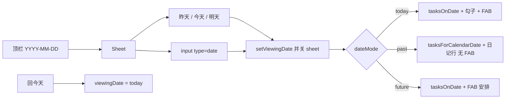
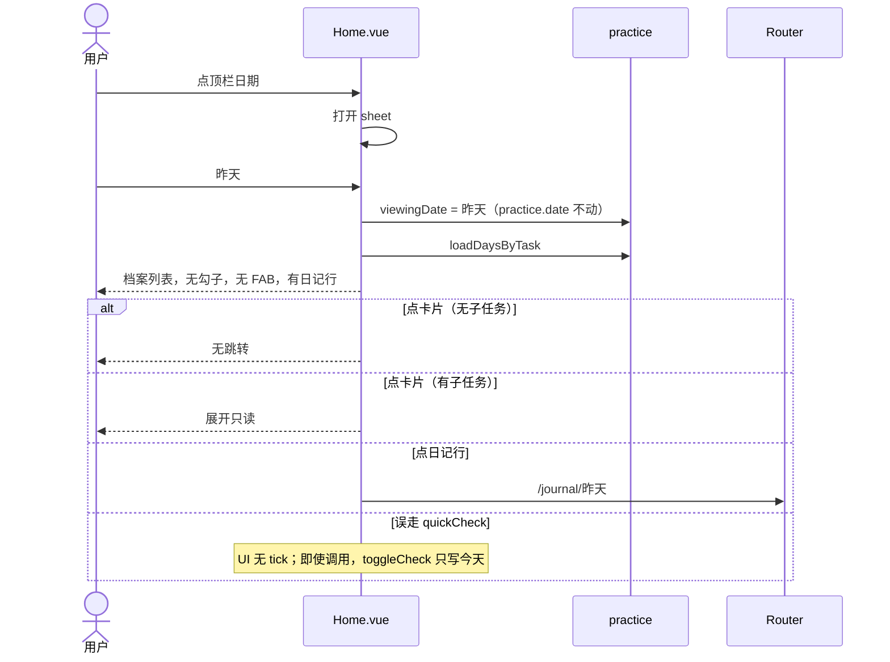
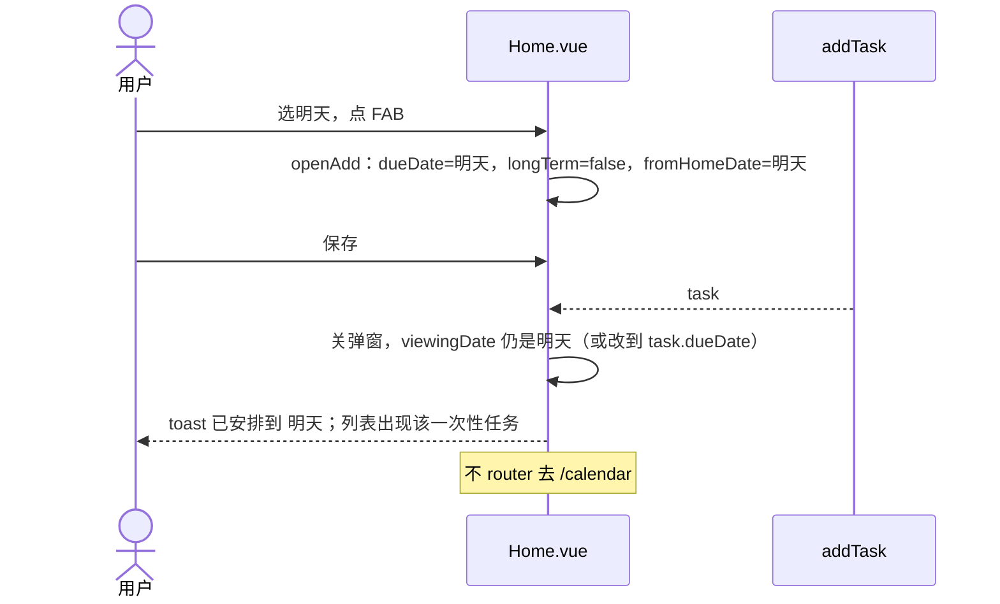
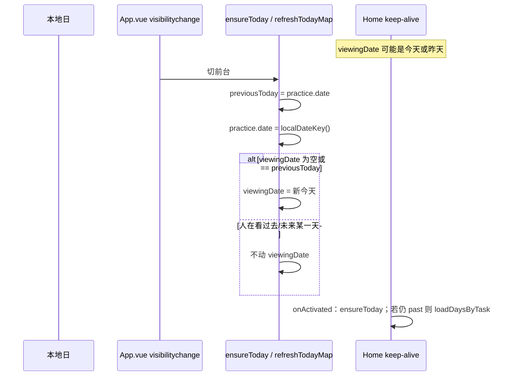
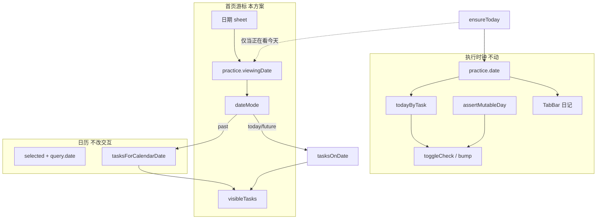

# 日课 · 首页点日期切换查看日

| 项 | 内容 |
|---|---|
| 文档类型 | 产品 + 工程设计 |
| 版本 | v1.2 |
| 日期 | 2026-08-26 |
| 作者 | 工程（设计稿） |
| 状态 | Draft |
| 修订 | v1.2：首页日期已改成封面大字（八月 / 廿六），点的是这块而不是右上角 `YYYY-MM-DD`。游标规则不变。视觉与后端见 `docs/08`。v1.1：日历三按钮间距。 |
| 代码根目录 | `/Users/mac/项目/personal-projects/rike` |
| 前置文档 | `docs/05-五问题完善方案.md`（日历 today/past/future 能力矩阵已落地）、`docs/06-体验与练习闭环.md`（本轮**不**重开 ⋯ 菜单） |
| 范围 | 首页顶栏日期可点，换一天看列表；过去 / 今天 / 未来规则与日历同一套；日历任务行操作按钮可点开、互不粘连 |

---

## Overview

首页封面大字（`formatCoverDate`：八月 / 廿六 / 星期三）是用户要点的「日期」。现网不可点。点它换正在看的那一天，过去 / 今天 / 未来必须和日历矩阵一样：今天执行、过去回看+写日记、未来只能安排。游标、列表、FAB 规则以本文为准；封面点击热区和其余视觉修补见 `docs/08`。

本方案不把 `practice.date` 改成游标。`practice.date` 仍是「本地今天」执行时钟（`refreshTodayMap` / `ensureToday` / `assertMutableDay` / Tab 日记都绑它）。首页另设内存态 `practice.viewingDate`。点日期弹出底部 sheet（昨天 / 今天 / 明天 + `type="date"`），留在主页 Tab，不跳日历、不复制日历「点两次才进日记/安排」的二次武装。

本轮只出方案，不改 Vue/JS。实现按本文 Key Decisions 与 Open Questions 的默认。

---

## Background & Motivation

### 当前状态（2026-08-26 对照源码）

| 表面 | 日期怎么用 |
|---|---|
| 首页顶栏 | `<p class="date">{{ practice.date }}</p>`，不可点 |
| 首页列表 | `visibleTasks()` → `tasksOnDate(practice.date)`，永远今天的课表 |
| 首页勾子 / 完成态 | `quickCheck` → `openTask` + `toggleCheck()`；`isDone` / `taskDoneToday` / `taskTodayLine` 都读 `practice.todayByTask`（今天） |
| 首页 FAB | `openAdd()`，`dueDate = route.query.date \|\| localDateKey()` |
| 日历选中日 | `selected` + `?date=`；`dateMode(selected, today)`；`tasksForCalendarDate` |
| 日历点格子 | 第一次选中看汇总；**再点已选中的同一天**才进日记（过去/今天）或安排任务（未来） |
| Tab 日记 | `TabBar.goJournal()` → `/journal/${practice.date}`，永远今天 |
| 跨日 | `App.vue` `visibilitychange` → `ensureToday()`；Home `onActivated` 也调。`refreshTodayMap()` **每次** `practice.date = localDateKey()` |

`practice.date` 不是浏览游标。谁把它写成昨天，下一轮 `ensureToday` / `refreshTodayMap` / 切后台都会抢回来。首页勾子一旦跟错日期，会绕过日历 UI 去打 `day.{task}.{错误日}`——store 虽有 `assertMutableDay`，但 `toggleCheck()` **没有 date 参数**，它先 `ensureToday()` 再写**新的今天**。也就是说：如果只改展示、不改写入闸，用户在「看昨天」时点勾子，会把**今天**勾上，昨天列表却毫无变化。这比「能补打卡」更糟，是串日。

### 痛点

1. 想看昨天练了什么、明天要做什么，必须离开主页去日历；日历第一次点击还不跳转，还要再点一次或找顶栏按钮。
2. 用户已经把首页日期当成「我在看哪一天」的徽章（截图就是它），它却不是控件。
3. 若图省事把 `practice.date` 赋成选中日：keep-alive 首页、`ensureToday`、Tab 日记、任务详情会一起坏。

### 日历已落地、必须复用的规则（不要重发明）

`src/utils/date.js`：

```js
export function dateMode(date, today = localDateKey()) {
  if (date > today) return 'future'
  if (date < today) return 'past'
  return 'today'
}
```

| 能力 | 过去 | 今天 | 未来 |
|---|---|---|---|
| 列表数据源 | `tasksForCalendarDate`：当日活动 ∪ 一次性 `dueDate`，**不**套当前长期周几 | `tasksOnDate` / `taskOnDate` | `tasksOnDate` |
| 完成 / 勾子 / 上传 checkin | ✗ `过去日期不能补打卡。` | ✓ | ✗ `还没到这一天，不能打卡。` |
| 打开 `/task/:id` | ✗ | ✓ | ✗ |
| 写/打开日记 | ✓ | ✓ | ✗ |
| 安排任务 | ✗ | ✗ 日历今天不提供；首页 FAB | ✓ `dueDate` = 那天，一次性 |
| 修改任务定义 | ✗（避免从历史改全局） | 首页左滑「修改」 | ✓「修改任务」 |

`tasksForCalendarDate` 已在 `src/stores/practice.js`；过去日判定用 `dayHasActivity`（`day.*` 的 count / `completedAt` / 子任务勾选 / 当日 checkin / 健身 helper 图）∪ 非长期 `dueDate === date`。

---

## Goals & Non-Goals

### Goals

- 点首页顶栏日期，在**主页 Tab 内**换 `viewingDate`；昨天 / 今天 / 明天一拍即达，任意日用系统日期控件。
- 三种 `dateMode` 的列表、空态、FAB、勾子、进任务、日记入口与日历语义对齐。
- `practice.date` 继续只表示今天；跨日、keep-alive、`assertMutableDay` 行为不变。
- 改任务继续只靠左滑，不恢复 ⋯。

### Non-Goals / 明确不做

- **不**实现本方案（本文只设计）。
- **不**把 `practice.date` 写成过去/未来。
- **不**把首页游标写进 URL（`/?date=` 已给日历安排任务占用；刷新 PWA 回今天是对的）。
- **不**复制日历二次点击：顶栏日期点一下出选择器，选中即换日。
- **不**点日期就跳到日历 Tab。
- **不**让 Tab「日记」跟随 `viewingDate`（仍进今天）。
- **不**同步首页 `viewingDate` 与日历 `selected`。
- **不**恢复 `docs/06` 的卡片 ⋯ / 长按菜单；左滑三键保留。
- **不**从过去/未来首页进入 `/task/:id` 执行。
- **不**给过去补打卡、不给未来执行；store 闸门已有，UI 先藏掉入口。
- **不**给过去日露出 FAB 新建（没有「补一次练习任务」的产品）。
- **不**做按日实例表、不改 IndexedDB schema、不改 Supabase DDL。
- **不**新增 feature flag / 埋点栈。
- **不**做午夜 `setTimeout` 对齐（靠 `visibilitychange` + `onActivated`）。
- **不**改日历页点格子的二次武装（`pick` / `armed`）。日历任务行**只**改操作按钮的排布与间距，不改谁出现、点了去哪。
- **不**改 TabBar、任务详情、提醒（提醒仍 `taskOnDate(today)`）。
- **不**把这三个按钮做成描边胶囊或底栏；仍是琥珀色文字链，只把间距拉开。

---

## Key Decisions

1. **选日 UI = 底部 sheet：昨天 / 今天 / 明天 + `input[type=date]`，不是跳日历，也不是顶栏直接挂原生 date。** 用户要的是「在首页换一天」，不是「去日历再点格子」。日历格子有二次武装（先看汇总再进日记/安排），和「换首页列表」不是同一手势。390 宽 PWA 拇指在下半屏；三个大芯片覆盖 80%（看昨天、回到今天、瞄明天）。任意日走现成的 `type="date"`（编辑器「完成日期」已用，字号 16 防 iOS 缩放）。顶栏直接挂原生 date：iOS 控件样式不可控、没有昨天/明天、热区比现在的小字日期还难瞄。

2. **`practice.date` 永不被浏览日覆盖。新增 `practice.viewingDate`（内存，不落盘）。** `refreshTodayMap()` 写死 `practice.date = localDateKey()`。`ensureToday()` 在 `practice.date !== localDateKey()` 时 `loadToday()`。`App.vue` 切前台必调。任务详情、`bump` / `toggleCheck`、`todayByTask`、Tab 日记都认 `practice.date`。把昨天写进去，等于和 keep-alive 对打，且勾子会写到错误的「今天」。`viewingDate` 只喂首页列表。

3. **跨日只在「当时正在看今天」时把游标跟到新今天。** `refreshTodayMap` 里：若 `viewingDate` 为空或等于**刷新前**的 `practice.date`，则 `viewingDate = 新 today`。人在看昨天：保持昨天。人在看「明天」、午夜后那一天变成今天：游标不动，`dateMode` 自动变成 `today`，勾子出现——这是对的，不要把人踢走。

4. **首页列表：今天/未来 `tasksOnDate(viewingDate)`；过去必须 `tasksForCalendarDate(viewingDate, daysByTask)`。** 禁止过去日走 `tasksOnDate`（会把当前「每天」长期课表刷成未完成，或改周几后历史消失）。`docs/05` Decision 11 已锁。今天列表排序仍是未完成在上、已完成沉底；过去用日历 `sortCalendarTasks`（归档/暂停在后，然后置顶、order）；未来同样置顶/order，但不做完成沉底（未来没有完成态）。

5. **过去/未来禁止 `router.push('/task/'+id)`。** 与日历 `openTask` 仅 `isToday` 相同。详情页只认今天，从昨天点进去会在今天上误操作。过去：有子任务可展开只读，否则点卡片无跳转（不 toast，避免误触刷屏）。未来：点卡片 = 打开编辑（对应日历「修改任务」）；左滑「修改」仍在。

6. **FAB：今天 = 新建今日任务；未来 = 安排到 `viewingDate`（一次性，`longTerm=false`）；过去 = 不渲染 FAB。** 过去的主操作是写日记，不是补一条练习。未来保存后**留在首页**并把 `viewingDate` 留在（或改到）该 `dueDate`，toast `已安排到 YYYY-MM-DD`。不要走现网 `saveEditor`「今天不可见 → 去日历」那条——那是给「人在今天、却把完成日期改到未来」用的。从日历 `from=calendar` 回来的路径不改。

7. **过去/今天在列表下方加一行日记（日历每天汇总同款）；Tab 日记仍进今天。** `docs/05`：TabBar「日记」继续 `/journal/${practice.date}`。首页换日是局部浏览，底部四 Tab 仍是「今天的日记」。未来不展示写日记。文案：有内容 `打开日记`，否则 `写日记`。

8. **勾子、子任务勾选、`quickCheck` 仅 `viewMode === 'today'`。** 过去/未来不画 `.tick`；子任务过去/未来只读（日历已是 `div` 不是 `button`）。store 已拒绝非今日写入，UI 必须先藏，避免「点了勾子却改了今天」。

9. **左滑：今天完整三键；未来保留（改的是任务定义，和日历「修改任务」同类）；过去关掉滑动。** 从历史档案里归档/改全局字段，日历明确禁止。不要在过去首页留一条通向 `openEdit` 的滑条。

10. **游标不进 URL、不进 IndexedDB、不进云。** 杀进程/下拉刷新回到今天。Home keep-alive 期间切日历再回来，仍停在刚才看的那天（内存还在）。

11. **不恢复 ⋯。** 现网首页只有左滑（`ACTION_W = 192`）。`docs/06` 第 4 节若未落地，本轮也不做。用户已要求去掉 ⋯、只留滑动。

12. **顶栏日期格式仍是 `YYYY-MM-DD`。** 与截图一致，不改成 `8月26日`。非今天时日期用 `--amber`，右侧出 `回今天`（与「归档箱」同级小按钮），不必先打开 sheet。

13. **不改 `Calendar.vue` 的 `pick` / 二次武装。** 首页和日历是两种入口：首页一次点选日；日历一次点看汇总。可把 `listDays` 扫库抽成 `loadDaysByTask()` 给首页过去日用，日历可暂不切。

14. **日历任务行操作按钮包进 `.task-actions`，横向拉开，不改出现条件。** 现网三个 `button.open.inline` 直接挨着写在 `.block` 里，默认 inline，没有 `column-gap`，390 宽上读成「打开任务上传图片查看作品墙」。`docs/05` 规定今天要有这三项，但没写间距。本轮只加容器和 gap，文案、路由、`v-if` 不动。

15. **无 feature flag。** 本地 PWA，行为是对现网「日期不可点」的加法；回滚 = revert 再跑 `./scripts/publish-pages.sh`。

---

## Proposed Design

### 1. 两个日期字段

```text
practice.date         // 执行时钟，永远 localDateKey()
practice.viewingDate  // 首页在看哪一天；空或未初始化 = 跟 date
```

只加在 `src/stores/practice.js` 的 `practice` reactive 对象。不写 `kv`，不进备份 version，不进 `rike_meta`。

```js
export async function refreshTodayMap() {
  const previousToday = practice.date
  const date = localDateKey()
  practice.date = date
  if (!practice.viewingDate || practice.viewingDate === previousToday) {
    practice.viewingDate = date
  }
  // 现有 todayByTask 扫描不变，键仍是 date（今天）
}
```

`bootPractice` → `loadToday` → `refreshTodayMap`：首次 `date`/`viewingDate` 都是 `''`，会被写成今天。

禁止：

- `practice.date = viewingDate`
- `tasksOnDate(practice.date)` 当过去列表
- `quickCheck` 在非今天仍 `openTask` + `toggleCheck`

Home：

```js
const today = computed(() => practice.date || localDateKey())
const viewingDate = computed(() => practice.viewingDate || today.value)
const viewMode = computed(() => dateMode(viewingDate.value, today.value))
```

### 2. 点日期 → 底部 sheet



#### 2.1 顶栏

把 `.date` 从 `<p>` 改成 `<button type="button">`：

- 文案：`viewingDate`（`2026-08-26`）
- `aria-label`：`切换查看日期，当前 {viewingDate}`
- `min-height: 44px`（现网只是 `--fs-sm` 文字，热区不够）
- `viewMode !== 'today'` 时加 class `away`，颜色 `--amber`
- 非今天时在日期下（现有 `.head-actions` 已是 `justify-items: end`）加 `回今天`，点了只改 `viewingDate`，不开 sheet

归档箱按钮仍在，不挤掉。窄屏：日期 + 回今天 + 归档箱维持右对齐网格。

#### 2.2 sheet 结构（复用 `.modal-mask` + `.modal-sheet`）

```
看哪一天
[ 昨天 ] [ 今天 ] [ 明天 ]

选择日期
[ type=date  value=viewingDate  font-size:16px ]

（点遮罩关闭；选芯片或改 date 后立刻应用并关闭）
```

- 芯片 `min-height: var(--tap)`（48px），三等分，当前命中的那天加 `.on`（底 `--amber`，字 `--ink`），与编辑器周几键同一套。
- `昨天 = shiftDateKey(today, -1)`，`明天 = shiftDateKey(today, 1)`。
- `viewingDate` 不是这三天之一时，芯片全不亮，date 框仍显示该日。
- **选中即生效**，不要再设「确定」。少一次拇指。
- 不放「去日历」链接（有 Tab）。

`src/utils/date.js` 新增：

```js
export function shiftDateKey(dateKey, days) {
  const [y, m, d] = String(dateKey || localDateKey()).split('-').map(Number)
  return localDateKey(new Date(y, m - 1, d + days))
}
```

本地午夜 `Date`，禁止 UTC。非法 `type="date"` 空值忽略。

#### 2.3 `setViewingDate(dateKey)`

```js
async function setViewingDate(dateKey) {
  if (!/^\d{4}-\d{2}-\d{2}$/.test(dateKey)) return
  practice.viewingDate = dateKey
  pickerOpen.value = false
  closeSwipe()
  expandedId.value = null
  if (pageRef.value) pageRef.value.scrollTop = 0
  if (dateMode(dateKey) === 'past') {
    daysByTask.value = await loadDaysByTask()
  }
}
```

不 `router.replace`。不碰 `practice.date`。

### 3. 三种模式在首页怎么呈现

与日历能力矩阵对齐的**首页映射**：

| 能力 | 过去 | 今天 | 未来 |
|---|---|---|---|
| 顶栏日期 | 那天，amber + 回今天 | 今天，muted | 那天，amber + 回今天 |
| 列表 | `tasksForCalendarDate` | `tasksOnDate` + 完成沉底 | `tasksOnDate` |
| 空态 | `这天没有任务记录` | 现网：有任务则 `今天没有安排的日课`，全无任务 `今天还没有任务` | `这天还没有安排任务` |
| 说明句 | `过去不能补打卡。下面是这天做了什么。` | 不显示（首页保持干净） | `还没到这一天。只能安排，不能打卡。` |
| `.tick` / `quickCheck` | 无 | check 无子任务：有 | 无 |
| 子任务 | 可展开，只读 | 可勾 | 可展开，只读 |
| 点卡片 | 有子任务则展开；否则无跳转 | 现网：展开或 `/task/:id` | 有子任务则展开，否则 `openEdit` |
| 左滑 | 无（`onDown` 直接 return） | 修改 / 归档 / 置顶 | 同今天 |
| FAB `+` | **不渲染** | `openAdd()`，dueDate=今天 | `openAdd()`，dueDate=`viewingDate`，一次性 |
| 日记行 | 有，进 `/journal/{viewingDate}` | 有，进今天日记 | 无 |
| 打开 `/task/:id` | ✗ | ✓ | ✗ |
| 行内完成文案 | 用该日 `day.*`，不要「今日」前缀 | `taskTodayLine`（今日…） | `已安排` |
| 归档/暂停标记 | 与日历相同，标题旁 `已归档` / `已暂停` | 今天列表本来就排除它们 | 今天/未来 `taskOnDate` 已排除 |
| 作品墙 | 本轮首页卡片不加重做日历那条「查看作品墙」；进不了详情就不进墙。要看墙走 Tab 或日历 | 点进任务后详情已有入口 | 同过去：不从首页卡片进墙 |

说明句放在 `SyncBar` 与任务列表之间，class 用 muted，仅 past/future。备份 nag 仍在列表上方，顺序：header → SyncBar → 备份 nag → 模式说明 → 列表 → 日记行 → FAB。

#### 3.1 列表函数

```js
function visibleTasks() {
  const date = viewingDate.value
  const mode = viewMode.value
  if (mode === 'past') return tasksForCalendarDate(date, daysByTask.value) // 已 sortCalendarTasks
  const rows = tasksOnDate(date)
  return [...rows].sort((a, b) => {
    if (mode === 'today') {
      const ad = taskDoneToday(a) ? 1 : 0
      const bd = taskDoneToday(b) ? 1 : 0
      if (ad !== bd) return ad - bd
    }
    // 未来不做完成沉底；置顶 / pinnedAt / order 与现网后半段相同
    /* ... */
  })
}

function emptyCopy() {
  if (viewMode.value === 'future') return '这天还没有安排任务'
  if (viewMode.value === 'past') return '这天没有任务记录'
  return practice.tasks.length ? '今天没有安排的日课' : '今天还没有任务'
}

function isDone(task) {
  if (viewMode.value !== 'today') return false
  return dayComplete(task, practice.todayByTask[task.id])
}
```

过去完成态**不要**用 `taskDoneToday`（那是今天的 map）。副文案：

```js
function taskViewLine(task) {
  const mode = viewMode.value
  if (mode === 'future') return '已安排'
  if (mode === 'today') return taskTodayLine(task) + (task.reminder ? ` · ${task.reminder}` : '')
  const rec = daysByTask.value[task.id]?.[viewingDate.value]
  return pastLine(task, rec) // 已完成 · 3/10 / 未完成 / 已打卡 · n 张；无「今日」
}
```

`pastLine` 可写在 Home 本地，或抽 `taskLineOnDate(task, date, record)` 进 `practice.js` 紧挨 `taskTodayLine`。默认抽到 store，避免和日历 `statusLine` 再分叉一套「未完成」语义。日历本轮不强制改去调用它。

过去日 `daysByTask` 未加载完时，一次性 `dueDate` 仍能出现（不依赖活动 map）；活动型历史可能晚一拍出现。切换到过去后 `await loadDaysByTask()` 再渲染完整列表。

#### 3.2 加载过去日档案

日历 `refresh()` 对每个 task `listDays`。首页不要每次 `onActivated` 都全表扫——**仅 `viewMode === 'past'`** 时加载。

```js
// practice.js
export async function loadDaysByTask() {
  const next = {}
  await Promise.all(
    practice.tasks.map(async (task) => {
      const map = {}
      for (const day of await listDays(task.id)) map[day.date] = day
      next[task.id] = map
    }),
  )
  return next
}
```

`dayHasActivity` 还读 `practice.checkins` / `helperImageBank`。`bootPractice` 已 `loadCheckins` + `loadAssets`（含 helper）。Home 切到过去不必再 `loadCheckins`，但 `onActivated` 若仍在过去日，再拉一次 `loadDaysByTask`（刚在今天勾完再切昨天，昨天不该变；在日历补了日记也不影响任务列表。保险起见过去日每次激活刷新 map，和日历一致）。

### 4. 从非今天首页进任务 / 编辑 / 新建



未来：



`openAdd()` 调整（保持日历 query 路径）：

```js
const date = String(
  route.query.date ||
    (viewMode.value === 'future' ? viewingDate.value : localDateKey()),
)
form.dueDate = date
fromCalendarDate.value = route.query.from === 'calendar' ? date : ''
fromHomeDate.value = !fromCalendarDate.value && viewMode.value === 'future' ? date : ''
form.longTerm = false
```

`saveEditor` 新建成功：

```js
const visibleToday = taskOnDate(task, today)
if (fromHomeDate) {
  practice.viewingDate = task.dueDate || fromHomeDate
  await finishClose() // 不传 calendarDate
  toast(`已安排到 ${task.dueDate || form.dueDate}`)
  return
}
const goCalendar = calendarDate || (!visibleToday ? task.dueDate : '')
// 其余现网不变
```

取消：`fromHomeDate` 只关弹窗，人留在首页原 `viewingDate`。不要把「从未来首页点 +」误标成 `from=calendar`。

编辑弹窗：未来首页 `openEdit` 时显示现网那句 `这里改的是整条任务，不是只改这一天。`（现在靠 `fromCalendarDate`；改为 `fromCalendarDate || viewMode==='future'`）。

### 5. 日记与 Tab

| 入口 | 目标 |
|---|---|
| Tab「日记」 | `/journal/${practice.date}` **今天**（`TabBar.vue` 不改） |
| 首页日记行（过去/今天） | `/journal/${viewingDate}` |
| 日历二次点击 / 顶栏 | 现网，不改 |
| 未来首页 | 无日记行 |

日记行：

- 标题 `日记`
- 有 `practice.journalTexts[viewingDate]` 则预览首行（两行截断）
- 有图无字：`有图片`
- 都无：`未写`
- 右侧 `写日记` / `打开日记`（`hasJournal(viewingDate)`）

`bootPractice` 已 `loadJournals`，首页可读 `journalTexts`。不必为日记行再扫 IDB。

### 6. keep-alive 与跨日



Home 已是 keep-alive（`App.vue` `include="Home,Journal,Calendar,Sheet"`）。人停在首页过夜、系统不发 visibilitychange：日期可能冻住。默认**不做** `setTimeout` 到午夜——本地 PWA 亮屏挂着过 0 点极少；下一次切应用或再进首页就会对齐。写进明确不做。

`onActivated`：

```js
onActivated(async () => {
  await ensureToday()
  refreshBackupNag()
  if (dateMode(practice.viewingDate || localDateKey()) === 'past') {
    daysByTask.value = await loadDaysByTask()
  }
})
```

### 7. 架构关系（只动首页游标）



### 8. 日历任务行操作按钮（v1.1）

截图现网（今天 + 画画类任务）一行挤成：

`打开任务上传图片查看作品墙`

源码：`src/pages/Calendar.vue` 约 408–425 行，四个独立 `<button class="open inline">`（今天打开、今天传图、未来修改、三种日期作品墙）**没有包一层**。样式：

```css
.open { margin-top: 12px; color: var(--amber); font-weight: 650; min-height: 40px; }
.open.inline { margin-top: 10px; }
```

按钮是 replaced 元素的默认 `inline-block`（或 UA `inline`），相邻之间**没有** `margin-inline` / `gap`，所以字顶字。

**改法（只布局）**

```html
<div class="task-actions">
  <button v-if="isToday" class="open" …>打开任务</button>
  <button v-if="isToday && task.completion === 'photo-log'" class="open" …>上传图片</button>
  <button v-if="isFuture" class="open" …>修改任务</button>
  <button v-if="taskHasGallery(task)" class="open" …>查看作品墙</button>
</div>
```

去掉 `.inline`。出现条件、`openTask` / `pickPhoto` / `editTask` / `openGallery` **一字不改**。没有按钮时不要渲染空的 `.task-actions`：`v-if` 包在容器上，或四个按钮都没有时不画这层（用计算属性 `taskActions(task)` 亦可；默认直接四个 `v-if` 按钮，容器 `v-if` 为「今天或未来或 hasGallery」）。

```css
.task-actions {
  display: flex;
  flex-wrap: wrap;
  align-items: center;
  column-gap: 20px;
  row-gap: 4px;
  margin-top: 10px;
}

.task-actions .open {
  margin-top: 0;
  min-height: 44px;
  padding: 0 2px;
}
```

390 宽：三个四字/五字按钮 + 20px 间隙仍可同一行；折行时 `row-gap: 4px`，不要再堆成密密的两行贴边。热区 44px 高，但视觉仍是文字链，不要改成胶囊底。

不采用：

| 方案 | 不采用原因 |
|---|---|
| 字中间加 ` · ` 分隔 | 仍像一句话，点热区不好拆 |
| 三个堆成竖排全宽 | 日历每天汇总已经很长 |
| 描边 / 实心按钮 | 和顶栏「写日记」文字链不一致 |
| 首页卡片也加这三项 | Decision 已否；首页今天进详情，非今天不进 `/task` |

首页本轮**不**复制这行按钮。日历修好后，若以后首页非今天要露出「查看作品墙」，再单开，间距规则跟这里走。

---

## API / Interface Changes

无 HTTP。前端契约：

### Store

| 符号 | 变更 |
|---|---|
| `practice.viewingDate` | 新增 string `YYYY-MM-DD`，内存 |
| `refreshTodayMap` | 跨日时按 Decision 3 校正 `viewingDate`；**仍然**只把 `practice.date` 写成今天 |
| `loadDaysByTask()` | 新增，返回 `{ [taskId]: { [date]: dayRecord } }` |
| `taskLineOnDate(task, date, record)` | 新增（推荐）。未来固定 `已安排`；今天可委托 `taskTodayLine`；过去无「今日」前缀 |
| `tasksForCalendarDate` / `taskOnDate` / `assertMutableDay` / `ensureToday` | 语义不改 |

`toggleCheck` / `bump` 继续无 date 参数。首页非今天不调用它们。

### 路由

| 现在 | 之后 |
|---|---|
| `#/` | 不变，**不**加 `?view=` |
| `#/?add=1&date=&from=calendar` | 不变 |
| 首页未来 FAB | **函数内** `openAdd`，不经 query，避免 `openAddFromRoute` 的 `router.replace('/')` 把别的 query 清掉时还要再塞 date |

### Home 模板要点

- `.date` → `button.date`
- `v-if="viewMode !== 'today'"` 的 `回今天`
- `pickerOpen` sheet
- `v-if="viewMode === 'today' \|\| viewMode === 'future'"` 的 FAB；未来 `aria-label="安排任务"`
- `.tick` 加 `viewMode === 'today'`
- `onDown`：`viewMode === 'past'` return
- `onCardClick` 按 §3 表
- 日记行 `v-if="viewMode !== 'future'"`

不新增独立 `.vue` 组件（sheet 与归档箱一样内联），避免本轮扩文件面。

---

## Data Model Changes

无。

| 字段 | 存储 | 缺省 |
|---|---|---|
| `practice.viewingDate` | 内存 reactive | `''`，首次 `refreshTodayMap` 写成今天 |
| `day.{taskId}.{YYYY-MM-DD}` | 已有 | 不改 |
| `journal.{date}` | 已有 | 不改 |

备份 version 保持现网（`docs/06` 若已升 4 则跟 06，本方案不碰）。云同步不传游标。

---

## Alternatives Considered

### A. 选日方式：跳日历 vs 顶栏原生 date vs 底部 sheet（采用）

| 方案 | 好处 | 坏处 |
|---|---|---|
| 点日期 `router.push('/calendar?date=')` | 0 新 UI；月历完整 | 离开主页 Tab；日历二次武装，第一次只选中不换「首页列表」；用户明确要在首页换日 |
| 顶栏 `<input type=date>` 或点了触发隐藏 input | 实现最短 | 无昨天/明天；iOS 滚轮占全屏且样式丑；顶栏热区小 |
| **底部 sheet：三芯片 + date（采用）** | 拇指区；覆盖高频；任意日仍可达；留在 Home；与现有 modal-sheet 一致 | 多一个遮罩；要写 `shiftDateKey` |

不采用「点日期 = 打开日历周视图」：`docs/06` 周视图尚未作为本轮依赖，且仍是离开首页。

### B. 游标：改写 `practice.date` vs 仅 Home `ref` vs `practice.viewingDate`（采用）

| 方案 | 好处 | 坏处 |
|---|---|---|
| `practice.date = 选中日` | 首页 `tasksOnDate(practice.date)` 不用改 | **高危**。`ensureToday` 抢回；`todayByTask` 键错乱；Tab 日记变成昨天；`toggleCheck` 先 ensureToday 再写今天，UI 显示昨天完成态却动了今天 |
| Home 组件 `ref('viewingDate')` | 不污染 store | `ensureToday` 在 store，跨日无法把「正在看今天」对齐；keep-alive 还行，但 App visibilitychange 够不着 |
| **`practice.viewingDate`（采用）** | `refreshTodayMap` 能按 Decision 3 对齐；Tab/详情不读它 | store 多一个字段，调用方必须分清两个 date |

### C. 过去列表：继续 `tasksOnDate` vs 复用 `tasksForCalendarDate`（采用）

| 方案 | 好处 | 坏处 |
|---|---|---|
| `tasksOnDate(viewingDate)` | 一行 | 与日历过去日已经修过的 bug 一模一样：当前每天课表铺历史、改周几后档案消失 |
| **`tasksForCalendarDate`（采用）** | 与日历同一函数，产品承诺「和日历一样」 | 过去日要 `loadDaysByTask` |

### D. 非今天点卡片：只读 vs 进详情只读页 vs 禁进 `/task/:id`（采用禁进）

详情三页（`RichTask` / `Draw` / `CheckTask`）全部按今天读写，没有「按 viewingDate 只读」模式。做只读详情是另一个方案。与日历一致：非今天不 `openTask`。

### E. 过去 FAB：隐藏 vs 去日记 vs 建一条过去 dueDate

建过去 dueDate 不是执行，但会在档案里多一条「未完成」一次性任务，像补课表。日历过去没有安排入口。采用隐藏 FAB + 日记行。不把 FAB 语义临时改成日记（`+` 在今天/未来是添加任务，换含义会误触）。

---

## Security & Privacy

本地单用户 PWA，无新后端。游标不持久化，无新 PII。`type="date"` 不离开本机。威胁模型相对 `docs/05` 无扩大。

非今天写入仍只靠现有 `assertMutableDay`；本方案是把入口藏掉，不是新 ACL。

---

## Observability

无 metrics。沿用 `toast`：

| 事件 | 用户可见 |
|---|---|
| 未来首页安排成功 | `已安排到 YYYY-MM-DD`（现网日历安排同句） |
| 今天新建且今日可见 | `任务已创建` |
| 非今日打卡（若仍打到 store） | `过去日期不能补打卡。` / `还没到这一天，不能打卡。` |
| 未来日记 | `未来日期不能写日记`（现网） |
| 选日失败 | 非法 date 静默忽略，不 toast |

开发期：不要 `console.log` 每次切日。

---

## Rollout Plan

静态站，无 flag。合并后 `./scripts/publish-pages.sh` 发 gh-pages `/rike/`。

1. 一个 PR 即可上（首页 + store 游标 + `shiftDateKey`）。
2. 回滚：revert 再发布。IndexedDB 无 migration；回滚后 `practice.viewingDate` 字段不存在，无脏数据。
3. 旧客户端：日期本来就不可点，无兼容问题。
4. 不要求与 `docs/06` 的 PR 同发；本 PR 改 `Home.vue` 列表/顶栏，若 06 的弹窗 sticky 未合，注意冲突，但日期 sheet 是新遮罩，可并存。

---

## 风险

| 风险 | 严重度 | 缓解 |
|---|---|---|
| 把 `practice.date` 当成游标「先跑起来」 | 高 | Decision 2；验收含：看昨天时 `practice.date` 仍是今天、Tab 日记仍是今天 |
| 过去日误用 `tasksOnDate` | 高 | 必须 `tasksForCalendarDate`；验收：把长期改成每天后，去年某日不应铺满未完成 |
| 看昨天点勾子，实际勾了今天 | 高 | 非今天不渲染 tick；`quickCheck` 开头 `if (viewMode !== 'today') return` |
| 未来 FAB 保存后被送去日历 | 中 | `fromHomeDate` 短路现网 `goCalendar` |
| keep-alive 跨日仍显示旧「今天」 | 中 | `refreshTodayMap` Decision 3；`onActivated` / visibilitychange |
| `loadDaysByTask` 任务多时卡一下 | 低 | 仅过去日加载；日历已这么干 |
| iOS `type=date` 空值 / 取消 | 低 | 空字符串忽略，保持原 viewingDate |
| 过去左滑仍能改全局任务 | 中 | past 禁用 `onDown` |
| 与 `docs/06` 同时改 Home.vue | 中 | 本 PR 碰 header / `visibleTasks` / FAB / 新 sheet；弹窗 sticky 冲突面小，merge 时看一下 `openAdd` |

---

## UX 文案

| 位置 | 文案 |
|---|---|
| sheet 标题 | `看哪一天` |
| 芯片 | `昨天` `今天` `明天` |
| date 标签 | `选择日期` |
| 顶栏非今天 | `回今天` |
| 过去说明 | `过去不能补打卡。下面是这天做了什么。` |
| 未来说明 | `还没到这一天。只能安排，不能打卡。` |
| 空态过去 | `这天没有任务记录` |
| 空态未来 | `这天还没有安排任务` |
| 空态今天 | 不改 |
| 未来行状态 | `已安排` |
| 日记行按钮 | `写日记` / `打开日记` |
| 日记无内容 | `未写` |
| 日记仅图 | `有图片` |
| 未来 FAB aria | `安排任务` |
| 今天 FAB aria | `添加任务`（现网） |
| 安排成功 | `已安排到 YYYY-MM-DD` |
| 归档/暂停 | `已归档` / `已暂停`（过去列表） |

顶栏日期本身仍显示 `YYYY-MM-DD`，sheet 里不必再写 `formatDayTitle`（可在 date 框下用 muted 显示 `2026年8月25日 周二` 作确认，默认**要**：改 `type=date` 时即时用 `formatDayTitle(value)` 一行，避免选错日。芯片不必重复。

---

## 手动验收

设备：390 宽触控（或 Chrome 390×844）。本地日用 `2026-08-26` 举例。

1. 首页今天：日期 `2026-08-26`，不可见「回今天」，FAB 在，勾子在。点日期 → sheet。点遮罩关闭，列表不变。
2. 点「昨天」→ 顶栏变 `2026-08-25`（amber）+「回今天」；无 FAB、无勾子；空态或档案列表；有日记行。`practice.date` 仍是 `2026-08-26`（Vue DevTools / 临时断言）。Tab 日记仍进 26 日。
3. 昨天若某长期任务当天有过 count/打卡，必须出现；若只是「现在勾了每天」且那天没活动，**不得**出现。一次性 `dueDate=昨天` 要出现，归档的标 `已归档`。
4. 昨天点卡片（无子任务）不进 `/task/:id`。有子任务只展开，勾不了。不能左滑出修改。
5. 昨天日记行 → `/journal/2026-08-25`，能写。回首页仍停在 25 日。
6. 「回今天」或 sheet「今天」→ 恢复 26 日、FAB、勾子。
7. 点「明天」→ 列表是明天课表（长期按明天周几 + 明天 dueDate）；行状态 `已安排`；无勾子；有 FAB；无日记行。点 FAB → 完成日期预填明天、非长期。保存 → 人在首页明天，toast `已安排到 2026-08-27`，**不**进日历；新任务在列表里。
8. 明天点无子任务卡片 → 编辑弹窗，有「整条任务」提示。保存留在首页。
9. 明天点有勾子的 check 任务：没有 tick。不能完成。
10. sheet 里改 `type=date` 到任意过去/未来，行为与芯片一致。
11. 看昨天时切到日历 Tab 再回主页：仍是昨天（keep-alive + 内存游标）。
12. 看**今天**时把系统日期改到 27 日（或等跨日）后切后台再回来：顶栏变成新今天。看**昨天**时同样操作：仍停在 25 日，不要被拽到 27。
13. 看明天、系统跨日使「明天」变成今天：那一天出现勾子和今日 FAB，游标日期字符串不变。
14. 从日历「安排任务」走 query 的路径：保存仍回日历，一条 toast。不要被 `fromHomeDate` 抢走。
15. 无 ⋯ 按钮；今天左滑三键仍在。
16. 日历今天 photo-log：三个操作按钮能分开读、分开点（见 PR 验收 16–19）。

---

## Open Questions（已给默认，实现按默认）

- 选日 UI？ → **底部 sheet：昨天/今天/明天 + `type=date`。**
- 游标放哪？ → **`practice.viewingDate`，禁止写 `practice.date`。**
- 首页 `?date=`？ → **不写 URL。**
- 与日历 `selected` 同步？ → **不同步。**
- Tab 日记跟游标？ → **不跟，仍是今天。**
- 过去 FAB？ → **隐藏；日记走列表下那一行。**
- 未来点卡片？ → **无子任务则 `openEdit`，不进 `/task/:id`。**
- 过去点卡片？ → **只展开子任务，否则 no-op，不 toast。**
- 过去左滑？ → **关。**
- 午夜定时器？ → **不做。**
- ⋯ 菜单？ → **不做、不恢复。**
- 首页卡片是否加「查看作品墙」？ → **不加**（日历已有；首页非今天进不了详情，墙走 Tab）。
- sheet 是否显示 `formatDayTitle`？ → **date 框下显示一行。**
- 抽 `loadDaysByTask` 时改日历去调用？ → **本轮不改日历调用方**，只给 Home 用；重复扫 kv 可接受。
- 日历三按钮要不要改成胶囊？ → **不要**，flex + `column-gap: 20px`。
- 首页要不要同步加这三项？ → **不要**（v1.0 已否）。

---

## References

- `docs/05-五问题完善方案.md` §1 能力矩阵、Decision 9/10/11/23、`tasksForCalendarDate`
- `docs/06-体验与练习闭环.md` §4 ⋯（本轮明确否定）
- `src/pages/Home.vue`：顶栏 `.date`、`visibleTasks`、`quickCheck`、`openAdd`、`saveEditor`、FAB
- `src/pages/Calendar.vue`：`dateMode`、`pick`、`canCompleteTasks`、`canEditJournal`、`openTask` 仅今天、`addTaskForSelected`、任务行 `.open.inline`（v1.1 间距）
- `src/stores/practice.js`：`refreshTodayMap`、`ensureToday`、`tasksOnDate`、`tasksForCalendarDate`、`assertMutableDay`、`taskTodayLine`、`taskDoneToday`
- `src/utils/date.js`：`localDateKey`、`dateMode`、`formatDayTitle`
- `src/components/TabBar.vue`：`goJournal` → `practice.date`
- `src/App.vue`：`visibilitychange` → `ensureToday`；keep-alive Home
- `scripts/publish-pages.sh`

---

## PR Plan

一个用户可感知功能，store 游标与 UI 必须同 PR 上线（只合 store 没有入口；只合 UI 没有 `viewingDate` 会去改 `practice.date`）。不拆成「先改列表再改顶栏」——过去日列表和顶栏是同一需求。

若与 `docs/06` 抢 `Home.vue`，本 PR 先合或与弹窗改动错开；不要和 ⋯ 菜单 PR 绑在一起（⋯ 本轮不做）。

### PR1 — 首页点日期切换查看日

**标题：** `feat(home): tap header date to view past or future days`

**依赖：** 无（日历矩阵与 `tasksForCalendarDate` / `dateMode` / `assertMutableDay` 已在主线）

**可单独合并：** 是

**影响文件：**

- `src/utils/date.js`（`shiftDateKey`）
- `src/stores/practice.js`（`practice.viewingDate`、`refreshTodayMap` 对齐、`loadDaysByTask`、建议 `taskLineOnDate`）
- `src/pages/Home.vue`（顶栏按钮、sheet、列表/FAB/勾子/日记行/左滑/保存短路）
- `src/pages/Calendar.vue`（任务行操作按钮包 `.task-actions` + gap；**不**改 `pick` / `armed` / `v-if` 条件）

**不改：** 日历二次武装、`TabBar.vue`、`Task.vue`、路由表、IDB、云 schema、卡片 ⋯

**行为 diff：**

- 顶栏日期可点 → sheet 换 `viewingDate`。
- `practice.date` 只在今天；跨日规则见 Decision 3。
- 过去档案列表 + 日记行 − FAB − 勾子 − 左滑 − 进详情。
- 未来课表 + FAB 安排 + 点卡片编辑 − 勾子 − 日记。
- 今天行为与现网一致，仅多「点日期」和一条今天也可点的日记行。
- 日历今天画画任务：打开任务、上传图片、查看作品墙之间肉眼有空隙，仍各自可点。

**手动验收：** 见上文 15 条，外加：

16. 日历选**今天**、画画/创作任务：三个文字按钮同一行或整齐折行，**不能**读成「打开任务上传图片查看作品墙」。两两之间 ≥ 16px（实现用 20px）。分别点：进 `/task/:id`、调相册、进 `/gallery/:id`。
17. 今天 check 无墙：只有「打开任务」，不要为间距留空占位。
18. 过去日有墙：只有「查看作品墙」，左边不留「打开任务」的空白槽。
19. 未来日：`修改任务` 与（若有）`查看作品墙` 同样拉开。

**回滚：** revert 本 PR，再 `./scripts/publish-pages.sh`。无数据迁移。
