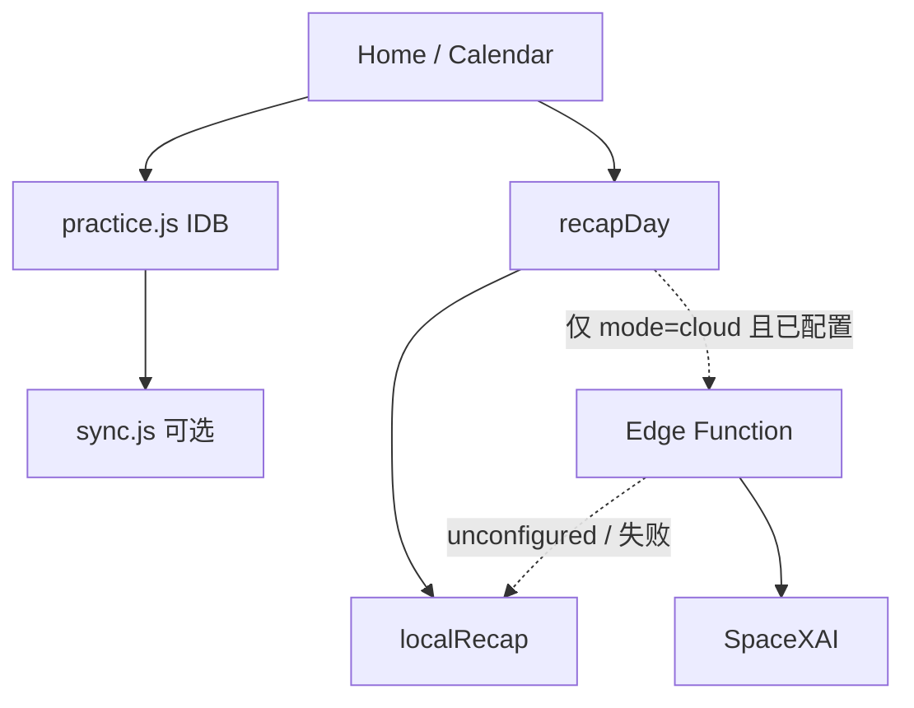

# 日课 · 完整计划（日常免费用 · AI 可关 · 面试能讲）

| 项 | 内容 |
|---|---|
| 文档类型 | 产品 + 工程路线 |
| 版本 | v1.0 |
| 日期 | 2026-08-26 |
| 状态 | Draft |
| 本轮 | **只出方案，不改代码** |
| 取代关系 | 之后按本文排期。细节仍读 `docs/05`–`08`，和本文冲突时 **以本文为准** |
| 代码根 | `personal-projects/rike` |

---

## Overview

日课要同时满足两件事：

1. **你每天自己用**：离线能打卡，**不付费、不强制登录、不强制开 AI**。
2. **面试拿得出手**：能讲清分层、数据规则、可选云、可选推理，而不是「又一个待办 List」。

AI **接得上、默认关、没有钥匙就永远走本地**。开了也只在你以后自己充 xAI 额度时才产生费用。平时用日课 = 0 元。

---

## 目标与非目标

### 目标

- 本地 PWA 仍是真相：IndexedDB 打卡、曲谱、图、备份。没网、没登录、没 AI 钥匙，今天的课都能做完。
- 封面点日期换「正在看的一天」，过去 / 今天 / 未来与日历同一套矩阵（`docs/07`）。
- 你标过的界面问题收掉：三按钮粘连、云同步沉底、作品墙废话、卡片彩边、左滑配色。
- AI 是开关，不是底座。关：规则小结（免费、可测）。开：同一接口换 SpaceXAI（钥匙只在服务端）。
- 架构能画在白板上：执行时钟 ≠ 浏览游标；完成方式 ≠ 组件；同步 ≠ 图；小结 Port ≠ 某个模型。

### 非目标

- 不为了简历改成必须联网的 SaaS。
- 不社交、不排行、不公开练习。
- 不把曲谱/打卡图送上云给模型看。
- 不把 `XAI_API_KEY` 写进前端或 GitHub Pages。
- 不恢复卡片 ⋯。
- 不要求你为日常使用充值。
- 不做午夜定时器、不做人脸/动作识别、不加常驻聊天泡。

---

## 三层产品（面试就讲这个）

```text
┌─────────────────────────────────────┐
│  使用层  Vue PWA · 离线打卡          │  你每天用，0 元
├─────────────────────────────────────┤
│  同步层  可选 Supabase（文字进度）    │  免费档；图仍本机 + 备份
├─────────────────────────────────────┤
│  推理层  可选小结 Port               │  默认 LocalRecap；有钥匙才 XaiRecap
└─────────────────────────────────────┘
```

下层挂了，上层照常。面试官问「没钱买 API 怎么办」：关掉推理层，日课完整；打开则同一条 `recap(day)` 换实现。

---

## Key Decisions

1. **日常路径零付费。** 打卡、换日、备份、云同步（Supabase 免费档个人量）都不走计费 API。
2. **AI 默认关。** `kv.aiRecap = 'off' | 'local' | 'cloud'`，缺省 `'off'`。设置里三档，文案：`关闭` / `本地小结（免费）` / `云端 Grok（需配置钥匙，按量计费）`。
3. **关着时界面不出现「小结中…」网关。** `off`：没有小结按钮。`local`：按钮在，纯函数，不出网。`cloud`：没配服务端钥匙则 toast「云端小结未配置」，**自动回落 local**，绝不弹出付费页。
4. **小结 Port 固定，Provider 可换。**

```js
// src/ai/recap.js
export async function recapDay(snapshot, mode) {
  if (mode === 'off') return null
  if (mode === 'cloud') {
    const remote = await tryCloudRecap(snapshot)
    if (remote) return { source: 'cloud', text: remote }
  }
  return { source: 'local', text: localRecap(snapshot) }
}
```

`localRecap`：根据完成/未完成/计数拼 3 句中文，无随机、可单测。这是简历上的 **Strategy + 降级**，不是「没接上模型所以空着」。

5. **钥匙只活在服务端。** 以后真要开 cloud：Supabase Edge Function secret `XAI_API_KEY`，模型 SpaceXAI `grok-4.6`（或当时 docs 的旗舰；实现前再对一下 `https://x.ai/docs/developers/models`）。PWA 只打自己的 function，带现有登录 JWT。没登录不能选 `cloud`。
6. **执行时钟与浏览游标分开。** `practice.date` 永远今天；`practice.viewingDate` 只给首页列表。禁止把昨天写进 `practice.date`（`docs/07`）。
7. **点封面大字换日**（八月 / 廿六 整块），不是已经没了的右上角 `YYYY-MM-DD`。Sheet：昨天 / 今天 / 明天 + `type=date`。
8. **云同步在首页滚动最底**；备份 nag 仍在列表上方。
9. **日历三按钮拉开；作品墙删 lead；卡片去左侧彩边；左滑改暖色。** 细节 `docs/08` A1–A6。
10. **`docs/06` 练习闭环（时长、连续天数、周视图、当前曲、健身每张 +1）放到换日之后，按需做。** 不是这次「能用 + 能讲」的阻塞项。时长/连续天数对面试和自用都有用，作为第二波。
11. **面试故事以代码结构为准，不编造用户量。** 能指着仓库讲：离线优先、日期模式矩阵、同步边界、Provider 降级、GitHub Pages 发布。

---

## 你日常怎么用（关 AI）

和现在一样：打开 PWA → 封面是今天 → 打卡 / 谱 / 日记。

多出来、且免费的：

- 点大字日期看昨天/明天（规则同日历）
- 云同步仍可选、免费档
- 若你在设置里开「本地小结」：点一下得到三句规则摘要，无网络、无费用

不要开「云端 Grok」，就不会产生 xAI 账单。

---

## AI 三档（接得上、可不开）

| 档 | 按钮 | 网络 | 钱 | 行为 |
|---|---|---|---|---|
| 关闭（默认） | 无 | 无 | 0 | 和现在一样 |
| 本地小结 | 有 | 无 | 0 | `localRecap`，文案带「本地」 |
| 云端 Grok | 有 | 有 | 仅当服务端有钥匙且你点了才会扣 xAI 额度 | 失败回落本地 |

设置放在首页底部 SyncBar 展开区最下（云同步已经沉底）：`智能小结` 三个芯片。不要新开「设置」页。

`cloud` 且未登录：芯片可点，toast「先登录云同步」，档位不改。

服务端没配 `XAI_API_KEY`：function 返回 `{ ok: false, reason: 'unconfigured' }`，前端回落本地。这样 **仓库里可以有完整 Edge Function 代码**，你不配钥匙也能演示架构，面试说「开关一打、密钥一配就接真模型」。

### 本地小结长什么样（免费、可测）

输入快照（不出图）：

```js
{
  date: '2026-08-26',
  tasks: [{ title, completion, done, count, target }]
}
```

规则（写进纯函数，单测锁死）：

1. 已完成的课：`今天完成了 A、B。`
2. 未完成：`还没做 C。`（最多点名 3 个）
3. 若全完成：`今日日课都完成了。`
4. 第三句固定句式之一：有未完成则 `明天先做未完成的那一课。`；全完成则 `保持这样就好。`

不超过 120 字。不调用任何 HTTP。

### 云端小结（你以后才可能付钱）

- 同一快照，截断日记 2k 字。
- 系统提示：只根据给定数字，不编造遍数。
- 超时 20s → 回落本地。
- 每用户每天最多 20 次（函数内计数），防止钥匙泄露被刷。
- 计费现实：这种短中文即使用旗舰模型也是每次远小于 1 美分；**但你选择不配钥匙 = 0。**

---

## 面试怎么讲（含金量在哪）

不要讲「我接了 ChatGPT」。讲四个设计：

1. **领域模型**  
   `completion`（打卡/计数/传图）和 `components`（谱、番茄钟…）分开；日历/首页 `dateMode` 过去不能补打卡、未来不能执行。
2. **两个时间**  
   `practice.date` 执行时钟 vs `viewingDate` 浏览游标；`ensureToday` 不会把昨天的勾子写到今天——这是修过的真实坑。
3. **数据分级**  
   文字进度可同步；图只在本机 + JSON 备份。面试官问 GDPR/换机：能答边界。
4. **推理可插拔**  
   Port + Local / Cloud Provider + 显式开关 + 无钥匙降级。这是可运行的架构，不是 PPT。

配图（实现后放 `docs/` 一张 mermaid 导出即可）：



仓库里还要有：对 `dateMode`、`tasksForCalendarDate`、`localRecap`、`normalizeTask` 的纯函数测试（Vitest，不需浏览器）。这比「页面上有个 AI 按钮」更像工程。

---

## A 层：本机 UI 与换日（你点名的，全部免费）

细节不重复，实现时对着文件改：

| ID | 做什么 | 文件 | 规格 |
|---|---|---|---|
| A1 | 日历三按钮不粘连 | `Calendar.vue` | `.task-actions` `column-gap: 20px`，`v-if` 不动 |
| A2 | 云同步沉底 | `Home.vue` | 列表+日记行之后；nag 仍在封面下 |
| A3 | 点封面换日 | `Home.vue` + `practice.js` + `date.js` | 整块可点；`docs/07` 游标与三种模式 |
| A4 | 删作品墙说明书 | `Gallery.vue` | 删 `.lead`；空态保留 |
| A5 | 去卡片左彩边 | `Home.vue` | 去掉 inset `box-shadow`；圆点保留 |
| A6 | 左滑暖色 | `Home.vue` | 修改 `--bg-soft`；归档 `--seal`；置顶 `--amber` |
| A7 | 小结开关 + 本地小结 | `SyncBar` / 首页今天 | 默认 off；local 纯函数 |

A3 的列表/FAB/勾子/禁止进 `/task`：严格执行 `docs/07` 表，不要把昨天的勾子画出来。

---

## B 层：可选云端 Grok（代码可以进仓库，钥匙可以不配）

| 做 | 不做 |
|---|---|
| `supabase/functions/recap`：校验 JWT，无 secret 返回 `unconfigured` | 前端直连 `api.x.ai` |
| 有 secret 才调 SpaceXAI | 没配钥匙时向用户要信用卡 |
| 前端 `mode=cloud` 失败回落 local | 视觉看谱、聊天泡 |
| 设置里写明「按量计费，需自备钥匙」 | 自动建任务、自动改 count |

你不配 `XAI_API_KEY`、不选云端档，**B 层对你个人使用费用为 0**。仓库里仍然有完整接线，面试可以讲、现场把档位打到本地小结演示。

---

## C 层：练习闭环（换日稳定后再说）

来自 `docs/06`，仍有用，但不是「能用 + 能讲」的阻塞：

- 时长写入 `day.seconds`、连续天数文案
- 周视图 + `skipDates`
- 健身每张打卡图 +1（不再 `syncPhotoDay` 覆盖）
- 当前曲 `pieces` / `byPiece`
- 曲谱 HUD 精简（空谱不占计数）

C 层全部免费、全本地。排在 A 之后、与 B 可并行。

---

## PR 顺序（实现按此，未叫开始前不动代码）

| 序 | 标题 | 内容 | 钱 | 面试点 |
|---|---|---|---|---|
| 1 | `fix(ui): home chrome and calendar action gaps` | A1 A2 A4 A5 A6 | 0 | 视觉系统、色板 |
| 2 | `feat(home): viewingDate on cover` | A3 + `docs/07` 全文行为 | 0 | 双时钟、日期矩阵 |
| 3 | `feat(recap): pluggable local recap` | A7 Port + `localRecap` + 开关 + Vitest | 0 | Strategy、可测纯函数 |
| 4 | `feat(recap): optional xAI edge function` | B Function 骨架 + cloud 档 + 无钥匙回落 | 0（不配钥匙） | 网关、降级、密钥边界 |
| 5 | `feat(practice): seconds streaks week skip` | C 层里时长/连续/周/跳过 | 0 | 领域规则 |
| 6 | `feat(fitness/sheet): photo counts and pieces` | C 层健身 +1、当前曲、HUD | 0 | 兼容旧数据 |

1–3 发完，你日常完全够用，面试已经能讲 1–4 的设计（4 可以只有 function 和开关，没有真扣费）。5–6 按你练琴/健身需要再做。

---

## 验收

**日常（AI 关，默认）：**

- 不登录、断网（或只关云），能完成今天打卡、看谱、写日记、导出备份。
- 设置里智能小结是「关闭」，首页无小结按钮。
- 不产生 xAI 调用（Network 面板无 `api.x.ai`、无 recap function）。

**换日与视觉：** `docs/07` 验收 1–15 + `docs/08` 验收 1–7（封面热区、SyncBar 在底、三按钮可分开点、无 lead、无彩边、左滑暖色）。

**本地小结开：** 今天点「小结」立刻出三句，无网络；文案含已完成/未完成课名。

**云端档、未配钥匙：** toast「云端小结未配置」，改出本地小结；仍无 `api.x.ai`。

**云端档、配了钥匙（你可选，非必须）：** 登录后出 Grok 文案，失败回落本地，打卡记录不被回滚。

---

## 风险

| 风险 | 缓解 |
|---|---|
| 为了简历把 AI 做成必开 | 默认 `off`；验收第一条就是关着能用 |
| 以后误开 cloud 开始扣费 | 设置文案写明计费；无钥匙无法真打 xAI |
| 把 `practice.date` 当游标 | `docs/07` Decision 2，PR2 评审卡死 |
| 本地小结像废话 | 句式绑任务名和完成态，单测锁样例 |
| Function 进仓库但没部署 | README 写「可选部署」；未部署 = unconfigured = 本地 |

---

## Open Questions（实现按默认）

- 默认档？ → **关闭。**  
- 没钥匙的 cloud？ → **回落本地，不报错成空白。**  
- 要不要一上来就充 xAI？ → **不要。**  
- 本地小结算不算「有 AI」？ → **面试讲「可插拔推理，默认规则引擎」；产品文案叫「本地小结」，不叫 AI。**  
- 封面热区？ → **月 + 日 + 星期整块。**  

---

## References

- `docs/05` 日历矩阵、`tasksForCalendarDate`
- `docs/06` 体验闭环（C 层来源）；⋯ 已否
- `docs/07` 换日游标与验收
- `docs/08` 视觉与三按钮 CSS
- `docs/04` 云同步范围
- SpaceXAI：`XAI_API_KEY`、`https://api.x.ai/v1`（仅 B 层、仅服务端）
