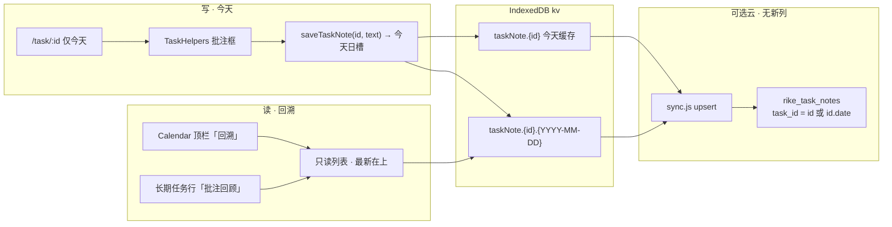
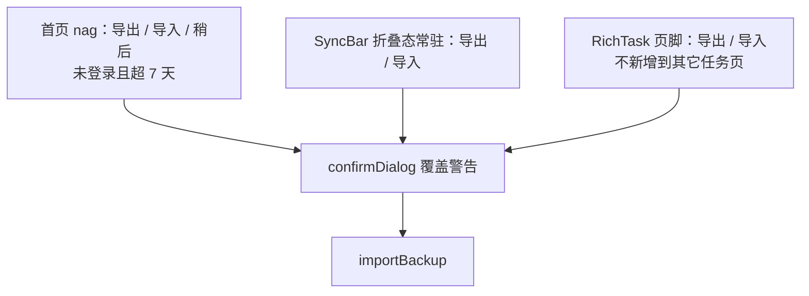
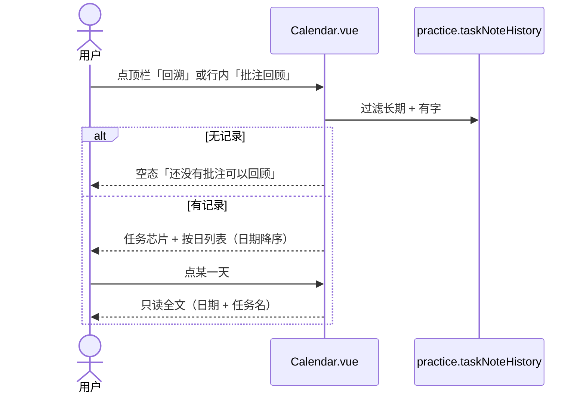
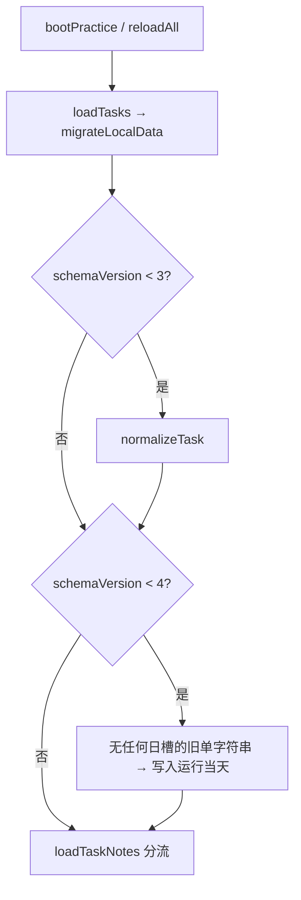

# 日课 · 日历批注回溯与修补

| 项 | 内容 |
|---|---|
| 文档类型 | 产品 + 工程设计 |
| 版本 | v1.1 |
| 日期 | 2026-08-27 |
| 作者 | 工程（设计稿） |
| 状态 | Draft |
| 修订 | v1.1：v5 导入不再把缓存抄到导入日；空保存走墓碑不 `kvDelete`；v1 不 prune；日历行入口补 wrapper；SyncBar file input 常挂；Helpers 只读日槽并 watch `practice.date` |
| 本轮 | **只出方案，不改 Vue/JS，不 commit，不发 Pages** |
| 代码根 | `personal-projects/rike` |
| 前置 | `docs/05`–`docs/09`（背景）。**与 `docs/09` 冲突时以本文为准。** |
| 范围 | Chrome 实测未修的 4 条；备份导入可发现；长期任务按日批注 + 日历回溯 |

---

## Overview

本轮两件事：**把 Chrome 场景里还能复现的四个洞补上**，以及 **让长期任务的「批注」按日可写、可在日历里整段回顾**。

现网 `taskNote.{taskId}` 是**每个任务一条字符串**，`saveTaskNote` 每次覆盖。用户把「刷题」当天经验写进批注，第二天打开只剩最新一段，昨天的没了。日历也没有按任务回看入口。这不是 UI 漏做，是数据模型不允许。必须改 kv 形态，并在不改 `rike_task_notes` 表结构的前提下继续走现有文字同步。

同时：勾「长期任务」会把空的 `repeatWeekdays` 锁成当天星期，乐器/健身/学习等模板默认不是长期，主课左滑把「打开曲谱」裁成「谱」，带了子任务的新建会自动展开并挡住「任务已创建」toast。备份 `importBackup` 早就有，但入口藏在云同步展开区和吉他页脚，首页 nag 只有导出。

本轮不做 AI、不恢复卡片 ⋯、不把 `practice.date` 改成浏览游标。点卡片进编辑的回归 **已经在现网**（见下文「已落地、不再重开」），不单开 PR。

---

## Background & Motivation

### 已落地、本轮不再重开

| 项 | 文档 | 现网 |
|---|---|---|
| 五问题 | `docs/05` | 已发 |
| 秒数 / 连续天数 / 周 / 跳过 | `docs/06` C | 已发 |
| 健身图 +1、sheet HUD、pieces | `docs/06` | 已发 |
| `viewingDate` 封面换日 | `docs/07` | 已发 |
| UI 修补 | `docs/08` | 已发 |
| MonthCal 替换 `input[type=date]` | 工作树 | 已发 |
| 点卡片误进编辑 | `main` | **已修、已提交**：今天卡进 `/task/:id`；未来卡 toast `还没到这一天，不能打卡。`（`openTaskFromHome`）；`.actions { pointer-events: none }` 直到 `.swipe.open` / dragging；勾选+子任务点卡片也进任务页，「展开」独立。**不重开 PR**，除非后续验收再冒回归。仓库里会多一份未跟踪的 `docs/10-…md`，源码树与本功能无关。 |

`docs/07` Decision 5「未来点卡片 = 打开编辑」作废，以现网 toast 为准。左滑「修改」仍在。

### 执行时钟 vs 浏览游标（沿用，禁止改）

- `practice.date`：本地今天，执行时钟。`ensureToday` / `refreshTodayMap` / `assertMutableDay` / Tab 日记 / 任务详情都绑它。
- `practice.viewingDate`：首页浏览游标，内存，不落盘。
- 任务页只从今天进入。过去/未来不写 count。本轮批注**写入**也只走任务页的今天；回溯是读。

### 批注现状（2026-08-27 对照源码）

| 表面 | 实际 |
|---|---|
| 组件芯片「批注」 | `TASK_COMPONENTS` id `annotation`（`practice.js`） |
| 任务页面板 | `TaskHelpers.vue`：`noteDraft`，`saveNote()` → `saveTaskNote(practice.task.id, noteDraft)`，toast `批注已保存`。placeholder：`写下这次任务的要点、提醒或复盘` |
| 存储 | kv `taskNote.{taskId}` = `{ text, updatedAt }`。**一任务一字符串，每次覆盖** |
| 内存 | `practice.taskNotes` / `practice.taskNotesUpdatedAt` |
| `loadTaskNotes` | 凡 `taskNote.*` 都 `key.slice(9)` 当 taskId，没有日期维 |
| 「笔记」组件 | **图片笔记**，`assets` role `note`，路由 `/notes/:taskId`，不是文字批注 |
| 日记 | 按日历日，`journal.{YYYY-MM-DD}`，按天不是按任务 |
| 云 | `sync.js`：`taskNote.*` → `rike_task_notes` upsert，PK `(user_id, task_id)`，列只有 `text` / `updated_at`。**不传图** |

结论：没有按日历史，回溯做不出来。改模型是前置，不是日历上加个按钮。

### Chrome 实测未修

1. **勾选「长期任务」锁成当天星期。** `Home.vue` `setLongTerm(true)` 在 `repeatWeekdays` 为空时写 `[weekdayOf(form.dueDate)]`。`taskScheduledOn` 里空数组 = 每天。结果：周三建的「长期刷题」周四首页空。编辑器 `em` 现网是「每天出现」/「按选中的周几出现」（`Home.vue` ~1018），勾上立刻变成后者，用户走不到「每天」。PR1 把文案改成「不选则每天出现」。
2. **模板默认 `longTerm: false`。** `openAdd` 先 `form.longTerm = false`，`applyTemplate` 不写 longTerm。乐器 / 画画 / 学习 / 健身 / 习惯模板都没有 `longTerm` 字段。种子吉他/画画 `defaultTasks()` 是 `longTerm: true, repeatWeekdays: []`。用户新建的「吉他」「健身」只在 `dueDate`（今天）出现。
3. **主课左滑裁 CTA。** `.swipe { overflow: hidden }` + 卡片 `translateX(-192px)` + `.feature-go` 居中，「打开曲谱」可见残字「谱」。
4. **带了子任务的新建自动展开。** `saveEditor`：`if (task.subtasks?.length) expandedId.value = task.id`，和 toast `任务已创建` 叠在一起。

### 备份「有导出没有导入」

`importBackup` 在 `src/utils/backup.js`，覆盖本机前有确认框。UI：

| 位置 | 导出 | 导入 | 能否当发现入口 |
|---|---|---|---|
| `Home.vue` 备份 nag | 有 | **无** | nag 在封面下，未登录且 7 天未备份才出现 |
| `SyncBar.vue` | 有 | 有 | **只在展开的云同步面板里**（`v-if="open"`） |
| `RichTask.vue` 页脚 | 有 | 有 | 只有计数任务详情 |
| `Today.vue` | 有 | 有 | **死路由**：`router/index.js` 没有 `/today`，也没有 import。`docs/03` 遗物 |
| CheckTask / Draw / Calendar / Gallery | 无 | 无 | — |

用户不展开云同步、不进吉他页，就只看见 nag 的「导出 / 稍后」。

---

## Goals & Non-Goals

### Goals

- 长期任务勾上之后，空星期 = **每天**，不再锁当天周几。存量任务的 `repeatWeekdays` **不改写**。
- 乐器 / 画画 / 学习 / 健身 / 习惯模板新建默认长期、每天；自定义仍一次性。
- 主课左滑时 CTA 不再残字；新建带了子任务不再自动展开。
- 首页不登录、不展开云同步，也能导入 JSON 备份。确认文案保持覆盖警告。
- 长期任务的批注按日持久化。任务页打开后，批注框绑定 **当天**（`practice.date`）。
- 日历可回顾某长期任务（或全部）所有有字的批注，最新在上。空历史给空文案，不造假列表。
- 旧 `taskNote.{id}` 仅在该任务还没有日槽时迁进运行当天，不丢字。已有日槽的备份原样导入。备份 version 跟着升。云同步继续走现有 `rike_task_notes`，**不加列、不传图**。

### Non-Goals / 明确不做

- **不**实现本方案（本文只设计）。
- **不**接 AI / SpaceXAI / 付费 API；`docs/09` B 层本轮不排。
- **不**恢复卡片 ⋯。
- **不**把 `practice.date` 写成浏览日。
- **不**把日记、图片笔记、曲谱笔迹塞进批注回溯。
- **不**在回溯 UI 里展示一次性 `dueDate` 任务。它们若勾了 `annotation`，写入仍落日槽（Helpers 不分支），只是列表滤掉。
- **不**允许从回溯里补打卡 / 改 count（`assertMutableDay` 仍挡）。
- **不**在 v1 修剪 366 日（单用户字符串很小；云路径只有 upsert，物理删除会被 pull 复活）。
- **不**给 CheckTask / Draw / Calendar / 每类任务页再挂一套导出导入。
- **不**删 `Today.vue`（死代码，另开清洁 PR 再动）。
- **不**改 IndexedDB `DB_VERSION`（仍是 1），只升 kv `schemaVersion`。
- **不**改 `rike_task_notes` DDL，不发明云列。
- **不**上 feature flag、不接 APM。
- **不**把存量「已经有一个星期」的任务改成每天。

---

## Key Decisions

1. **批注历史用按日 kv 键，外加一条无日期缓存。**  
   `taskNote.{taskId}.{YYYY-MM-DD} = { text, updatedAt }` 是真相。Helpers 与回溯 **只读日槽**，禁止回落到无日期缓存（否则第二天空框会被昨天的字填满）。`taskNote.{taskId}` 只是旧客户端 + 云上无日期那一行 + 「今天」镜像：`saveTaskNote` 在写今天日槽时同步写它。Pages + `sw.js` 发布是原子的，混版窗口可接受；不要用缓存回落去「修」旧 SW。不采用「一个 map 塞进一个 key」——两台设备写不同天会整表 LWW 互相抹掉。

2. **云同步不加列。** 现有 PK `(user_id, task_id)`。推送仍 `task_id = key.slice(9)`，于是历史行的 `task_id` 是 `{id}.{YYYY-MM-DD}`。旧客户端会把这些行读进 `practice.taskNotes['guitar.2026-08-26']`，没人用，无害。新客户端 `parseTaskNoteKey` 拆日期。任务 id 是 `guitar` / `drawing` / `t_${Date.now().toString(36)}_…`，不会以 `.\d{4}-\d{2}-\d{2}` 结尾。

3. **写：只在任务页、只写 `practice.date`（今天）。** 公开 API 是 `saveTaskNote(taskId, text)` 两参，内部日期锁 `localDateKey()`。读：日历回溯列出所有有字且 `date <= today` 的日期。v1 回溯列表只读；点一天看全文。不做「改这天」。过去不能执行。

4. **迁移只跑「还没有任何日槽」的任务。** 首次从无日期 `taskNote.{id}` 升级：把旧字符串写进**运行当天**槽（不要用 `updatedAt` 那天，升级当天框不能空）。若该 `taskId` 已有任意 `taskNote.{id}.YYYY-MM-DD`（v5 备份、已升级设备），**整段跳过**——禁止把缓存抄到导入日。空文本不建有字历史。

5. **空保存走日记同款墓碑，不 `kvDelete`。** 当天清空写 `{ text: '', updatedAt }`。`push` 只有 upsert、没有删行；物理删除会在 pull 时被远端复活。`listTaskNoteEntries` / Helpers / 回溯把空字当不存在。v1 **不 prune**。

6. **`setLongTerm(true)` 不再预填星期。** 空数组保持空。编辑器文案改成「不选则每天出现」（现网是「每天出现」）。**禁止** migrate 去清存量 `repeatWeekdays`。

7. **五个内容模板默认 `longTerm: true`，自定义仍 `false`。** `applyTemplate` 写入 `form.longTerm`。不给学习模板强加 `annotation` 组件；回溯入口看「长期且（有 annotation 或已有历史）」。归档/暂停的长期课进顶栏回溯，不要求当天日历行还在。

8. **导入入口：nag 加「导入」；SyncBar 折叠态也常驻 导出/导入。** 备份按钮和 `<input type=file>` 都放在 `.summary` 的兄弟节点、始终挂载。展开面板里的备份按钮删掉。RichTask 页脚保留。不在每类任务再复制一套。

9. **点卡片进编辑已修，不进本轮 PR。** 未来点卡片继续 toast，不回到 `docs/07` 的 `openEdit`。

10. **主课 CTA：左滑/拖时隐藏 `.feature-go`，不靠 min-width 硬撑。** 卡片在 `overflow: hidden` 里平移，min-width 100% 救不了居中残字。

11. **新建成功不写 `expandedId`。** `finishClose` 已经把它置空。

12. **日历「回溯」以顶栏为准；行内是附加。** 过去只写了批注、没有打卡的日子，`tasksForCalendarDate` 仍不出现该行（批注不算 `dayHasActivity`，v1 不改这套矩阵）。行内按钮只在行已经渲染时出现，并把 `.task-actions` 的 wrapper 扩成含 `canReviewNotes(task)`。

---

## Proposed Design

### 总览



### 1. 长期任务默认与星期

**根因。** `taskScheduledOn`：

```js
if (task.longTerm) {
  const weekdays = Array.isArray(task.repeatWeekdays) ? task.repeatWeekdays : []
  if (!weekdays.length) return true
  return weekdays.includes(weekdayOf(date))
}
```

空 = 每天。`setLongTerm` 却在勾上时长出 `[weekdayOf(form.dueDate)]`，语义变成「只周几」。编辑器 `em` 在空数组时显示「每天出现」，用户永远走不到。

**改 `Home.vue` `setLongTerm`：**

```js
function setLongTerm(on) {
  const was = form.longTerm
  form.longTerm = on
  if (!on && was) form.repeatWeekdays = []
  // 勾上：保持空数组 = 每天。不要预填 weekdayOf(dueDate)
}
```

`em` 文案：`不选则每天出现` / `按选中的周几出现`。

**模板。** `TASK_TEMPLATES` 增加 `longTerm`：

| id | 标题 | longTerm |
|---|---|---|
| `instrument` | 乐器练习 | true |
| `creative` | 画画 / 创作 | true |
| `study` | 学习 / 备考 | true |
| `fitness` | 健身 / 康复 | true |
| `habit` | 生活习惯 | true |
| `custom` | 自定义 | false |

`applyTemplate` 增加 `form.longTerm = Boolean(item.longTerm)`。新建换模板时 `form.repeatWeekdays = []`（避免自定义勾过的周几带到乐器上）。`openAdd` 仍可先清零，以 `applyTemplate(custom)` 为准——这是长期开关的真相源：自定义保持 false，点乐器变 true。

现网「返回模板」只在 `editor.mode === 'add'`。编辑态不要接模板步。若以后编辑也能换模板，**不得**清已有 `repeatWeekdays`（会把周三课洗成每天）。

种子 `defaultTasks()` 已经是长期+空星期，不动。

**存量。** 已经有 `repeatWeekdays: [3]` 的任务保持周三。用户打开「修改」，把周几点掉即可变每天。migrate **禁止** 批量清空。

### 2. 主课 CTA 裁切 + 新建不展开

**CTA。** `.swipe { overflow: hidden }` 必须留（左滑三键）。`.feature-go` 在平移的卡片里居中，窗口里只剩「谱」。

```css
.feature-swipe.open .feature-go,
.feature-swipe:has(.card.dragging) .feature-go {
  opacity: 0;
  pointer-events: none;
}
```

不改 `ACTION_W`、不把 CTA 挪出卡片（会盖住三键）。

**展开。** 删 `saveEditor` 里：

```js
if (task.subtasks?.length) expandedId.value = task.id
```

子任务仍用卡片上的「展开」。toast 不再和展开区抢位置。

### 3. 备份导入可发现

**主路径（推荐，两条一起做）：**

1. **备份 nag**（`Home.vue` `.backup-nag`）：「导出」旁加「导入」，「稍后」保留。未登录、7 天未备份时这是封面下第一块，必须能导入。Home 现网没有 `importBackup` / file input，PR3 要补上与 SyncBar 同一套 `askImport` / `onImport`。确认文案用 SyncBar 这句：`会覆盖本机现有的遍数、图片、标注和笔记。`（不要用死路由 `Today.vue` 的「曲谱」变体。）Home 自己挂一个始终存在的 `<input type="file" accept="application/json">`。
2. **SyncBar 常驻备份行**：`导出备份` / `导入备份` 放到 `.summary` 下面、展开面板**外面**。**`<input ref="importRef">` 必须是 `.summary` 的兄弟、始终挂载**——现网它在 `v-if="open"` 的 `.panel` 里，只挪按钮不挪 input，折叠态 `importRef.click()` 是静默空操作。面板内部那两颗备份按钮删掉，避免折叠+展开三份。

`askImport` 确认框原文保留：`会覆盖本机现有的遍数、图片、标注和笔记。`（Home nag 与 SyncBar 同一句。）`input accept="application/json"`。`importBackup` 行为不改：校验 `app==='rike'` → `clearAll` → 写 kv/assets/strokes → `schemaVersion=0` → `reloadAll`。`schemaVersion=0` 仍强制，以便 v3 `normalizeTask` 对旧备份再跑一遍；**按日批注迁移必须幂等**（见 §5），v5 再导入不会把缓存抄到导入日。

RichTask 页脚保留给已经走进计数任务的人。CheckTask / Draw / Calendar **不加**。`Today.vue` 不改（死路由）。



登录后 nag 隐藏（现逻辑 `!cloud.user`），仍靠 SyncBar 常驻行。JSON 备份与云图同步是两条路，登录了也要能导出导入。

### 4. 按日批注：写路径

**Helpers。** 任务页只从今天列表/日历进入，但页可以跨午夜仍挂着（`ensureToday` 在 Home `onActivated` / App 前台，**不在** `Task.vue`）。框必须跟 `practice.date`，不能只 watch 任务 id。

- `watch(() => [practice.task.id, practice.date], …, { immediate: true })`：`noteDraft = taskNoteOn(id, practice.date)`（只读日槽；空字符串当空）。**不要**回落到无日期缓存。
- 日期一变就重置草稿：昨天的字不准写进新的今天槽。
- 面板副文案由「文字会同步」改为 `今天 · {{ practice.date }}`（有云时仍可在按钮旁留「会同步」）。
- `saveNote`：`saveTaskNote(practice.task.id, noteDraft)`。toast 仍 `批注已保存`。
- 空保存：日槽写成 `{ text: '', updatedAt }`（墓碑），今天缓存同样写成空。回溯不列出空行。

一次性任务若勾了 `annotation`，Helpers 同样写日槽；回溯 UI 按 `longTerm` 滤掉它们。

**Store API（`practice.js`）：**

```js
const TASK_NOTE_DAY_RE = /^(.*)\.(\d{4}-\d{2}-\d{2})$/

export function parseTaskNoteKey(key) {
  if (!String(key).startsWith('taskNote.')) return null
  const rest = key.slice(9)
  const m = rest.match(TASK_NOTE_DAY_RE)
  if (m) return { taskId: m[1], date: m[2] }
  return { taskId: rest, date: null }
}

export function taskNoteOn(taskId, date) {
  return String(practice.taskNoteHistory[taskId]?.[date]?.text || '')
}

export function listTaskNoteEntries({ taskId } = {}) {
  const today = localDateKey()
  const out = []
  const source = taskId
    ? { [taskId]: practice.taskNoteHistory[taskId] || {} }
    : practice.taskNoteHistory
  for (const [id, days] of Object.entries(source)) {
    for (const [date, rec] of Object.entries(days || {})) {
      if (date > today) continue
      const text = String(rec?.text || '')
      if (!text.trim()) continue
      out.push({ taskId: id, date, text, updatedAt: rec?.updatedAt || '' })
    }
  }
  out.sort((a, b) => (a.date < b.date ? 1 : a.date > b.date ? -1 : 0))
  return out
}

export function reviewableNoteTasks() {
  return practice.tasks.filter((task) => {
    if (!task.longTerm) return false
    if (task.components?.includes('annotation')) return true
    const days = practice.taskNoteHistory[task.id] || {}
    return Object.entries(days).some(
      ([date, rec]) => date <= localDateKey() && String(rec?.text || '').trim(),
    )
  })
}

export async function saveTaskNote(taskId, text) {
  const day = localDateKey()
  const clean = String(text || '')
  const updatedAt = new Date().toISOString()
  const dayKey = `taskNote.${taskId}.${day}`
  const cacheKey = `taskNote.${taskId}`
  const rec = { text: clean, updatedAt }
  await db.kvSet(dayKey, rec)
  if (!practice.taskNoteHistory[taskId]) practice.taskNoteHistory[taskId] = {}
  practice.taskNoteHistory[taskId][day] = rec
  practice.taskNotes[taskId] = clean
  practice.taskNotesUpdatedAt[taskId] = updatedAt
  await db.kvSet(cacheKey, rec)
  notifyCloud()
}
```

v1 **没有**第三参。以后「改这天」另开函数，不把任意日期写进这个入口。不要 `kvDelete`，不要 `pruneTaskNotes`。

`loadTaskNotes`：扫描 `taskNote.*`，用 `parseTaskNoteKey` 分流到 `taskNotes`（无日期 = 缓存镜像）和 `taskNoteHistory`（有日期，含空墓碑）。Helpers **只**用 `taskNoteHistory[id][practice.date]`。无日期键不在 load 里当今天展示。

`practice` 增加 `taskNoteHistory: {}`。`reloadAll` / `bootPractice` 仍调 `loadTaskNotes`。

### 5. 迁移与备份

kv `schemaVersion` 现网 **3**（`migrateLocalData`：`>= 3` 直接 return）。备份文件 `version` **4**（`pieceId`）。

本轮：

- IDB kv `schemaVersion` → **4**（拆批注）。`DB_VERSION` 仍 1。
- 备份 `version` → **5**。导入 3/4/5 都收。

```js
async function migrateLocalData() {
  let version = Number((await db.kvGet('schemaVersion')) || 0) || 0
  if (version < 3) {
    /* 现有：normalizeTask 后写回 */
    version = 3
  }
  if (version < 4) {
    await migrateTaskNotesToDated()
    version = 4
  }
  await db.kvSet('schemaVersion', version)
}

async function migrateTaskNotesToDated() {
  const kv = await db.kvGetAll()
  const today = localDateKey()
  const datedByTask = new Set()
  for (const key of Object.keys(kv)) {
    const parsed = parseTaskNoteKey(key)
    if (parsed?.date) datedByTask.add(parsed.taskId)
  }
  let n = 0
  for (const [key, value] of Object.entries(kv)) {
    const parsed = parseTaskNoteKey(key)
    if (!parsed || parsed.date) continue
    if (datedByTask.has(parsed.taskId)) continue // 已有任意日槽：v5 / 已升级，不动
    const text = String(value?.text || '')
    if (!text.trim()) continue
    const dayKey = `taskNote.${parsed.taskId}.${today}`
    await db.kvSet(dayKey, {
      text,
      updatedAt: value?.updatedAt || new Date().toISOString(),
    })
    n += 1
  }
  if (n) console.info('[rike] migrated task notes', n)
}
```

闸是「该任务有没有**任何**日槽」，不是「今天槽有没有字」。08-27 导出的 v5（缓存 + `…08-26` / `…08-27`）在 08-28 导入：`datedByTask` 已有该 id → 不写 `…08-28`。旧 v4（无日槽）仍把单字符串写入**导入当天**。

`importBackup` 继续 `schemaVersion=0` 再 `reloadAll`（现网如此，v3 `normalizeTask` 依赖这条）。幂等迁移让重跑 v4 安全。不要改成「备份里已是 4 就跳过 migrate」——旧客户端可能把 `schemaVersion` 写成 4 却还没有日槽。

旧备份：只有 `taskNote.{id}` → schema 0 → v3 任务 + v4 批注 → 字进导入日槽。

已有日槽的备份：kv 原样进出，迁移 no-op。`clonePlain` 只用于 tasks 数组，批注不走它。

### 6. 云同步（无新列）

`push` 现逻辑对所有 `taskNote.*` upsert，历史键自动变成额外行。**push 循环不用改键前缀。**

`mergeTaskNotes` 必须改：按 `parseTaskNoteKey('taskNote.' + row.task_id)` 写入对应 kv，LWW 仍用 `updated_at`。不能再假设 `row.task_id` 一定是任务 id。

```js
async function mergeTaskNotes(rows) {
  for (const row of rows || []) {
    const parsed = parseTaskNoteKey(`taskNote.${row.task_id}`)
    if (!parsed) continue
    const key = parsed.date
      ? `taskNote.${parsed.taskId}.${parsed.date}`
      : `taskNote.${parsed.taskId}`
    const local = await db.kvGet(key)
    const localAt = local?.updatedAt || ''
    if (later(localAt, row.updated_at)) continue
    await db.kvSet(key, { text: row.text || '', updatedAt: row.updated_at })
  }
}
```

然后 `reloadAll()` 现网已在 `pull` 末尾调用。

旧客户端只维护无日期行：新机历史键不会被旧机删掉（旧机不知道这些 key）。新机再同步会把历史行推回去。

空墓碑 `{ text: '', updatedAt }` 照常 upsert。远端若仍是有字的旧行，LWW 看 `updated_at`：本地清空更新则远端变空；远端更晚则空会被有字覆盖（和日记相同）。

两台新机写**同一天**：LWW。写**不同天**：不同 key，都留。这是选按日键而不是单 map 的原因。

### 7. 日历回溯 UI

**谁出现（顶栏 sheet）。** `reviewableNoteTasks()`：`task.longTerm` 且（`components` 含 `annotation` **或** 有 `date <= today` 的非空日槽）。**含归档、暂停**——去年的刷题仍要能读。一次性 dueDate 即使有日槽也不进。日记 / 图片笔记 / 曲谱墨迹不进。

**行内是附加，顶栏是可靠入口。** 过去日 `tasksForCalendarDate` 只认 `dayHasActivity`（count / completedAt / 子任务 / checkin / 健身图）或一次性 `dueDate`。**批注不是 activity**，v1 不改这套矩阵：只写了字、没打卡的那天日历汇总里没有该行。不要为了行内按钮把批注算进格子。

**入口。**

`Calendar.vue` 顶栏现在是 `日课 | 日历 | <span />`，右槽空着（`.head` 三列，右列 `minmax(0, 72px)`）：

- 右槽按钮文案 **「回溯」**（两字，72px 放得下）。始终可点；没有可回顾内容时 sheet 空态，而不是藏按钮。归档课只走这里。
- 行已经渲染且 `canReviewNotes(task)` 时，`.task-actions` 再加 **「批注回顾」**，打开同一 sheet 并预选该任务。其它按钮各自的 `v-if` 不动。
- 现网 wrapper 是 `v-if="isToday || isFuture || taskHasGallery(task)"`（`Calendar.vue` ~474）。过去无作品墙的日子整排操作被吃掉。改成：

```vue
<div
  v-if="isToday || isFuture || taskHasGallery(task) || canReviewNotes(task)"
  class="task-actions"
>
```

`canReviewNotes` 与 `reviewableNoteTasks` 同一谓词。过去无行时这个改动无可见效果，顶栏兜住。与 `docs/08` 的 `column-gap: 20px` 同一排。



**Sheet 结构（本地 overlay，不新开路由、不改 `selected` / `armed` / `pick`）：**

- 视觉跟首页 editor / 日记的 `.modal-sheet`：点遮罩或「关闭」收起；`z-index` 高于 TabBar（日历页 padding 已留 `--tab-h`，sheet 仍要盖住 Tab）。打开时锁页面滚动。
- 标题：`批注回顾`
- 任务芯片：`全部` + `reviewableNoteTasks()` 的标题（多任务才出芯片；行内进来则预选该任务，含归档课）
- 列表：`listTaskNoteEntries({ taskId })`（「全部」则不传 taskId，再按 `reviewableNoteTasks` 的 id 过滤），`date` 降序；preview 取首行、截断约 42 字
- 点行：同一 sheet 内切到只读详情（日期标题 `formatDayTitle` + 全文，预格式换行）
- 详情有「返回列表」，没有保存、没有进 `/task/:id`、没有勾子
- 空：`还没有批注可以回顾`。不要骨架假数据

**不要**用日历选中日去滤批注——用户要的是「刷题这一课所有天的经验」，不是「8 月 26 日所有课的批注」。`selected` 仍管完成态/跳过/日记。

性能：历史在 `bootPractice` / `reloadAll` 已进内存，打开 sheet 只做 filter+sort。单用户、按日一则字符串，可接受。不 prune。

### 写/读日期怎么对齐

| 场景 | 批注框 | 回溯 |
|---|---|---|
| 今天打开 `/task/:id` | 读/写 `practice.date` 日槽 | 当天那条出现在列表顶（若有字） |
| 任务页跨过午夜 | watch `practice.date`，草稿换成新今天（空则空） | 昨天那条进回溯 |
| 首页 `viewingDate` 是昨天 | 不能进任务页（Home 挡住） | 可在日历顶栏读昨天及更早 |
| 未来日 | 不能进任务页、不能写 | `listTaskNoteEntries` 丢掉 `date > today` |

---

## API / Interface Changes

### `practice.js`

| 符号 | 变化 |
|---|---|
| `TASK_TEMPLATES[].longTerm` | 新增布尔 |
| `practice.taskNoteHistory` | `{ [taskId]: { [date]: { text, updatedAt } } }` |
| `parseTaskNoteKey(key)` | 新增 |
| `taskNoteOn(taskId, date)` | 新增 |
| `listTaskNoteEntries({ taskId }?)` | 新增：`date <= today` 且非空 `{ taskId, date, text, updatedAt }[]`，日期降序。**不**在这里滤 longTerm/归档；sheet 用 `reviewableNoteTasks` join |
| `reviewableNoteTasks()` | 新增：长期（含归档/暂停）且（有 annotation 或有非空历史） |
| `saveTaskNote(taskId, text)` | **两参**。内部只写 `localDateKey()` 日槽 + 无日期镜像。空字写墓碑，不 `kvDelete` |
| `loadTaskNotes` | 分流日槽 / 缓存镜像 |
| `migrateLocalData` | schema 4：仅当该任务还没有任何日槽时把无日期键抄到今天 |

### `Home.vue`

- `setLongTerm`：勾上不预填星期
- `applyTemplate`：写 `form.longTerm`；新建换模板清星期；编辑态不清
- `saveEditor`：去掉自动 `expandedId`
- nag：导入 + 始终挂载的 file input，确认文案与 SyncBar 相同
- `.feature-go`：左滑隐藏

### `TaskHelpers.vue`

- `watch([practice.task.id, practice.date])`，草稿绑 `taskNoteOn(id, practice.date)`，不读缓存
- 副文案带今天日期

### `Calendar.vue`

- 顶栏「回溯」；行内「批注回顾」
- `.task-actions` wrapper 增加 `canReviewNotes(task)`；其它按钮 `v-if` 不动
- 本地 overlay sheet：不改 `selected` / `armed` / `pick`；遮罩+关闭；盖住 TabBar

### `SyncBar.vue`

- 备份按钮和 file input 都移到 `.summary` 兄弟、始终挂载
- 面板内重复按钮删除

### `backup.js`

- `exportBackup().version = 5`
- `importBackup` 仍收旧文件、仍 `schemaVersion=0`；安全靠幂等 migrate，不靠跳过 v4

### `sync.js`

- `mergeTaskNotes` 解析带日期的 `task_id`
- `push` 键前缀不变

不改：`rike_task_notes` 表、`assertMutableDay`、`practice.date` 语义、TabBar。

---

## Data Model Changes

### kv

| key | value | 角色 |
|---|---|---|
| `taskNote.{taskId}` | `{ text, updatedAt }` | 今天镜像 / 旧客户端 / 云无日期行。Helpers **不读** |
| `taskNote.{taskId}.{YYYY-MM-DD}` | `{ text, updatedAt }` | 按日真相。空字 = 墓碑，列表当不存在 |
| `schemaVersion` | `4` | 批注迁移闸 |

空日：保留键 `{ text: '', updatedAt }`，与 `journal.{date}` 相同。不 `kvDelete`。

### 云（不加列）

`rike_task_notes (user_id, task_id, text, updated_at)`

- `task_id = guitar` → 缓存行
- `task_id = guitar.2026-08-26` → 日行

### 备份

```js
{ app: 'rike', version: 5, exportedAt, kv, assets, strokes }
```

导入旧 v4：kv 无日键 → migrate 4 把单字符串写入**导入当天**。导入 v5：已有日槽 → migrate no-op，不新增导入日。

### 迁移策略



**明确不迁：** 任何任务的 `repeatWeekdays` / `longTerm`。

---

## Alternatives Considered

### 批注历史形态

| | A. 按日 kv 键 + 今天缓存（采用） | B. 单 key 内 `days` map | C. 追加 log 数组 |
|---|---|---|---|
| 键 | `taskNote.id.date` + `taskNote.id` | `taskNote.id = { text, days, updatedAt }` | `taskNoteLog.id = [{date,text,at}]` |
| 同一天冲突 | 该键 LWW | 整份 history LWW，另一台昨天的字会被抹掉 | 追加，折叠日要再做一层 |
| 云不加列 | `task_id` 带日期，PK 已能撑 | 若把 map JSON 进 `text`，旧 Helpers 文本框会显示 JSON；若只同步 `text` 最新一句，历史不上云 | 同 B |
| 备份 | kv 原样 | kv 原样但 version 仍要升 | 新前缀 |
| Helpers | 读今天**日槽**，不读无日期缓存 | 读 `days[today]` | 按日 fold |
| 结论 | **采用**：按日 LWW、云可寄生、旧客户端多几个无用 map 项 | 否决：跨设备互抹历史，或旧框看到 JSON | 否决：读路径复杂，无收益 |

B 在「绝对单机、从不上云」时更省键，但日课已经把 taskNote 推进 `rike_task_notes`。选 A。

### 日历入口位置

| | 1. 顶栏「回溯」+ 行内「批注回顾」（采用） | 2. 只行内 | 3. 新路由 `/review` |
|---|---|---|---|
| 发现 | 顶栏不依赖「这天列表里有没有长期课」；归档也走这里 | 过去只写批注的日子没有行 | 多一个 Tab/路径，过重 |
| 批量 | 「全部」芯片一次看完刷题经验 | 要先点到该任务所在的一天 | 可以，但本轮不需要独立 URL |
| 布局 | 右槽现成空 `<span />` | `.task-actions` 已有间距 | 新 keep-alive 页 |
| 结论 | **采用**：顶栏是可靠入口（归档、纯批注日也走这里）；行内是行已渲染时的快捷方式，同一 sheet | 否决为唯一入口 | 否决 |

### 备份入口

| | nag + SyncBar 常驻（采用） | 只改 nag | 每类任务页脚都加 |
|---|---|---|---|
| 未登录 7 天 | nag 能导入 | 同左 | 用户还是进不了任务 |
| nag 已「稍后」 | SyncBar 仍在 | 导入再次消失 | 差 |
| 重复 | 首页最多两处，可接受 | 一处 | 第五份页脚，明确不做 |

### 左滑 CTA

隐藏 vs `min-width: 100%`：卡片本身已是 100% 宽再平移，min-width 不能让居中文字留在裁切窗口里。隐藏。

---

## Security & Privacy

- 批注仍是本机 kv + 可选登录后的文字同步。内容是用户自己写的复盘，与现网日记同一敏感级。
- **不上传**曲谱图、打卡图、笔记图、笔迹来「做回溯」。
- 导入备份：`clearAll` 先清空再写入，确认框必须保留。选错文件会丢掉本机遍数和图——这是现网行为，文案已说明。导入后不自动 `fullSync` 覆盖云端；若已登录，下一次 `notifyCloud` / 手动同步才会把新 kv 推上去（与现网导入后 `reloadAll` + `onLocalChange` 一致）。实现时保持「导入不等于立刻打云」；若现网 `reloadAll` 会间接触发 scheduleSync，要在验收里点一次：导入后云端是否被整表覆盖。**风险见下。**
- 无新鉴权。云 RLS 仍 `auth.uid() = user_id`。带日期的 `task_id` 仍落在同一用户行。
- 无 XSS 额外面：回溯只文本渲染，沿用日记那套纯文本（不要 `v-html`）。

---

## Observability

PWA 无指标后端，不上假 APM。

| 事件 | 用户 | 控制台 |
|---|---|---|
| 批注保存 | toast `批注已保存` | 无 |
| 批注迁移 | 无（升级应无感） | `console.info('[rike] migrated task notes', n)` |
| 导入成功 | toast `备份已导入` | 无 |
| 导入失败 | toast 错误 | `console.error` |
| 导出失败 | toast `导出失败` | `console.error` |
| 同步失败 | 现网 toast | 现网 |

验收靠 Chrome 场景，不靠看板。

---

## Rollout Plan

无 feature flag。顺序见文末 PR Plan。全部合入后按现网 `scripts/publish-pages.sh` 发 GitHub Pages。

回滚：Pages 指回上一 hash。数据：schema 4 是加键不是改表；回滚前端后旧客户端只认 `taskNote.{id}` 缓存，历史键残留无害。若必须清历史键，另写一次性脚本，本轮不做。

备份 version 5 与 4 并存：新客户端两种都导入。

---

## Risks

| 风险 | 严重度 | 缓解 |
|---|---|---|
| `saveTaskNote` 仍只写缓存，第二天覆盖历史 | 高 | API 强制写日槽；Helpers 禁止读缓存；PR4 验收：连存两天，kv 有两个日键 |
| v5 备份次日导入把缓存抄成导入日 | 高 | 该任务已有任意日槽则 migrate no-op；PR4 验收：改系统日期再导入，不新增导入日键 |
| 空保存 `kvDelete` 后 pull 复活 | 高 | 不删键，写 `{ text: '', updatedAt }` 墓碑 |
| 任务页跨午夜把昨天草稿存进今天 | 中 | Helpers watch `practice.date`，变日重置草稿 |
| 迁移写进 `updatedAt` 那天，升级后框是空的 | 中 | 首次升级进**运行当天**槽 |
| 迁移写进今天，用户以为「活文档」会永远在框里 | 中 | 副文案 `今天 · YYYY-MM-DD`；第二天空框是新语义，回溯里能找到昨天 |
| 导入把本机图和遍数清掉 | 高 | 确认框不改；nag / SyncBar 同一句 |
| 已登录时导入后 sync 把云历史/任务打成备份那一版 | 高 | 验收登录态导入；若现网会立刻 `fullSync`，PR3 注明，不在导入路径上静默推 | 
| 存量周三长期课被 migrate 改成每天 | 高 | **禁止**动 `repeatWeekdays` |
| 旧客户端把 `guitar.2026-08-26` 当 taskId 写进 `practice.taskNotes` | 低 | 无 UI 消费；新客户端解析后忽略这种缓存键 |
| 任务 id 撞上 `.\d{4}-\d{2}-\d{2}` | 低 | `uid` / 种子 id 不会；解析失败则当无日期键 |
| 两台同时写同一天 | 中 | 与日记相同 LWW，不合并正文 |
| 回溯误提供「打开任务」导致从昨天进 `/task` | 高 | sheet 无该按钮；`assertMutableDay` 仍挡 count |
| 把日记/图片笔记混进列表 | 中 | 只扫 `taskNote.` 前缀 |
| 主课隐藏 CTA 后左滑无主操作暗示 | 低 | 三键已露出「修改/归档/置顶」，关滑后 CTA 回来 |

---

## Open Questions

实现按括号内默认，只有真分叉：

1. **回溯里要不要「改这天」？** → **v1 不要。** 列表只读，点开只读。改字走今天任务页。`saveTaskNote` 不收第三参。以后若要改错字，另开 dated write，仍不准打卡。
2. **学习模板要不要默认带批注组件？** → **不要。** 本轮只改 `longTerm`。刷题自己勾「批注」。回溯认组件或已有历史。
3. **顶栏「回溯」在完全没有长期批注时还要不要显示？** → **要。** 空态比藏按钮容易懂。

不再问：星期预填（否）、存量清星期（否）、云加列（否）、AI（否）、⋯ 菜单（否）、`practice.date` 当游标（否）。

---

## References

- `src/stores/practice.js` — `TASK_TEMPLATES`、`taskScheduledOn`、`saveTaskNote`、`loadTaskNotes`、`normalizeTask`、`defaultTasks`、`migrateLocalData`
- `src/pages/Home.vue` — `setLongTerm`、`applyTemplate`、`saveEditor`、`openTaskFromHome`、`.backup-nag`、`.feature-go`
- `src/pages/Calendar.vue` — 顶栏空右槽、`.task-actions`、skip/week
- `src/components/TaskHelpers.vue` — 批注面板
- `src/components/SyncBar.vue` — 展开后才有导入
- `src/utils/backup.js` — `version: 4`、`importBackup`
- `src/stores/sync.js` — `mergeTaskNotes` / push `taskNote.`
- `src/router/index.js` — 无 `Today.vue`
- `supabase/schema.sql` — `rike_task_notes` PK `(user_id, task_id)`
- `docs/06` 备份入口背景、`docs/07` 双时钟、`docs/09` 路线（本轮冲突以本文为准）

---

## PR Plan

本轮不写代码。实现按序合，无 flag。点卡片进编辑已在 HEAD，**无 PR0**。

### PR1 — `fix(tasks): long-term defaults and empty weekdays mean every day`

- **依赖：** 无
- **文件：** `src/stores/practice.js`（`TASK_TEMPLATES[].longTerm`）、`src/pages/Home.vue`（`setLongTerm`、`applyTemplate`、重复行 `em`）
- **做：** 模板默认长期；勾长期不预填周几；文案「不选则每天出现」。
- **不做：** 改存量 `repeatWeekdays`；给学习模板加 annotation。
- **验收：** 学习模板建「刷题」，**不要再勾长期、不要点星期** → 周四首页仍在。自定义仍只今天。已有 `repeatWeekdays: [3]` 的课仍只周三。新建流程里换模板会清星期；编辑态现网回不到模板步，不要在编辑里清 `repeatWeekdays`。

### PR2 — `fix(home): hide feature CTA while swiping and stop auto-expand`

- **依赖：** 无（可与 PR1 并行）
- **文件：** `src/pages/Home.vue`（`saveEditor`、`.feature-go` CSS）
- **做：** 左滑/拖主课隐藏 CTA；新建不 `expandedId = task.id`。
- **验收：** 「打开曲谱」左滑不再残「谱」；带子任务新建 toast 不挡展开列表。点卡片进 `/task`、未来 toast、左滑 pointer-events 仍符合现网，不回退。

### PR3 — `fix(backup): import on home nag and collapsed SyncBar`

- **依赖：** 无
- **文件：** `src/pages/Home.vue`、`src/components/SyncBar.vue`
- **做：** nag 加导入（Home 补 `askImport` / `onImport` / 始终挂载的 file input，文案与 SyncBar 同一句）；SyncBar 备份按钮 **和** `importRef` 挪到 `.summary` 兄弟、始终挂载；面板内重复按钮删除。确认框与 `accept="application/json"` 不变。
- **不做：** Calendar/CheckTask/Draw 加页脚；动 `Today.vue`。
- **验收：** 不登录、不展开云同步，从 nag 能导入。云已配置、面板折叠，点 SyncBar「导入备份」仍弹出文件选择。覆盖警告出现。`Today.vue` 仍无路由。

### PR4 — `feat(notes): dated task notes and today-bound Helpers`

- **依赖：** 无（建议在 PR1 后，长期课才是主用户）
- **文件：** `src/stores/practice.js`、`src/components/TaskHelpers.vue`、`src/stores/sync.js`、`src/utils/backup.js`
- **做：** 按日键 + 无日期镜像；schemaVersion 4；备份 version 5；Helpers watch `[task.id, practice.date]`、只读日槽；`mergeTaskNotes` 解析日期；空保存写墓碑；migrate 仅当该任务零日槽。
- **不做：** 日历 UI；云 DDL；`kvDelete`；366 prune；`saveTaskNote` 第三参。
- **验收：** 今天写「A」、改系统日期或等一天写「B」，kv 有两个日键，框里只有当天。升级前的单字符串出现在升级当天的框和该日槽。导出 v5 → 改系统日期 → 导入：没有新的导入日键，旧日槽还在。旧 v4 备份导入后单字符串落在导入当天。清空今天批注后再 pull，空墓碑 LWW，不复活成有字（除非远端 `updated_at` 更新）。未登录全程可用。

### PR5 — `feat(calendar): annotation review sheet`

- **依赖：** PR4
- **文件：** `src/pages/Calendar.vue`（可抽小组件则放 `src/components/NoteReviewSheet.vue`，非必须）
- **做：** 顶栏「回溯」（含归档/暂停）；`.task-actions` wrapper 加上 `canReviewNotes`；合格行「批注回顾」；只读 overlay（遮罩/关闭、盖 TabBar）；空态文案；不进日记/图/谱。
- **验收：** 「刷题」多日批注最新在上；过滤任务；点一天只读；没有入口能从这里打卡。一次性任务不出现。归档长期课在顶栏能找到。过去只写批注没打卡的日子日历格子可以没行，顶栏仍能读。

合入 PR1–5 后再发 Pages。
